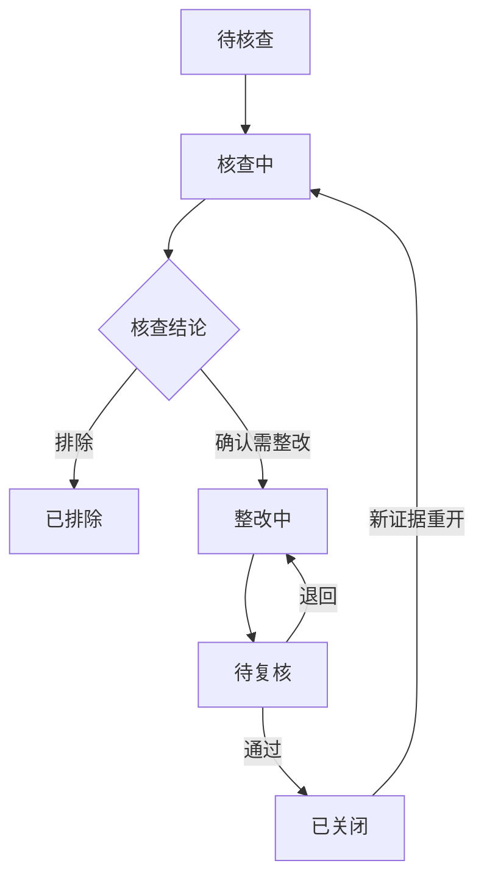

# 海油工程穿透式监管平台完整业务需求

版本 1.6  项目系统原型与实施调研版  2026年9月15日

**V1.6当前定位：本Demo是穿透式监管项目的一项交付成果，以可交互业务原型展示未来系统形态，支持领导了解建设方向、业务部门确认功能和口径、科技信息部调研实现条件。** 原型包含六领域监管、指标穿透、场景联动、核查整改、配置和AI辅助；配套资料建立页面功能与数据、来源候选及待确认问题的对应关系。第23章规定原型展示，第24章规定实施调研。投资适配及三个JSON继续沿用已复核版本；没有将样例界面等同真实系统接入。

本说明书用于指导 Codex 或 Cursor 构建海油工程穿透式监管平台的可交互演示系统。平台从海油工程总部出发，覆盖所属单位及其投资项目、工程项目、资产、被投企业、账户和产权事项，支持从总体指标逐级找到具体对象，沿业务阶段查看监管事项，再追溯数据依据、核查和整改。

投资领域已依据《【海油工程】投资管理穿透式监管底稿@0914(1).xlsx》逐行适配：固定资产34个子场景，股权19个子场景，共53项；E列40次指标定义去重后形成38项KRI。V1.3的40项结构化、10项线索、3项专业标签是旧版能力分类，不代表40项可自动判断整个场景。V1.4重新逐行审阅原Excel，主执行方式为21项结构化自动识别、29项线索识别与人工复核、3项专业核查支撑；AI是否辅助按具体材料和任务确定，详见第22章与逐项适配。具体原文、取舍、公式及注意事项见《投资底稿适配对照_V1.4.md》和 investment_catalog.json。

本文件规定产品行为；附件适配对照规定投资口径及取舍；JSON保存稳定编号、来源与演示数据。原始底稿中的业务审批、执行和处罚动作，按适配说明处理。主体、金额、业务记录和行情曲线使用合成样例数据，数据性质集中写入“数据说明”；业务页面名称和字段采用正式业务语言，不在单位、项目、按钮上添加“演示”前缀。正式组织、制度、授权、阈值和接口由业务管理部门确认后配置，不影响本版Demo开发。

V1.2修订重点：落实本轮确认的“指标点击弹出组织树、首页横向肩形箭头、环节点击联动场景执行情况”。固定资产细化为8个环节，并将运营与后评价放在同一末端环节内分别查看；股权、产权、工程按业务特点同步细化。统一监测对象、命中对象、未关闭事项、本期已整改闭环及逾期整改的统计口径，保留已完成业务环节中的未关闭问题。

V1.2已整合产品行为与阶段映射；原投资底稿内容、53个子场景、38项原KRI及演示金额基准保留。本包是完整参考依据，无需拼接历次对话；现有工程增量改版优先读取系统原型定位与实施调研说明、开发说明第8节，再按改动读取第2/3/6/21/22/23/24章及相关实现，投资按场景或指标ID检索，不要求每轮全量装载原文。投资适配附录与场景目录更新为V1.4监管执行方式，阶段ID和原始投资口径仍沿用V1.2映射。厂商公开产品参考继续保留，具体链接和资料类型见《公开产品借鉴与页面设计_V1.6.md》。本项目流程模板属于可配置的Demo设计，不宣称已获得企业正式流程确认。

V1.3新增要求：同一业需包供Cursor与Codex使用，开发入口和任务说明改为通用文件；将“蓝色调、国央企系统、稳重高端”落成第3.2节完整视觉规范及AC65至AC70。V1.2的业务流程、指标树、计数口径、原投资场景和金额基准继续有效。本次色彩与排版要求是本Demo的设计选择，具体参考页见《公开产品借鉴与页面设计_V1.6.md》第9章。

**本轮实施方式：在Cursor已生成的现有Demo上增量改版。** 先完成综合总览、共用视觉和固定资产原型路径，再贯通各领域、AI及整改材料，随后完善配置体验与原型评审；统一数据及授权查询从每批开始即生效。无需重新创建项目或重新生成一套业务数据。第21、22章承接V1.4配置需求，第23章校准原型定位，第24章新增实施调研要求，已同步调整前文相关条款；新增配置初始值在`configuration_seed.json`。初次拿到此包的开发工具应检查现有工程和已有修改，按稳定ID迁移配置，不覆盖已经完成的交互修复。前文的“首版”包含本次明确要求的配置页面和权限行为。

本平台让总部查看所属单位及项目的经营与风险事实，围绕异常找到规则、业务依据和责任跟进。各领域以“监管总览、专题/流程监管、对象穿透、核查整改”组织页面。业务台账作为监管证据和被监管对象，默认以只读方式查看；监管核查、督办、整改提交及复核是本平台可办理的动作。

## 1 建设目标和范围

### 1.1 要回答的管理问题

1. 海油工程六个业务领域目前的规模、目标执行和主要风险分别如何。
2. 异常集中在哪个二级单位、三级单位、项目或其他业务对象。
3. 异常发生在哪个业务阶段，涉及什么监管场景，依据什么规则发现。
4. 当前结果由哪些计划、批复、合同、资产、经营或资金记录形成，数据是否完整。
5. 外部事件会影响哪些境外项目、采购、运输、成本、回款和资产安排。
6. 谁负责核查或处置，处理到哪一步，是否逾期，是否已经复核。

### 1.2 首版业务范围

| 一级入口 | 对象范围 | 首页主要组织方式 |
|---|---|---|
| 综合总览 | 海油工程总部及纳入管理范围的单位和六领域对象 | 监管主体全景、专项领域监管概况；高风险与异常从数字和卡片进入 |
| 固定资产投资管理 | 自有能力建设、基地设施、大型装备、技改等投资及形成资产 | 投资建设至转固后运营的完整生命周期 |
| 股权投资管理 | 新设、增资、股权收购、参股和控股投资，及相关投后管理 | 投资生命周期、被投企业、收益和风险 |
| 国际化业务 | 境外机构、项目、投资、人员及资产所在区域和业务活动 | 地区与项目风险、外部事件及业务影响 |
| 资金管理 | 资金计划、账户、收支、项目资金、资金支持等 | 资金专题监测 |
| 产权管理 | 所持企业权益、产权登记及产权变动事项 | 产权结构和分类事项流程 |
| 工程项目管理 | 面向客户的工程合同及履约项目 | 承揽履约、并行实施阶段、成本和收款 |

固定资产投资项目用于形成公司自有资产或能力；工程项目默认指对外履约的工程业务。两者分别建档，有关联时建立对象关系，不能因同为工程建设而重复计算投资规模和工程合同额。

### 1.3 平台职责

平台承担数据归集展示、指标分析、规则监测、证据追溯、核查任务及监管整改跟踪。投资审批、招采、签约、支付、会计记账、资产调拨处置、正式产权办理及责任追究由相应业务体系实施。平台可查看这些流程的事实和结果，记录本平台的核查意见与整改复核。

AI用于提取、比对、定位依据和提出核查问题；AI不直接确认违法违规、资产减值、专业报告真实性、投资可行性或责任归属。首版采用由当前授权事实驱动的预置分析，并在分析面板简短标注“预置分析”、设置页说明未连接模型服务；引用可查看的材料位置，不能伪称实际调用了模型。

### 1.4 用户角色

| 角色 | 数据范围 | 可办理内容 |
|---|---|---|
| 总部查看人员 | 获授权领域中海油工程及全部所属单位 | 指标与对象穿透、重大事项及进度查看 |
| 总部监管人员 | 获授权领域的全公司管理范围 | 核查、分派、督办、复核；场景/规则/指标维护另按动作权限 |
| 总部投资管理人员 | 所属单位的固定资产和股权投资数据 | 投资核查和规则维护；其他领域证据按专项授权访问 |
| 所属单位管理人员 | 本单位及获授权的下属单位与项目 | 本范围查看、核查、分派及整改提交 |
| 项目经办人员 | 明确授权的项目或业务对象 | 查看本对象、说明疑点、提交证据与整改 |
| 系统配置管理员 | 用户、角色、AI和运行设置；默认无全公司业务数据权限 | 维护设置与检查运行；不能自行扩大本人业务授权 |

有效可见范围由“账号数据范围＋业务领域权限＋动作权限”共同确定，页面筛选只能缩小范围。权限须覆盖指标汇总、组织树、详情、导出、关系、证据和AI；不只隐藏菜单。同一提交人不能复核自己的整改。预置9个匿名账号、5个角色及可核验结果见configuration_seed.json；用于本地权限行为验证，真实认证和服务端强制校验列入正式实现要求。身份切换入口放用户菜单，显示“切换账号”，集中说明其样例性质。

## 2 导航和页面目录

### 2.1 左侧导航

业务菜单固定为：综合总览、固定资产投资管理、股权投资管理、国际化业务、资金管理、产权管理、工程项目管理。左侧底部另设“系统配置”，形成七个业务入口加一个配置入口。股权和固定资产分别作为独立入口，资金和产权分别作为独立入口。

顶部优先显示“监管工作台”和当前用户；“场景规则库”“数据依据”作为“更多”中的共用查询入口，并从相关详情直接访问。事项、指标和对象详情也可从领域内进入。系统配置移至左侧底部P76，帮助保留在顶部；场景规则库是统一目录的查看入口，维护动作进入同一套配置页面。导航显示顺序独立于页面编号，P20固定资产显示在P10股权之前，保留稳定路由与对象ID。

### 2.2 页面目录

| 页面编号 | 页面或路由 | 主要内容 |
|---|---|---|
| P00 | /overview | 综合总览 |
| P20 | /fixed-asset-investment | 监管总览、流程监管、资产运营监管、项目穿透、监管事项 |
| P10 | /equity-investment | 监管总览、流程监管、投后监管、投资穿透、监管事项 |
| P30 | /international-business | 监管总览、事件与市场、业务影响、境外项目穿透、监管事项 |
| P40 | /funds | 监管总览、资金计划监管、账户与收支穿透、重点交易核查、监管事项 |
| P50 | /property-rights | 监管总览、产权关系穿透、事项流程监管、一致性核查、监管事项 |
| P60 | /engineering-projects | 监管总览、履约流程监管、成本与回款穿透、项目穿透、监管事项 |
| P71 | /indicators/:indicatorId | 默认以大抽屉或弹窗打开指标组织树、趋势、构成、明细与口径；路由用于直达或恢复 |
| P72 | /scenarios/:scenarioId | 场景依据、规则、适用对象及风险事项 |
| P73 | /risk-cases/:riskId | 风险证据、核查、整改、复核和历史 |
| P74 | /objects/:objectType/:objectId | 项目、资产、法人、账户、合同等对象详情 |
| P75 | /events/:eventId | 国际事件、窗口比较、受影响业务和应对 |
| P76 | /settings | 左侧底部系统配置：用户与权限、监管场景、监测规则、指标管理、AI分析设置、数据与运行；以?tab=users/scenarios/rules/indicators/ai/data切换 |
| P77 | /supervision-workbench | 待核查、整改跟踪、待复核、已办事项及统一督办 |
| P78 | /data-trace/:traceId | 指标结果、计算构成、来源记录、凭据和数据时间 |
| P79 | /business-links/:objectType/:objectId | 对象之间的业务关系、关联领域及风险事项 |

领域内的Tab属于同一领域的不同工作视图；切换Tab应保留领域筛选。详情页使用面包屑返回来源页面，不重新初始化筛选和页码。

### 2.3 共用筛选

全局筛选包括组织范围、统计期间和截至日期。领域按需补充项目类型、生命周期阶段、境内外、国家地区、资产类别、风险等级和处理状态。

总部授权账号的组织根节点为海油工程总部；所属单位账号以其授权单位为根节点，不显示全公司或同级单位数据。单位名称按组织主数据与本版匿名名称映射展示。默认范围包含选中单位及其下属管理对象，并在页面写明“含下级”。支持切换“仅本级”。

金额发生额按所选期间统计；余额、存量和未关闭事项按截至日期统计。年度计划、同期累计计划及年度预计完成分别显示期间标签。历史事件分析使用独立窗口，不偷偷修改全局业务统计期间。

## 3 总体页面和交互规范

### 3.1 领域首页的固定结构

| 从上到下的位置 | 内容 | 核心交互 |
|---|---|---|
| 页面标题及筛选栏 | 领域名称、组织、期间、业务属性 | 改变组织或期间后全页按同一范围重算 |
| 重点指标区 | 默认4至6张卡片，含业务规模、执行、风险 | 点击卡片详情弹出P71指标组织树；“查看事项清单”是独立入口 |
| 中部主视图区 | 有生命周期的领域放阶段监管；资金放专题，国际化放地区/事件 | 点击阶段或专题联动下方场景和对象 |
| 场景监测区 | 场景执行状态、监测与命中对象、未关闭/闭环/逾期事项 | 点击场景进入P72；点击数量打开明细 |
| 对象及事项区 | 项目/资产/企业/资金等明细，带状态和依据入口 | 点击对象进入P74，点击风险进入P73 |

固定资产、股权、产权、工程的流程主视图必须位于大型趋势图、排名图之前。在1440×900桌面下，首次进入领域即可看到指标区和流程节点，不需要先向下滚动寻找流程。

### 3.2 视觉规范：蓝色调国央企监管工作台

整体定位为“稳重、专业、精致的国央企总部监管系统”。高端感通过统一的蓝色体系、清晰的信息层次、规整布局、适度留白和细致交互实现。所有领域、共用详情、指标抽屉、规则及工作台使用同一主题。

#### 3.2.1 色彩与布局

| 用途 | 颜色/规格 | 使用要求 |
|---|---|---|
| 深蓝导航 | #0B1F3A | 左侧导航及品牌区；白色主文字、浅蓝辅助图标。页面主要深色面积集中在导航 |
| 导航选中 | #164B8E | 选中项底色配白字及清晰选中标识；悬停与选中分开 |
| 品牌及操作主蓝 | #1D5FD1 | 主按钮、链接、选中Tab底线、焦点及核心图表；六领域统一 |
| 页面背景 | #F3F6FB | 浅灰蓝底，形成工作区层次；数据密集区域保留清晰对比 |
| 卡片和详情 | #FFFFFF | 指标卡、场景表、规则详情和指标抽屉主内容面 |
| 浅蓝强调 | #EAF1FD | 选中树行、表格悬停、阶段选中底纹和辅助提示 |
| 主文字 | #172B4D | 页面标题、正文、关键数字；不把全部文本着成蓝色 |
| 次级文字 | #5A6B83 | 时间、单位、口径、辅助说明；仍保持可读 |
| 边框及分隔 | #E1E8F0 | 1px细线；同类模块一致 |
| 布局间距 | 4/8/12/16/24/32px | 页面内边距24px，模块间距16至24px，卡片内边距16至20px |
| 圆角与阴影 | 卡片8px，按钮6px | 卡片细边框配轻阴影；抽屉使用稍明显阴影区分层次；不以大圆角、厚阴影堆叠装饰 |

默认采用“深蓝侧栏＋白色顶部工具栏＋浅灰蓝页面＋白色内容卡片”。综合总览可用小面积深浅蓝渐变作为标题背景，内容和数值仍清晰。日常领域页面不增加占据首屏的大幅装饰横幅。1440×900时导航默认248px、顶部约56px，首屏保持KPI与流程可见。

#### 3.2.2 字体与信息层次

采用系统可用中文无衬线字体，优先PingFang SC、Microsoft YaHei、Noto Sans SC，英文和数字使用清晰无衬线字体；不依赖在线字体加载。页面标题22至24px、模块标题16至18px、正文/表格14px、辅助文字不小于12px、KPI主数字28至32px。金额、比例和日期保持一致对齐，金额右对齐，百分号和单位弱于主数字，数值可用等宽数字属性。

KPI卡统一高度、内边距和标签结构：指标名称、主值及单位、同期间目标/偏差或风险提示、数据状态及详情入口。4至6张卡片按同一栅格排列；超长名称自然换行，不能靠极小字号塞满。用一条细蓝色强调或简洁图标建立层级，不给每张卡片涂不同饱和颜色。

表格默认行高44至48px、表头浅灰蓝，列名、内容、数字和操作对齐。行悬停轻微浅蓝反馈；状态采用有文字的细小标签，主要操作使用文字链接或统一按钮。列表可分页、固定必要列，并保留足够的名称与数值宽度。

#### 3.2.3 风险颜色与流程选中状态

| 语义 | 文字/标记颜色 | 浅底色 | 规则 |
|---|---|---|---|
| 高风险 | #B42318 | #FEF3F2 | 红色配“高风险”等文字，不因蓝色主题被改成蓝色 |
| 关注 | #9A6700 | #FFFAEB | 深琥珀色文字配浅黄底，避免浅黄色小字难读 |
| 有效监测正常 | #067647 | #ECFDF3 | 仅在数据足够且结果正常时使用 |
| 待核查/数据不足/不适用 | #52627A | #F3F6FB | 中性灰蓝并明确写明实际状态，不以0或绿色代替未知 |

风险等级、流程业务状态、数据状态和办理状态分别展示。一个已完成业务环节仍可含高风险未关闭事项。“待核查”办理状态不把已有高风险等级覆盖成灰色。

横向肩形箭头继续仅显示环节名和未关闭事项数，使用细边框及浅底纹。风险通过角标、数量颜色或窄色条表达；选择某环节时额外加主蓝描边/下划线。已选中且高风险的环节同时显示蓝色选中标识和红色风险数字，不能相互覆盖。颜色之外有文字及选中状态，不能要求用户只凭颜色判断。

#### 3.2.4 图表、抽屉与交互细节

图表采用主蓝、较浅蓝和深蓝的有限色阶，同一系列在所有页面颜色固定。实际值实线、目标或计划虚线，预测或情景使用不同线型和明确图例；风险点用红黄标记。优先条形、折线及简单分布图，保留坐标、单位、数据时间和直接可读的提示。避免3D图、立体饼图、大面积霓虹发光、装饰地球或持续旋转元素抢占监管内容。

P71采用白色大抽屉：顶部深色文字标题和蓝色强调，左侧树区略浅蓝灰底，右侧为白色指标内容；抽屉宽度和关闭返回按第4章执行。按钮、树行、表格、Tab和箭头都有一致悬停及键盘焦点反馈。过渡动画约150至200毫秒，以淡入、展开为主，关闭动效时功能完整；不使用持续闪烁或装饰加载动画。

首页系统名称为“海油工程｜穿透式监管平台”，可用简洁文字标识；企业正式Logo、标准字和VI色值后续有正式素材时统一替换。截至日和“数据说明”入口以固定、克制但清楚的方式显示；数据性质在说明中集中披露，影响本次判断的数据状态在对应结果旁清楚显示，不遮住指标或表头。留白用于区分模块，不牺牲首屏流程、关键数值和清单可读性。

视觉验收关注四点：整体蓝色主题统一；密集信息仍清晰可读；高风险和选中状态独立；所有已确定的业务点击与返回行为完整。具体色值是本Demo设计配置，不表述为海油工程已核验的官方VI标准。

### 3.3 所有按钮的结果

查询、清除、排序、分页、列设置、查看依据、展开层级、查看规则、认领核查、提交整改、复核、返回、导出和演示重置均需产生可见结果。导出应导出当前筛选后的明细和口径说明。未实现的操作不展示成可用按钮。

规则依据不足、资料为空、对象不在范围、数据更新失败、记录被排除、无匹配项目等场景均有具体提示。不能用同一条“暂无数据”覆盖全部情况。

### 3.4 首页怎样体现“监管”

每个领域首先回答重点异常及监管任务，其次显示用于理解业务的规模和执行指标。顶部4至6张卡片中，至少2张直接对应风险或监管工作，如预计超概项目数、低利用率资产占比、逾期回款、未关闭高风险事项。金额规模保留明确含义，不将领域首页做成只有收入、利润和完成率的经营报表。

指标卡下方增加一行“本期重点关注”，最多3条可点击事项摘要。进入固定资产领域可直接看到“FA-P001预计超概18%”“AS001低利用率整改逾期”；点击分别打开事项或指标构成，不仅跳到一个全量项目列表。

流程卡及专题卡显示的数字必须能够打开同范围清单。鼠标悬停可提示范围，点击才触发筛选；显示选中状态、返回上一级和清除条件。全局组织、阶段筛选、对象选择分别可见，不互相隐式覆盖。

### 3.5 监管首页的首屏结构

在1440×900视口，左侧一级导航默认248px，顶部约56px，内容区域留20至24px内边距。首屏依次安排标题及筛选、4至6张指标卡、重点关注提示、中部阶段/专题看板、下方场景清单表头与首批事项。允许表格向下延展，但不能把流程放到多张趋势图之后。

固定资产、股权、产权、工程在监管总览中直接显示横向肩形箭头。每个箭头只放“环节名称”和“未关闭事项N件”，不用箭头承载六七个数字。箭头下紧接当前环节说明、五项执行摘要和场景表，点击立即联动，无须先切到“流程监管”Tab。工程9环节在1440宽度下压缩留白并允许名称换行，保持字号可读；小屏采用横向滚动，当前环节自动进入可见区域，不折成多行流程或绘制复杂分支。

“流程监管/事项流程监管/履约流程监管”Tab保留为详细核查入口，复用同一箭头和筛选状态，增加计划、实际、预计日期及依据表。阶段×场景矩阵、复杂流程编辑器及全屏流程大图不列为首版要求。

领域名称和Tab表述以第2.2节为准。项目穿透、投资穿透和产权关系穿透页可查看业务台账，但主操作为“看指标构成”“查规则依据”“看关联交易”“进入核查”。同一对象不因切换Tab创建新档案。

## 4 指标逐级穿透

### 4.1 默认路径

项目可归集的指标默认采用“海油工程总部—二级单位—三级单位—项目—业务明细”。管理树按实际关系展开；二级单位直接管理的项目直接挂接，不补造三级单位。管理单位不必都是独立法人，法律主体另用legal_entity_id记录。

资金余额的末端对象是账户，产权结构指标的末端对象是相关法人及产权事项。能够按项目归集的支付、投资和工程指标继续到项目。资产可以从来源投资项目进入，也可从使用单位直接进入；来源项目不明时标记来源待核实，不创建虚假项目。

### 4.2 指标详情布局

| 区域 | 内容与要求 |
|---|---|
| 顶部 | 指标名称、单位、期间、当前组织范围、口径版本和数据时间 |
| 左侧组织树 | 每个节点显示名称、节点类型、指标值、目标/阈值、异常事项数；支持展开收起和只看异常 |
| 右侧摘要 | 当前选中节点的值、分子分母、目标、偏差、趋势及数据覆盖 |
| 下级比较 | 下属单位或项目的指标值、偏差及排名；点击继续下钻 |
| 业务明细 | 形成指标的项目、资产、企业、合同、支付等；可进入原始对象 |
| 口径与构成 | 公式、比较基准、适用范围、包含排除项、数据来源、审批版本 |

首次打开默认选中来源页面的组织节点（综合总览或领域页当前筛选单位），保持同一指标、期间、截至日和授权范围。选择某个树节点后右侧内容同步更新。公式构成作为独立视图，不把公式树作为默认的组织穿透树。

### 4.2.1 指标弹窗/抽屉交互

1. 点击任意领域顶部指标卡的“详情”或卡片主体，打开P71。桌面默认右侧大抽屉，占视口约80%至90%；也可统一采用同等面积居中弹窗，整个Demo保持一致。宽度不足时全屏显示。底页保留可见上下文，不整页跳走。
2. 左侧约30%为组织树，右侧约70%为选中节点指标详情。首次选中来源组织，默认继承领域、组织范围、含下级/仅本级、统计期间、截至日期和业务属性，不继承仅用于下区的阶段筛选。抽屉标题写明“领域指标范围”。
3. 默认按“海油工程总部—二级单位—三级单位—项目”展开；其他叶子按指标对象改为资产、账户、被投企业或产权事项。单位、项目、法人、资产用类型标签区分，不因企业有持股关系就挂入管理树。
4. 点击树节点，只更新抽屉右侧。切换指标保留能够适用的组织节点。点击“只看异常”保留异常节点的祖先路径；正常父节点也显示所含异常对象提示。右侧无可比目标时写“未配置目标”，不生成虚构偏差。
5. 点击项目/资产名称可在抽屉内部切换到对象摘要；查看完整档案或来源依据时携带返回位置。避免连续叠开多层遮罩。返回指标时恢复所选节点，关闭P71后恢复底页原阶段、场景筛选、页码和滚动位置。
6. 抽屉支持明确关闭按钮、Esc关闭、键盘选择和焦点回到来源卡片；金额、比例和无数据状态不能只靠颜色表达。关闭抽屉不重置或更改全局组织。
7. 直接访问P71路由时提供同内容独立页，返回链接指向携带上下文的来源领域。卡片默认交互仍然是弹出组织树。
8. 综合总览点击专项领域指标，始终围绕所点指标展开组织穿透，不提供整排“切换指标”。领域标题或“进入领域”进入对应领域首页。领域页如保留指标切换，候选项必须同时满足：当前领域、当前用户有权查看、已启用、符合该入口展示配置、具备计算器。停用、仅目录且未具备计算能力的指标不得成为运行入口。判断使用指标 ID 和领域标识，不得按名称猜测。
9. 抽屉取数范围必须是“用户授权范围 ∩ 打开时的组织筛选范围（含下级/仅本级）”，并继承统计期间与截至日。单位 A（含下级）只能在 A 的授权∩筛选范围内穿透，不能选到单位 B。祖先组织若用于路径展示，不得点击后扩大取数范围。抽屉内下钻不改变背景页面筛选。
10. 组织树、主指标、下级比较、构成明细、计算依据必须共用同一查询范围。切换指标时校验当前节点是否仍适用；不适用则回到当前筛选范围内的有效组织节点，所有区域同步更新，不得悄悄回到总部，不得出现 undefined 或汇总覆盖对象数与同口径明细条数矛盾。
11. “只看异常”仅依据当前指标适用的监测规则及评估结果（高风险/关注）。对象涉及其他监管事项，不自动代表当前指标异常。对象关联事项单独标注，不计入当前指标异常数量。无业务、未评估、未开展监测不得当成异常或正常。

### 4.2.2 不同指标的穿透终点

| 指标类别 | 默认终点 | 必须说明的关系 |
|---|---|---|
| 固投计划执行、概算偏差 | 投资项目及成本/计划记录 | 项目归属与资金支付范围分别定义 |
| 资产利用、低利用率占比 | 使用单位下资产；可追来源投资项目 | 同一资产仅按已定义归属汇总，不按服务项目重复计净值 |
| 股权计划、收益、出资 | 投资项目，再到被投企业/出资及分红义务 | 多个投资批次对应同一被投企业时按指标计量对象去重 |
| 资金余额、受限资金 | 法律主体对应账户 | 项目没有独立账户时不强造“项目账户”层级 |
| 产权事项进度及差异 | 产权事项及所涉法人 | 产权事项数、企业数和持股比例不相互替代 |
| 工程成本、毛利、回款 | 工程项目及合同、成本或收款记录 | 项目总额和分包/付款明细不重复加总 |
| 国际化受影响对象 | 境外项目/资产/合同等相应类型 | 国家地区是辅助分组，可切换查看，不代替管理树 |

### 4.3 汇总规则

1. 可加金额和数量以唯一业务记录汇总；父节点数据与所展示子节点范围相符。
2. 比例按分子合计/分母合计重算，不直接平均单位或项目的百分比。
3. 固定资产收益加权偏差按附件规定，仅对评价期间、收益口径和范围可比的项目按实际投资额加权。
4. 延期天数、连续亏损周期、不可比项目收益率等不相加；上层展示最大值、分布或异常对象数，并明确该指标不适用简单汇总。
5. 资产利用率只汇总同类别、同计量口径的使用量和可利用量；小时、天数和产能不能相加。
6. 法人报表存在合并范围重叠时，不直接累加资产负债；管理分析汇总与财务合并口径分别标识。
7. 父节点整体正常但含红色子项目时，显示“含高风险对象N个”，并支持定位。
8. 缺失数据不以零替代；显示已覆盖对象数及缺失范围。分母为0时按不适用或计划外事项规则处理。

示例：项目A完成80万元/计划100万元为80%，项目B完成90万元/计划300万元为30%；上级执行率为170/400=42.5%。本例独立用于说明汇总方式。

### 4.4 从指标继续追到来源数据

P71的组织树解决“哪家单位、哪个项目”；选中末端对象后，“查看计算依据”进入P78，解决“这个数怎么形成”。P78分四层：指标结果与期间、分子分母或组成项、来源业务记录、单据/凭据与版本。每项有来源类型、业务日期、数据更新时间、责任单位和数据性质。

FA-P001例：预计完工偏差18% → 预计完工投资11800及有效概算10000 → 五项互斥成本构成 → 对应入账、未入账、合同剩余、变更、剩余工作估算依据。财务已入账项可以追到模拟凭证；未来成本项追到合同和预测说明，不伪造尚未发生业务的会计凭证。

支付例：超批准差额400 → 实付1200和有效批准800 → 支付记录、批准记录、SC001合同 → 模拟回单和批准材料。页面同时显示业务可支付上限2000，说明该规则比较的具体依据。未提供真实源系统接口时，在本平台直接展开模拟材料，不设置跳转后无内容的“查看源系统”按钮。

### 4.5 横向业务关系穿透

P79采用中心对象关系视图，并提供同内容的关系表。关系边必须带业务含义和有效依据，不能只画几条无含义的连线。默认仅展开1至2层，可逐对象继续展开；同一对象只显示一个节点。

| 中心对象 | 要能看见的业务关系 | 可进入的关联监管 |
|---|---|---|
| 固定资产投资项目 | 投资计划/概算、成本与合同、形成资产、资产使用单位及服务项目 | 固定资产建设、资金支付、资产运营 |
| 股权投资项目 | 投资法人、被投企业、出资义务、分红义务、产权快照及资金收付 | 股权、资金、产权 |
| 境外工程项目 | 客户合同、分包合同、成本项、付款、应收、航线事件和未锁价敞口 | 工程、资金、国际化 |
| 产权事项 | 批准权益、同有效期登记信息、被投企业和关联投资项目 | 产权一致性、股权方案变更核查 |

组织树、股权结构图和业务关系图分开切换。父子管理关系、持股关系、项目合同关系不混在同一棵“总部—单位—项目”树里。业务关联入口始终保留当前对象和事项，不返回另一个领域的未筛选首页。

## 5 流程与监管场景联动

### 5.1 关系模型

| 对象 | 含义 | 关系 |
|---|---|---|
| 阶段 | 业务所处环节 | 一个阶段关联多个场景，一个场景可关联多个阶段 |
| 监管场景 | 需要监督的具体问题 | 关联原始监管事项、制度依据、适用对象和规则 |
| 监测规则 | 可以判断或提示的条件 | 关联数据前提、指标、阈值、例外及核查要求 |
| 指标 | 规模、执行和偏差的量化结果 | 可被多个场景复用，不要求每个场景都有KRI |
| 风险事项 | 需要跟踪的一次具体业务异常 | 可以命中多条规则、出现在多个领域，但有同一事项ID |
| 证据 | 形成判断的业务事实与材料 | 记录来源、时间、版本、对象及具体位置 |

本版制度来源预置国务院国资委令第46号《中央企业违规经营投资责任追究实施办法》，2026年1月1日起施行。它规定责任追究框架，平台的风险提示应继续经过事实核查及有权程序。用户所称“46号文”是否即指此文件、与附件的逐条对应关系，保留为制度名称和条款核对项。[国务院国资委发布页](https://www.sasac.gov.cn/n2588035/c35128064/content.html)

投资场景保留一级监管场景和监管子场景原文；工作表、行号和列映射只保存在研发来源元数据中，并关联正式制度来源。附件扩展的资产运营、权属、资金衔接和减值场景单独标注来源，不伪装为第46号令的逐字条款。企业内部阈值、期限和例外另设制度来源及版本。

### 5.2 首页横向流程

四个流程领域统一采用简单横向肩形箭头。固定资产、股权展示8环节，工程9环节，产权根据所选事项类型展示5至8环节。资金和国际化以专题卡/地区事件组织，并复用下述筛选、清单和事项办理能力。

| 元素 | 展示和操作要求 |
|---|---|
| 环节箭头 | 环节名称、未关闭事项N件；整个箭头可点击；计数为该环节及关联范围内唯一risk_id数 |
| 环节风险 | 红色为含未关闭高风险，黄色为含未关闭关注；无开放问题且有效监测完整才可为正常；无实例、不适用、待监测或数据不足用中性灰并写明状态 |
| 选中状态 | 用青蓝描边、底线或明确选中标识；不要把选中态蓝色覆盖红黄风险含义 |
| 全部环节 | 箭头栏旁设“全部环节”筛选项，默认选择；它不是第一个业务流程阶段 |
| 点击结果 | 更新下方环节说明、五项摘要、场景执行表、对象清单和事项列表；自动定位到下方表头，不离开领域首页 |
| 再次点击/清除 | 再点当前箭头仍保持选中；点“全部环节”或清除标签恢复领域范围 |
| 提示 | 悬停可解释统计范围；没有鼠标悬停的设备也能通过点击后的说明获取同一信息 |

领域流程是业务顺序的监管索引，不是源系统审批工作流或当前项目的强制状态机。当前项目所处阶段与事项归属环节分开存储。阶段记录完成不自动关闭风险；进入下一阶段不抹掉上一阶段问题；有批准条件的提前采购、分批投用和并行工作包均可有重叠日期。

主阶段用于默认归档，关联阶段用于显示实际相关监管事项。配置上“场景关联多个阶段”不表示每件风险都自动计入所有阶段；必须存在该risk_id与该阶段的事实关联。各箭头均按本阶段关联risk_id去重，跨阶段总数再次去重，不相加得到领域总数。统计入口与点击后清单必须使用同一关联条件。

### 5.3 环节选择后的执行情况

箭头下按顺序显示：环节名称及监管重点、必要的业务子类切换、五项摘要、场景执行表。默认“全部环节”显示全部场景；固定资产混合项目和资产时摘要分类型列出，不能写含义不明的“主体共N个”。选择“运营及后评价”后默认“资产运营”，可切“投资后评价”；前者按资产、后者按项目。箭头未关闭总数覆盖两者且去重，子切换后的摘要只含所选子类，写明范围差异。

| 摘要名称 | 口径及点击结果 |
|---|---|
| 监测对象数（项目/资产/产权事项等） | 所选观察范围内，至少完成一项适用规则评估或一次有结果的人工核查的对象，按object_type+object_id去重；点击看对象及已评估/应评估规则数。只配置规则、收到资料或等待人工结论不算完成监测 |
| 命中对象数 | 同范围内至少有一个有效命中或明确核查线索的对象去重数；含未核实线索但不含已确认为误报的排除事实。该观察期曾命中后整改闭环，历史命中仍保留，不能随关闭变成“从未命中” |
| 未关闭事项数 | 截至日已发现、仍待核查/核查中/整改中/待复核的唯一risk_id数；以前期间发现但未关闭的也纳入，不用本期新发现条件过滤存量 |
| 本期已整改闭环数 | 复核通过关闭日期位于所选期间、截至日仍为已关闭且关闭原因为整改完成的唯一risk_id数；已提交、已排除、仅指标恢复不计；重开后移出当前闭环数并保留历史动作 |
| 逾期整改数 | 截至日尚未关闭、已进入整改责任范围且超过有效整改期限的唯一risk_id数；待复核仍未闭环时按本Demo保持整改逾期提示，提交材料不自动停表。其他核查/复核办理超期在工作台另列 |

“监测对象”不代表这个对象全部适用规则都已评估。摘要旁显示“应监测N个，已监测M个，部分覆盖/数据不足…”，详细覆盖仍按对象与规则组合计算。历史遗留事项即使本期业务不再需要重复评估，仍在未关闭清单展示，并标“历史遗留”；不得为了使其计入本期监测数而补造本期规则评估。

监测及命中对象以评估记录的业务观察窗口结束日window_end落入所选期间（起止日均包含）归属，且evaluated_at不晚于截至日。季度、年度及滚动窗口均按窗口结束日归属，不能按窗口重叠把同一结果分摊进多个月。完整窗口所需历史数据可早于本期，例如本期规则评估引用上期季度利用率；详情同时显示评估归属窗口与引用数据窗口。没有足够完整窗口时标“样本/观察期不足”，不按天折算季度结果。

对同一规则版本、对象、归属窗口，监测完成数取截至日有效评估记录去重；曾经有效命中后改善的历史保留在命中记录中，不因最新结果正常而抹除。确认误报、错误数据作废及有效例外的排除按截至日已生效核查结论处理，保留原记录及排除原因。核查和评估取得时间只控制截至日是否可见，不替代业务窗口归属时间。

场景定义可展示在其配置主阶段和关联阶段；监测、命中对象只按评估/核查记录实际关联阶段统计，不由场景配置复制。未关闭、闭环及逾期按事项事实阶段关联统计。允许显示“本期已监测0个、历史未关闭N件”，此时解释历史遗留来源，不补造本期评估。

五项摘要既有期间数据也有截至日存量，必须分别标“观察期”“截至日”“本期闭环”。命中对象数、事项数和闭环数不是同一个计数单位，不能据此计算所谓总体合规率，也不能用闭环数/(本期闭环数+未关闭数)冒充同批次整改完成率。若后续加完成率，需另建相同任务批次/应完成期限的分母。

### 5.4 场景执行清单

| 必显列 | 展示要求 |
|---|---|
| 监管场景 | 名称与稳定ID；标签标明结构化监测、线索核查或专业核查依据；点击进入P72 |
| 监测状态 | 未到监测时点、待监测、部分完成、已完成监测、需人工核查、不适用、数据不足；多规则时按覆盖与结论呈现，不能把有一条正常称为整个场景正常 |
| 监测对象数 | 使用该行指定对象类型；鼠标/点击详情可看适用、应监测和已监测数量 |
| 命中对象数 | 与该行监测对象口径一致，点击精确打开对应对象及命中依据；命中包含有效自动命中和人工明确线索，并标注依据类型；专业核查尚无结论时显示“—（待人工核查）”，不能隐藏已有人工线索 |
| 未关闭事项数 | 该场景、当前环节及组织范围内risk_id去重；点击打开同范围事项列表 |
| 本期已整改闭环数 | 与5.3同口径；点击查看复核通过时间、结论及证据 |
| 逾期整改数 | 与5.3同口径；点击看责任、原期限、有效期限、逾期天数与督办记录 |

默认按“有高风险未关闭、逾期整改、其他未关闭、数据不足、其余”排序；同优先级保持场景稳定编号排序。支持搜索名称/ID、只看异常、监测状态和对象类型筛选，并显示筛选标签；分页不影响摘要的全量计算。涉及多个对象类型的场景分组展示，不把项目、资产和法人加成一个数。

展开场景行或进入详情后再展示：配置规则数、应执行规则实例数、已执行实例数、命中规则种类数、有效命中次数、涉及责任单位数、数据缺口和最近监测时间。命中规则种类按rule_id去重；规则实例与版本、对象、观察期关联；重复跑批的相同命中不累计成多条监管事项。前台不显示无解释的“执行率”。

没有实例的产权模板仍显示适用流程与场景定义，数量使用“—”并标“当前筛选无事项”；明确监测完整且没有命中才显示0。尚缺资料时显示缺口数量与所需材料，不用绿色0掩盖未知。

### 5.5 项目/事项详细环节核查

在详情或流程监管Tab内，继续使用同一横向箭头；点击后在普通表格中展示子环节、适用性、原批准计划、现有效计划、实际开始/完成、预计完成、业务状态、依据和未关闭问题。子环节是可展开清单，不再增加第二排复杂箭头；一个首页环节可有多个子环节及工作包。

业务状态至少包括未开始、进行中、已完成、不适用；数据缺失和待确认是独立状态维度。标“不适用”需有项目类型、适用条件和依据，不能当作已完成纳入阶段完成率。批准计划调整保留版本、原因和批准日期，后补批复不改写为事前批准。

固定资产分别保存验收、达到预定可使用状态、实际投用、转固以及后评价状态；股权分别保存交割、各期出资、治理履职、收益及退出状态；产权按事项类型核对条件程序；工程按工作包保留并行日期和里程碑。多个阶段可同时进行中，风险颜色按未关闭事项独立显示。

### 5.6 筛选与跳转联动约定

| 用户动作 | 顶部领域KPI | 中下部流程与场景 | 弹窗/返回行为 |
|---|---|---|---|
| 改全局组织、期间或截至日 | 全部重算并标范围 | 全部重算；仍适用的选中环节保留 | 已打开详情同步提示范围变化或先关闭，不能保留旧值假装同步 |
| 点击环节/子环节主题 | 保持领域范围，在卡片区写明 | 只更新相关说明、摘要、场景、对象与事项 | 不离开首页 |
| 点击KPI详情 | 不改底页数据 | 保留原选择 | 打开组织树；关闭恢复原位置 |
| 点击监测/命中对象数 | 不变 | 继承场景与阶段 | 打开准确对象清单；查看对象后可原路返回 |
| 点击未关闭/闭环/逾期数 | 不变 | 继承组织、场景、阶段、状态和时间口径 | 打开筛选后的事项清单，不跳到全量工作台 |
| 跨领域查看同一事项 | 目标领域按已授权范围展示 | 保留对象和risk_id，明确来源领域 | 返回恢复来源上下文，不复制事项或改变归属 |
| 提交整改/复核通过/重开 | 涉及事项指标即时重算 | 同risk_id所有领域、环节、场景和清单同步 | 显示操作结果及日志，业务实际日期不变 |

同一页面的“项目当前业务阶段”台账筛选与“问题所属环节”筛选需分开命名。选建设实施监管不能仅保留current_phase=建设实施的项目，从而遗漏运营项目建设期间遗留的问题。

## 6 综合总览

综合总览用于海油工程领导查看监管范围、所属单位监管情况、专项领域业务情况及整改进展。具体布局、字段、点击与计算依据以第23.2节及《系统原型定位与实施调研说明_V1.6》第2节为准。页面只保留标题、组织/期间/截至日筛选，以及“监管主体全景”“专项领域监管概况”两个主区块。不设介绍性副标题、概括摘要、名词解释或操作引导。第二个区块不得命名为“六领域监管概况”。具体业务流程继续放在各领域首页。

### 6.1 监管主体全景：四项总体数字

全部按用户授权范围 ∩ 当前组织筛选动态计算。范围内结果可以为0；缺少计算所需事实时显示空态，不得把缺失当成0。首页不增加综合风险评分，不用命中数量判定单位风险等级。

| 数字 | 计算依据 | 点击后 |
|---|---|---|
| 纳管单位数 | 截至日有效、纳入监管的单位按组织 ID 去重。含下级＝当前单位及授权范围内下属；仅本级＝当前单位。只计所属公司、分支机构及确需纳管的业务单元；总部在范围内计入。总部部门、项目、项目部不得混入。 | 单位清单 |
| 纳管项目数 | 所选期间纳入管理的 FA/EQ/ENG 项目按项目 ID 去重。同一项目跨领域只计一次。 | 项目清单，可按类型筛选 |
| 规则命中涉及单位数 | 所选期间、截至日之前的有效规则命中对象，按对象实际归属单位去重。不把仅因下级命中的祖先汇总节点重复计入；总部或二级单位若有直接归属的命中对象仍计入。已排除误报不计入有效发现，记录仍可追溯。当前范围、期间及截至日内没有适用的监测执行记录时，主数值显示“—”，状态为“未开展监测”，不得因命中结果数组为空显示 0。已运行监测且未命中显示 0；仅部分完成监测时显示已完成部分的命中并标识“部分完成”；有明确缺失数据记录时按实际情况显示未评估或数据未覆盖。历史截至日按已有评估还原，不为与整改数字对齐而补造监测评估。 | 涉及单位清单，再看命中规则与对象 |
| 未关闭整改事项数 | 截至日已确认需要整改、尚未复核关闭的事项按 `risk_id` 去重。计入整改中、待复核；不含待核查、核查中、已排除、确认无需整改。不得把原“未关闭监管事项”直接改名。附：本期完成整改（本期复核关闭且截至日仍关闭，已重开不计）、逾期整改（超期且未关闭）。 | 未关闭整改清单；辅助数字打开对应子集 |

时间口径：命中看期间流量（window_end 落入所选期间且评估不晚于截至日）；未关闭整改看截至日存量，含以前期间仍未关闭事项。历史截至日按办理记录还原当时状态。同一事项跨领域同一标识，总部去重不相加。整改按牵头责任单位归属。同一规则重复运行不重复生成同一未解决问题的整改事项。人工核查确认的问题可进入整改，不必虚构自动命中。

### 6.2 所属单位监管情况

根节点为海油工程总部。默认展示当前单位及其直接下属。选中某单位后只展示该单位及其直接下属；上级留在路径中供返回。无下级则不虚构层级。末级可查看关联项目、资产。节点：名称、单位类型、纳管项目数（该节点监管范围，含授权范围内下属）、命中规则数（按规则 ID 去重）、未关闭整改、监测状态。命中规则数与总体“规则命中涉及单位数”、领域卡命中规则、点击清单共用同一监测执行判断：无适用执行记录为“—／未开展监测”，已监测未命中为 0，部分完成为已完成部分的命中并标识“部分完成”。单位清单另列“本级纳管项目数”，只计直接归属项目。点击名称或“查看下级”切换全局组织；点击卡片数字打开对应范围清单，标题标明含下级或仅本级。规则命中涉及单位按对象实际归属去重，非末级单位有直接归属命中对象时仍计入。

### 6.3 专项领域监管概况

顺序：固定资产投资、股权投资、国际化业务、资金管理、产权管理、工程项目管理。每卡：领域名及“进入领域”、一至两个核心业务指标、底部命中规则/未关闭整改（及逾期提示）。仅展示已启用且配置为首页展示、当前用户有权查看的指标；未启用指标完全隐藏。股权“现金回报目标偏差”（EQ-I08）未启用则隐藏，不得补位。不强制两个指标。比例按分子分母重算。不按执行率高低简单标红。

| 领域 | 核心指标 |
|---|---|
| 固定资产投资 | 投资计划执行率（主指标，FA-I06）、投资完成额（辅助业务字段，FA-I06 分子）。二者同一配置项，停用 FA-I06 后同时隐藏。首页不常显“完成额为执行率分子”；该关系写入查看计算依据与配置口径说明 |
| 股权投资 | 账面金额（EQ-BALANCE）；另一项取已启用可计算的出资或收益指标（当前取 EQ-I15） |
| 国际化业务 | 境外项目数（INTL-CNT）、未定价成本敞口（INTL-EXPOSURE） |
| 资金管理 | 可用资金（CASH-I02）、受限资金占比（CASH-I07） |
| 产权管理 | 纳入产权管理企业数（RIGHTS-ENTITIES）、在办产权事项（RIGHTS-MATTERS） |
| 工程项目管理 | 有效合同额（ENG-REVENUE）、预计完工毛利率（ENG-I01） |

进入领域继承筛选。指标走既有抽屉（抽屉钻取不改背景；总览抽屉不切换指标，始终围绕所点指标；取数=授权∩筛选）。命中规则打开该领域监测结果，对象按类型分列。整改数打开该领域整改清单。

### 6.4 点击、返回与范围

领域标题或“进入领域”进入已有领域主页，继承组织、是否含下级、期间、截至日。返回总览时保留原主体选择。筛选或身份变化清除旧浮层。关闭详情回到原清单，关闭清单回到原入口和滚动位置。事项状态变化后总览同步；原始事实与历史保留。停用指标影响当前首页；停用规则保留历史有效监测结果；关闭整改退出未关闭统计但保留历史。

综合总览点击领域指标打开该指标的组织穿透抽屉，不提供跨领域或跨指标切换。抽屉继承打开时的组织范围、含下级/仅本级、期间、截至日和用户授权；可取数范围=授权∩当前筛选。抽屉钻取不改背景筛选。祖先路径不可扩大取数。领域页指标切换仅限本领域已启用、该入口展示且具备计算能力、当前用户有权查看的指标，按指标 ID 与领域标识判定。

待复核事项通过监管工作台查看；外部事件和历史比较通过国际化业务查看。综合总览不再常显待复核明细、历史外部事件表和单位×领域风险矩阵。

## 7 固定资产投资管理

### 7.1 领域目标和入口

从投资需求、论证审批、建设投入，一直监管到资产投用、运营效益、盘活和后评价。领域内视图为“监管总览、流程监管、资产运营监管、项目穿透、监管事项”。资产运营为首版必备功能。

项目类型默认提供基地设施、大型装备、技术改造及其他四类演示字典；资产另设船舶、专用装备、生产设备、基地设施等分类。分类用于匹配监测口径，不能把项目类型与资产类型当成同一字段。

### 7.2 首页重点指标

| 卡片 | 展示内容 | 点击后 |
|---|---|---|
| 在管投资项目 | 储备、在审、在建、已投用项目数量，默认突出在建数 | 项目清单及组织归属 |
| 投资计划执行率 | 同期累计完成投资/同期有效累计计划；显示计划及完成额 | FA-I06组织指标树和项目明细 |
| 预计超概项目 | 预计完工投资超过当前有效概算的项目数、最大偏差 | FA-I07项目分布和构成，不用平均偏差替代逐项异常 |
| 重大进度偏差项目 | 命中总体进度或关键里程碑规则的唯一项目数 | FA-I08/09明细和基准版本 |
| 重大资产低利用率占比 | 已确认低利用率重大资产净值/纳入监测重大资产净值 | FA-I14单位、类别、资产穿透 |
| 未关闭监管事项 | 当前范围事项数、高风险数和逾期数 | 同范围风险清单 |

切换资产运营监管视图后，卡片重点展示重大资产账面净值、低利用率占比、低效闲置占比、盘活逾期占比、权属异常和减值迹象。指标卡片保留来源期间，不能把月度利用率直接标为年度效益。

### 7.3 首页流程阶段及子环节

固定为8个横向箭头：**储备谋划 → 可研论证 → 决策审批 → 设计概算 → 采办管理 → 建设实施 → 验收投用 → 运营及后评价**。按主要业务顺序提供监管入口，正式适用程序通过项目类型和有效制度配置。环节ID采用FA-V12-01至FA-V12-08，不复用旧版六阶段ID。

| 环节 | 点击后可查看的子环节 | 重点监管及附件场景主归属 |
|---|---|---|
| 储备谋划 | 需求识别、存量能力核实、项目准入、储备更新 | 需求与存量资产是否匹配、准入规则是否更新；FA-S04、25 |
| 可研论证 | 可研编制、基础数据核验、收益及风险论证、中介独立性核查、专业审查 | 论证依据、数据及重大风险；FA-S03、07、08、09；审批结果关联FA-S02 |
| 决策审批 | 方案审议、授权核对、适用报批报备、决策结论及条件落实 | 材料审批、千万元以下适用报备、超授权、拆分规避；FA-S02、10、12、13 |
| 设计概算 | 设计成果、概算编制、概算审查及批准、估算概算差异处理 | 编制基础、适用审查、与可研批准估算比较；FA-S05、06 |
| 采办管理 | 策略与方式、招采与供应商核查、提前采办条件、合同及采购依据 | 早采条件、应招未招、关联线索、关键资质；FA-S14至18 |
| 建设实施 | 开工前提、投资成本、建设进度、设计变更、环境变化、实施备案、计划资金衔接 | 未批实施、变更、超概、进度、成本、环境、备案、计划资金；FA-S11、19至24、34 |
| 验收投用 | 分批验收、可使用状态确认、实际投用、价值归集、转固办理、项目资产关联 | 新增FA-X01；权属登记FA-S32、境外安排FA-S31/33关联查看 |
| 运营及后评价 | 子主题一“资产运营”：利用、盘活、权属及境外安排、减值迹象；子主题二“投资后评价”：计划、评价、目标实现、评价问题整改 | 资产运营FA-S29至33、35；投资后评价FA-S26至28 |

**业务顺序校准：资产投入使用并运营后，才有实际运营数据支持投资后评价；后评价后资产仍继续运营。** 因此末箭头合并展示，内部有独立子主题和状态，不能实现成“后评价完成后才可开始资产运营”。附件FA-S26以实际投产或达到预定可使用状态为起算依据，并提出上会项目一般1—2年完成、最迟不超过2年的底稿要求；Demo按各项目已配置评价计划判断，不把底稿期限当作所有资产统一法定期限。FA-S27读取投用后的需求、利用和收益事实，FA-S28跟踪评价问题整改。

“验收投用”中的转固为会计衔接子环节，实际运营开始不以转固记账或后评价完成为前提。分批验收、分批投用、分批转固逐批保存，未完成的结算资料或转固办理仍受监管。

“决策审批”主要承载前期投资方案和可研相关决策；设计概算审查批准、变更审批、有效计划调整在对应阶段继续核查，不能理解为全生命周期只审批一次。部分项目没有独立初设概算环节，按有效适用条件显示“不适用”，不虚造批复。

长周期设备等提前采办按附件FA-S14的适用项目、前置条件和合同签订权限核查。询价、选商与对外签约/支出分别记录，不能因为箭头排列就推断一切采办都必须等全部设计工作完成。

跨阶段场景及其关联阶段详见investment_catalog.json。年度计划、资金安排、动态风险、投资调整贯穿相关阶段；资产运营侧查看FA-S04时应显示与新增投资的需求衔接，不能误当作资产本身“审批违规”。首页场景主归属和关联入口共用同一场景ID，不复制原场景。

### 7.4 投资项目台账

基础字段：项目编号、项目名称、主归属单位、法律主体、项目负责人、项目类型、所在地区、当前阶段、项目/WBS编码、重大项目标识、储备编号及来源。

金额字段：可研批准估算、原初设批准概算、当前有效概算、累计概算调整、年度投资计划、同期累计计划、同期完成投资、累计完成投资、预计全年完成投资、预计完工投资、资金计划、实际支付。

状态字段：计划及批复版本、预计完工投资数据完整性、总体进度、关键里程碑偏差、预计投用日期、未关闭事项数及等级。列表默认展示最关键的10至12列，其他字段在列设置或详情查看。

支持按单位、类型、阶段、风险、是否超概和是否进度异常筛选。项目搜索同时支持项目编号、名称及WBS。导出保留当前筛选、金额单位、统计期间和版本。

### 7.5 投资项目详情

| 详情页签 | 内容及交互 |
|---|---|
| 项目全景 | 基本信息、当前阶段、投资及进度、资产形成、重点风险；阶段节点可点击 |
| 论证与决策 | 需求、存量资产利用、可研假设、估算/概算、授权及实际审批证据 |
| 投资执行 | 投资完成、有效概算、预计完工构成、年度计划及资金计划对照 |
| 进度与变更 | 基准进度、里程碑、合同及设计变更、最早实施事实与审批时间 |
| 形成资产 | 一项目多资产的分配、验收、投用、转固、原值与净值，点击进资产档案 |
| 运营与效益 | 资产利用、需求和业务贡献、当前预计收益及目标变化 |
| 后评价 | 起算依据、年度计划、报告评审、目标偏差及整改 |
| 监管事项 | 场景、规则、风险记录及核查整改历史 |

预计完工投资构成表字段：来源类型、来源记录ID、WBS、合同/变更编号、已发生或尚需分类、金额、预计发生时间、状态、测算依据及是否已包含在其他项。按单据和成本范围去重。对已签未执行、已履约未入账、待审批变更、索赔及未签约剩余工作建立互斥或明确差额关系。

当关键预测记录缺失时，显示“已知预计投资下限”和缺失清单；不能把删除缺失项后的结果标为完整EAC。如果已知金额已经超过概算，可以显示“至少超概X万元”，同时保留数据不完整提示。

### 7.6 核心自动规则

| 规则编号 | 触发逻辑 | 结果与证据 |
|---|---|---|
| FA-R11-01 | 适用前置审批晚于合同、支付或最早可信实施日期，且无有效提前实施依据 | 未批先实施待核查；展示日期、条件、批复、业务记录 |
| FA-R12-01 | 实际审批岗位/层级与业务当时有效授权要求不符 | 授权执行差异；展示当时授权版本及实际审批 |
| FA-R14-01 | 提前采办不符合适用范围、条件或合同签订限制；或金额占比达到配置提示值 | 条件异常与规模提示分开；不因达到30%自动认定违规 |
| FA-R19-01 | 已实施变更无关联有效审批、实施早于审批或超批准范围 | 变更核查；指标偏差只作为辅助线索 |
| FA-R20-01 | EAC超过有效概算；达到95%但未超过时关注；连续两期增加时提示 | 同项目同一超概原因合并为一事项；展示构成和历史 |
| FA-R21-01 | 总体进度落后达到10个百分点，或关键路径延期达到演示配置60天，或重大节点预计晚于批准日 | 进度核查及恢复措施；保留原/当前基准 |
| FA-R24-01 | 应办备案任务超过有效期限且没有有权确认结果 | 备案逾期；区分策略、计划及其他备案种类 |
| FA-R26-01 | 属适用范围且超过批准后评价期限/计划验收日仍未完成验收 | 后评价逾期；显示起算日期来源和评价节点 |
| FA-R29-01 | 按季度监测，连续两个监测期或滚动12个月低利用率，形成待复核；人工确认后纳入低利用率净值占比 | 月度明细辅助趋势，不能替代季度触发依据；不自动认定闲置 |
| FA-R30-01 | 已确认低效闲置资产的盘活安排逾期，或多次延期 | 盘活督办；仅改计划日期不自动关闭原事项 |
| FA-R31-01 | 已结束境外项目资产无批准后续安排或安排逾期 | 资产滞留核查；关联工程和国际化同一事项 |
| FA-R32-01 | 应登记资产超办理期限、权证失效、主体差异无有效解释或争议未解决 | 权属核查；有效办理期内已受理的单列办理中 |
| FA-R33-01 | 境外许可、登记或临时进口临期/逾期，或主体差异缺少合法依据 | 按国别和资产类别提示；处置结论由专业人员确认 |
| FA-R34-01 | 预计全年投资偏差低于-5%或高于5%；同期资金计划偏差达到配置值；零计划发生投资/支付 | 计划衔接核查；投资完成与支付分别计算 |
| FA-R35-01 | 已确认减值迹象而测试逾期，或批准结论与账务处理不一致 | 测试/入账核查；不直接确认减值金额 |

其他场景按V1.4逐项适配的主执行方式处理，实例适用性、准备状态与判断结果分别呈现。采购关联及人员关联必须展示具体证据，不能只显示AI风险分数。

### 7.7 资产运营台账及资产档案

资产字段：资产编码、名称、类别、重大资产标识、来源投资项目、权属单位、使用单位、保管部门、所在国/地点、启用日期、原值、累计折旧、减值准备、账面净值、运行状态、当前及滚动利用率、目标、最近复核结论、盘活安排、权属证照、临时进口期限、关联工程项目。

资产详情展示“来源投资—资产形成—当前使用—运营效益—盘活及权属—风险与整改”。来源项目、使用单位和服务工程项目分别展示。多个工程项目使用同一资产时，利用量按不重叠使用记录归集；不能把完整资产净值分配到每个项目后重复汇总。

低利用率候选、确认低利用率、正式低效闲置、待盘活、盘活中和已完成是不同状态。将资产是否闲置与是否存在减值迹象分别记录。减值迹象资产与已计提减值资产分别统计。

### 7.8 验收转固补充场景

新增FA-X01“验收投用与转固衔接异常”，用于满足投用及转固链条。读取验收日期、达到预定可使用状态日期、实际投用日期、转固日期、在建工程余额、已分配资产原值和待结算说明。

按已确认的项目类型及办理期限识别应转固未转固、项目与资产未关联、资产价值分配不完整等事项。尚未取得办理期限时只显示待核查，不编造法定天数；分批验收、分批投用、分批转固分别建批次。

补充指标：FA-XI01转固办理逾期项目数；FA-XI02转固后资产关联完整率，分子为已形成资产且完成规定项目/资产关联的批次数，分母为应完成关联的转固批次数；FA-XI03减值测试逾期资产净值占比，分子为已到批准测试期限仍未完成的相关资产/资产组净值，分母为已确认迹象且应开展测试的同范围净值。这三项明确标为补充设计。

## 8 股权投资管理

### 8.1 管理对象和首页

以海油工程作为投资主体管理范围，覆盖投资项目、投资方、被投企业、交易、出资、治理、收益、重大事件及后评价。以产业投资和经营协同为主要演示背景，不默认设置基金募集、LP管理等业务。

左侧导航位于固定资产投资管理之后。领域视图保留“监管总览、流程监管、投后监管、投资穿透、监管事项”；进入监管总览即能看到并操作流程，不能要求先切换到流程监管页签。

首页上部显示股权投资账面余额、年度投资计划完成率、会计口径股权投资收益率、现金回报目标偏差、重大风险敞口占比和未关闭事项数。指标卡标明统计期、组织范围、单位及数据状态；单击“详情”打开指标穿透大抽屉，左侧为总部—二级单位—三级单位—投资项目，右侧为选中节点的指标、目标、偏差、计算分子分母及明细。不存在的组织层级跳过，投资项目关联被投企业，不能把被投企业自动并入海油工程管理组织树。被投企业经营数据能否全量汇总，取决于财务或管理口径；不能直接按持股比例替代会计确认。关闭抽屉保留页面状态。

首页中部展示8个简单水平肩形箭头；箭头仅含“阶段名称、未关闭事项数”。点击阶段直接切换下方“监管场景执行情况”，并联动对象清单和事项清单。顶部指标仍按当前组织及期间统计整个股权投资领域，显示“领域整体”；场景区标明“当前环节：××”，避免误读统计范围。

场景区上方依次显示“监测投资项目数、命中投资项目数、未关闭事项数、本期已整改闭环数、逾期整改数”。投资项目按project_id去重，被投企业法人事件按event_id去重后关联项目；场景详情另列涉及被投企业数、责任单位数和命中规则数。投资结构、行业及标的分布作为辅助分析，放在场景表之后或投资穿透页。附件Top5/Top10集中度保留作结构参考；对象数量少时不自动预警，补充Top1占比及具体对象分布。

### 8.2 阶段、场景与交互

首页顺序：**尽职调查 → 估值论证 → 决策审批 → 协议交割 → 出资履约 → 投后治理 → 收益价值 → 评价与退出**。

这些是Demo监管展示模板，尚不是海油工程已确认的正式业务流程。节点用于监管定位；不驱动投资审批，不依据节点序号强制业务串行。

| 阶段ID及名称 | 进一步查看的业务内容 | 首页重点监管内容 | 主要场景 |
|---|---|---|---|
| EQ-V12-01 尽职调查 | 财务、法律、业务及HSE尽调；中介独立性；重大风险核查 | 经营基础与预测依据、重大风险、专业报告矛盾或缺失 | EQ-S02、03、07 |
| EQ-V12-02 估值论证 | 估值及价格；整合论证；交易结构；风险分担和退出安排 | 价格与同权益估值、协同依据、条款与风险对应 | EQ-S04、05、06、10、14；关联EQ-S11、12、13、18 |
| EQ-V12-03 决策审批 | 准入和战略匹配；适用审议报批；授权；重大风险进入决策 | 适用程序证据、授权版本、决策方案及重大风险响应 | EQ-S08、09、18；关联EQ-S19 |
| EQ-V12-04 协议交割 | 协议生效；交割条件；股权交付；适用登记；方案变更 | 逐笔付款条件、有效方案与实际交易、权属及登记衔接 | EQ-S15、19；关联EQ-S06、08、10、13、14及PTY-S01 |
| EQ-V12-05 出资履约 | 我方和合作方分期出资；金额及期限；有效延期；非货币交付 | 到期出资缺口、各方义务和额外资金支持、付款条件 | EQ-S12、EQ-X01；关联EQ-S15、18、19 |
| EQ-V12-06 投后治理 | 治理履职；信息报送；并购整合；重大经营异常 | 权利执行、约定报送、整合节点、经营风险处置 | EQ-S13、16、17；关联EQ-S02、03、04、09、11、12、19、20 |
| EQ-V12-07 收益价值 | 经营目标；会计收益；现金分红；协同价值；减值迹象 | 现金回报偏差、分红到期回收、目标兑现、财务确认价值变化 | EQ-S11、EQ-X02；关联EQ-S02、04、05、16、17、20 |
| EQ-V12-08 评价与退出 | 独立子视图“投资后评价、退出事项” | 评价计划及完成证据、目标差异及整改；已触发退出事项的履行 | EQ-S20；关联EQ-S02、04、05、11、13、14、16、17及适用产权事项 |

阶段细分在箭头下方显示简短子分类，不再增加第二排箭头。选择“评价与退出”时，“投资后评价”和“退出事项”分别有对象、状态及证据；不存在退出事项显示“暂无适用退出事项”，不能显示逾期或未完成。持续持有期间可以多次评价；触发退出也不以先完成后评价为默认条件。后评价组织、起算事件和期限依据适用制度及有效计划配置，不能把附件中的“投产”日期硬套为所有股权交易的起算日。

交割与出资分别保存状态，交易价款、增资款、分期出资不是一个状态字段。合同允许的首付款、交割款、尾款分别核验各自条件；交割完成后仍可能有未到期出资，分期出资期间也可同时开展治理和收益监管。重大方案变更可发生在多个阶段，查看当时有效方案及变更批准，不把所有变更集中至首次审批节点。

按第5章口径展示场景表：**监管场景｜监测状态｜监测投资项目数｜命中投资项目数｜未关闭事项数｜本期已整改闭环数｜逾期整改数**。线索核查和核查依据保持各自状态，资料未接入不能显示“未命中即正常”。点击命中项目数筛选项目，点击事项数展开同一组事项；从事项追到规则、义务、有效合同、批准记录和来源数据。历史尽调、交割等已完成阶段仍展示未关闭问题；一个事实跨阶段只保留一个risk_id。

### 8.3 投资项目及被投企业台账

投资项目字段：项目编号、名称、主归属单位、投资法律主体、被投企业ID、投资类型、投资目的、主业属性、所在国、批准投资额、交易对价、对应权益比例、当前持股比例、累计实际投入、年度计划、期内投入、期初/期末投资余额、会计收益、现金分红、处置收益、减值准备、所处阶段及风险状态。

被投企业字段：法人ID、名称、统一标识、国家、行业、股权结构、治理和控制安排、报表口径、收入、利润、资产、负债、经营现金流、目标值、重大风险事件、报送时间、关联投资项目。一个被投企业可关联多个投资项目，法人事件按唯一事件计数，再关联相关项目。

### 8.4 投资项目详情

详情顶部展示主归属、投资法律主体、被投企业、投资类型、当前持有状态及活动环节。主状态不代替出资、治理、评价和退出各自状态；例：“持续持有｜出资分期履行中｜治理运行中｜后评价待开展｜无退出事项”。

| 页签 | 展示要求 |
|---|---|
| 投资全景 | 投资目的、批准金额、权益、当前持有状态、8阶段及主要收益与风险；阶段点击保留历史未关闭问题 |
| 尽调与估值 | 专业报告、目标假设、估值基准、同权益价格对照、风险与条款对应；资料缺失与专业结论争议分开 |
| 决策与变更 | 应履行程序、实际决议、授权版本、原方案/有效方案/实际差异；查看发生业务时的有效版本 |
| 协议与交割 | 协议批次、前置条件、交割里程碑、股权交付、登记证据及尾款条件；显示当时条件满足情况 |
| 出资履约 | 按出资方、协议批次和到期义务列示认缴、到期应缴、匹配实缴、未到期及逾期；非货币出资显示已确认交付与价值 |
| 股权与治理 | 权益结构、表决安排、委派及报送义务；可跳产权领域，保留当前投资项目和被投企业 |
| 投后经营 | 目标与实际、整合节点、连续亏损、重大事件、经营及财务报送 |
| 收益与价值 | 会计收益率、实际现金回报、已决议分红、协同价值及减值分别展示 |
| 后评价与退出 | 两张独立事项清单；评价有适用起算事件、计划和报告验收；退出有触发依据、决策、路径、价款和权益结果，可跳产权事项 |
| 监管事项 | 当前场景、规则、事项及处置记录；在任一业务阶段均可发起核查与整改 |

### 8.5 核心监测规则

| 编号 | 规则 | 结果及限制 |
|---|---|---|
| EQ-R02-01 | 同期间实际经营表现持续低于批准预测，达到配置阈值 | 显示预测、实际和正向落后比例；不据此直接认定尽调失职 |
| EQ-R03-01 | 被投企业新增已确认重大事件、负债率持续恶化或重大风险敞口上升 | 展示法人事件、投资项目、对应投资余额及处置 |
| EQ-R05-01 | 同权益和对价范围下交易溢价超过关注值；投后兑现偏差达到阈值 | 分开显示交易定价关注和经营兑现偏差，提供评估及协议依据 |
| EQ-R08-01 | 必需决策记录缺失、授权执行不匹配或实施与批准方案冲突 | 核查业务当时版本；不生成正式决策流程 |
| EQ-R09-01 | 已识别重大风险缺少应关联决策披露或处置责任，或应更新未更新 | 事实缺口核查，措施是否充分由专业人员判断 |
| EQ-R11-01 | 实际现金回报低于同期批准目标，达到阈值或持续两个周期 | 使用现金回报，未分配利润不计入；与同一分红逾期事项关联去重 |
| EQ-R12-01 | 合作方到期义务未履行，同时存在我方额外资金支持且缺少明确依据 | 变相承担义务线索，核查有效协议、贡献形式和批准例外 |
| EQ-R13-01 | 约定报表、重大事项或治理履职超过期限仍无有效完成证据 | 信息/治理义务核查；不自动认定管理失控 |
| EQ-R15-01 | 逐笔付款发生时该笔适用前置条件未满足，且无有效批准例外 | 对照合同阶段及条件，不要求首付款机械满足尾款条件 |
| EQ-R16-01 | 整合节点逾期、同类协同目标实际兑现持续落后 | 下钻共同项目及合同，合同额、收入及成本节约分开 |
| EQ-R17-01 | 连续亏损、重大事件增加且缺少应有处置或处置逾期 | 风险变化和处置缺口分别列示；零基期不计算增长率 |
| EQ-R18-01 | 投资实施超有效计划或主业属性/准入出现待核实不匹配 | 结合分期计划及有效调整；产业集中度仅作结构参考 |
| EQ-R19-01 | 主体、金额、权益、合作方、交易方式等重大变化无对应有效再审批 | 区分登记同步差异和实际方案变化，保留原上级场景挂接 |
| EQ-R20-01 | 会计收益持续下降、财务确认减值或后评价逾期 | 会计核算事实与现金回报分别追溯；不自动计提减值 |

EQ-S06、10、14作为专业核查依据，不设置“条款充分率”等自动KRI。页面保留核查结论、来源材料及责任人员。来源中F列为空的EQ-S07/12，按适配说明补充有限线索核查；不能假称附件已经给出完整算法。

### 8.6 收益和交易口径

会计收益率使用报告期经财务确认且去重的投资收益，除以同范围期初期末投资账面余额的平均数。股利和处置收益如果已经包含在会计投资收益中，不再次相加。该值不自动年化。

投资收益实现偏差率使用投资方实际收到的现金分红、已实现退出收益等对比同期间目标。被投企业利润、未实现估值增值和退出收款中的投资本金不计入该收益。

交易溢价率比较同一权益比例、同一对价范围的完整交易价格与评估价值；分期付款的已付金额另列。若评估值为100%股权价值而交易收购60%，应先取得相应权益价值及调整依据，不直接拿60%交易对价对比100%估值。

投资减值率按本Demo明确使用期末减值准备余额/减值前长期股权投资账面余额；账面净值另列。底稿对余额和价值的文字存在歧义，正式口径由财务确认。

### 8.7 出资及分红补充场景

新增EQ-X01“到期出资义务履约”，展示各方累计约定、截至日到期金额、匹配实际投入、未到期金额、到期缺口及有效延期依据。到期履约率=已匹配到期义务的实际履约金额/到期应履约金额。提前支付或未到期义务不作为逾期分母。非货币出资采用已确认的交付及价值依据。

新增EQ-X02“已决议分红回收”，显示分红决议、我方应收金额、约定收款日、实际到账、逾期和收款依据。回收率=实际匹配回收额/截至日到期应收额。已决议尚未到期与投资方案目标未实现分别显示。与资金领域共用分红义务和收款记录。

### 8.8 场景阶段映射及落地边界

附件EQ-S02至EQ-S20原文、场景编号、指标编号与阶段映射保留；V1.4重新审查主执行方式和自动识别边界。主阶段用于场景归口，关联阶段表示可挂接的监管范围；具体事项只按其实际证据和risk_context_links进入相关阶段，不能因为模板配置了关联阶段便把全部命中事项铺满所有箭头。不将同一风险复制为多个整改事项。19条场景的完整主/关联映射保存于investment_catalog.json；EQ-X01、EQ-X02为本业需补充场景。

EQ-S02的投后经营偏差可用于回看尽调依据，但偏差本身不证明尽调失职。EQ-S04和EQ-S16共享的协同指标应引用同一数据；EQ-S11与EQ-S20的现金收益相关指标不能重复汇总。对“条款是否充分、交易是否公允、是否应退出”等专业结论，展示核查材料和责任人员意见，平台不自动作法律或投资判断。

股权关联产权差异时优先复用PTY-S01及原事项。仅发现批准权益60%、产权台账55%的来源差异，应显示“权益信息待核实”，不能直接挂为“实际重大投资方案变更未审批”，也不能认定国有权益损失。

### 8.9 首版可演示的联动

1. 点击“到期出资履约率”详情，展开总部—二级—三级—EQ-P001，展示到期3000万元、匹配履约2400万元、80%及缺口600万元，再查看义务与付款。
2. 点击“出资履约”，下方场景表显示EQ-X01，点击未关闭事项打开R03；跳资金领域仍为R03。
3. 点击“收益价值”，查看EQ-X02和已决议分红义务：到期200万元、到账80万元、回收率40%；现金目标偏差另为−60%，同一事实关联R04。
4. 点击已完成的“协议交割”，仍可看到R08产权来源差异；展开原交割/登记材料并跳产权结果核对，保留同一事项。
5. 点击“评价与退出”，分别显示评价计划与退出事项；当前持续持有且未触发退出的项目不生成退出逾期。

## 9 国际化业务

### 9.1 页面定位和布局

围绕境外业务在哪里、受什么外部因素影响、影响哪些具体业务、当前如何应对展开。国际化既展示外部环境，也展示境外履约、资金回收和资产安全。

| 区域 | 展示内容 | 联动要求 |
|---|---|---|
| 指标区 | 境外在管项目、有效合同额、已确认受影响项目、未定价成本敞口、逾期应收、未关闭事项 | 点击详情弹出P71组织指标树，继续到相应业务对象 |
| 中部左侧 | 国家地区与项目分布、港口和关键运输路线 | 点击地区后筛选项目、事件和事项，保留组织范围 |
| 中部右侧 | 当前重点事件，标明发生时间、来源、涉及地区/航线、业务关联状态 | 点击进入事件详情 |
| 中下部 | 历史事件窗口与油价、钢材、船用燃油、运费的比较 | 切换事件、窗口、序列与基期 |
| 下部 | 受影响项目/合同/采购/运输、影响路径、敞口及应对 | 点击对象进入工程、投资或资金详情 |

地图颜色表示本平台纳入业务的风险状态，不称为官方国家风险评级。一个项目可以涉及实施国、供应来源国、运输途经国等多个地区；项目数和合同额按项目ID去重。

### 9.2 国际事件台账

事件字段：event_id、名称、事件类型、发生时间、首次报道时间、最新核实时间、发生及影响地区、涉及港口/航线/主体/商品、来源名称和链接、事实摘要、数据性质、持续状态、可能影响方向、关联业务及核实结论。

事件类型包括地缘政治与公共安全、制裁及贸易限制、外资准入或监管变化、港口航线中断、汇兑与资金限制、重大自然事件、市场供需变化。地区和名单匹配用于筛选候选业务，是否实际适用由有依据的规则或专业人员确认。

流程为事件进入台账、按业务要素匹配候选对象、核实受影响范围、形成监管事项、跟踪处置。重复报道归并同一事件，新闻条数不作为重大风险事件数。

### 9.3 事件到业务的关联

| 影响方式 | 匹配字段 | 应显示的具体对象 |
|---|---|---|
| 区域安全或监管变化 | 实施地区、机构、人员、资产及适用活动 | 境外机构、工程项目、投资和资产 |
| 供应链中断 | 供应商、产地、采购品类、交货期 | 未交付采购包、关键设备及合同 |
| 航运变化 | 起讫港、途经区域、船型、航线、计划运输期间 | 运输任务、重件/模块运输、对应工程节点 |
| 钢材等价格变化 | 具体规格、地区、未定价数量、定价条款 | 未定价采购及承包合同成本敞口 |
| 原油价格变化 | 客户行业、客户资本开支、订单及投资假设 | 市场需求和投资论证关键假设 |
| 船用燃油变化 | 船型、航次、预计用量、燃料条款 | 船舶作业或运输成本 |
| 资金回收或汇兑 | 收付款国家、币种、银行渠道、到期时间 | 应收款、账户及计划收付款 |

原油价格主要作为客户需求和投资假设的观察因素，船用燃油采用独立成本序列。钢材选与采购相符的规格和地区；运费选与航线、运输方式和船型相符的口径。BDI反映干散货市场，不直接代替海工重件运输或船舶服务价格。[Baltic Exchange指数定义](https://www.balticexchange.com/en/data-services/market-information0/indices.html)

### 9.4 历史事件窗口

用户可以选择历史事件，设置前30/90天、后30/90天或自定义窗口，比较价格变化、峰谷幅度和波动程度。事件时间与报道时间分开；基准日期采用事件发生前最近一个有效观察日，界面显示实际基准日期。

默认采用基期100的归一化折线，鼠标提示保留原始价格、币种、单位和日期。指标包括：窗口末相对基期变化、窗口最高/最低相对基期变化、前后窗口均价变化、前后波动率及样本数量。

标准化值为价格/基期价格×100。非正价格不进行对数收益率和普通基期比值计算，改为展示原价和绝对变化。波动率以同频率有效价格的对数收益率样本标准差计算；需要年化时明确日频252、周频52的演示约定，至少20个有效收益率样本，不足则显示样本不足。插值和前值填充不能用于凑波动率样本。

同一比较使用一致的频率，缺失日、非交易日及窗口截断明确显示。窗口内涨跌只能说明同一时期的变化，不能直接显示“该事件导致涨价X%”的因果结论。多个事件重叠时标出其他事件。

首版包含真实事件日期资料和模拟行情：马士基2023年12月15日暂停相关红海航行、2024年1月2日再次暂停通行的公告可作为历史事件锚点；行情曲线必须标识为模拟重放，不能称为实际历史涨跌。[马士基历史公告](https://www.maersk.com/ja-jp/news/articles/2023/12/15/maersk-operations-through-red-sea-gulf-of-aden)

### 9.5 影响测算

事件详情提供可调整的成本敏感性面板：钢材价格变化、对应运费变化、受影响数量、基准价格、已锁价比例、经确认可转嫁比例和币种。只计算未锁价、未结算且在影响期间内的敞口。

钢材净增成本=未定价数量×基准单价×价格变化比例×不能转嫁比例。运费按对应运输任务尚未锁定的费用基数计算。不同币种按明示的演示汇率换算；同一成本不同时从采购和合同口径重复计入。

显示基准成本、模拟增量、模拟预计完工成本和模拟毛利率。调整情景只改变模拟结果，不修改工程项目实际预测基准，也不生成已发生损失。可将经人工确认的测算及应对说明关联到风险事项。

演示计算：1000吨钢材，6000元/吨，上涨10%，可转嫁20%，净增48万元；未锁定运费400万元，上涨25%，增100万元；合计148万元。工程项目有效不含税合同收入20000万元，基准预计完工成本17600万元，毛利率12%；情景成本17748万元，情景毛利率11.26%。

### 9.6 监管规则

| 编号 | 监测事项 | 触发和下钻 |
|---|---|---|
| INT-R01 | 外部事件影响业务 | 区域/航线/主体及时间匹配，人工确认受影响项目；展示匹配依据 |
| INT-R02 | 关键设备交付或运输受阻 | 对应通知或运输安排影响关键节点；查看采购包、运输和进度 |
| INT-R03 | 未定价成本上升 | 同口径市场或报价变化达到配置值且存在有效敞口；查看测算明细 |
| INT-R04 | 境外应收和汇兑异常 | 到期回收不足、已证实渠道受限；关联资金事项，不另建重复风险 |
| INT-R05 | 境外许可或准入条件异常 | 适用手续临期、失效或完成依据不足；依据类型由专业确认 |
| INT-R06 | 境外项目结束资产未安排 | 复用FA-R31-01；联动工程项目收尾和资产明细 |
| INT-R07 | 重大变化后未重评 | 已确认影响投资/履约关键假设，超过规定期限无再评估记录 | 

## 10 资金管理

### 10.1 首页布局

资金领域采用专题布局。上方展示资金余额、可用资金、资金计划执行、到期收款、异常支付及未关闭事项。中部为“资金计划、账户与集中、支付、回款、资金支持与汇率”专题卡片，点击联动下方明细。

资金余额与可用资金分开；受限资金显示限制类型、金额、到期及依据。外币原币金额保留，折算人民币金额显示汇率日期及来源。内部资金划拨在收支汇总中单列，不重复计算为经营流入流出。

顶部指标同样点击弹出P71组织树；资金余额终点为账户，到期回款或支付指标可追项目、合同及义务。点击资金专题只筛下区，顶部保留领域范围；专题场景执行清单复用第5章口径，监测对象按账户、支付、应收义务等类型分别统计，不能把银行账户数与付款笔数相加。

### 10.2 专题需求

| 专题 | 展示内容 | 穿透对象 |
|---|---|---|
| 资金计划 | 期初及有效调整计划、实际收支、预计现金缺口、计划外支出 | 单位、项目、合同、计划行及付款 |
| 账户与集中 | 账户主体、币种、银行、余额、可用/受限、集中状态 | 单位、账户、银行回单或余额记录 |
| 支付 | 批准、业务条件、支付计划、金额、收款方及异常 | 项目、合同、付款条件、申请、实际支付 |
| 回款 | 已形成应收、已到期、逾期、实收及匹配 | 客户、项目、合同、发票/应收、收款 |
| 资金支持 | 股东借款、担保及其他支持安排的适用业务和余额 | 法律主体、被投企业、义务及批准文件 |
| 汇率与境外资金 | 分币种、分期间的应收应付和受限/汇兑情况 | 境外单位、项目、账户及计划 |

没有融资、担保等业务时显示“当前范围无此业务”；数据没有接入时显示“数据未覆盖”。两种状态不能都显示零风险。

### 10.3 指标定义

| 编号 | 指标 | 计算及限制 |
|---|---|---|
| CASH-I01 | 期末资金余额 | 同截至日纳入范围账户余额，保留原币及折算；不跨期间相加余额 |
| CASH-I02 | 可用资金 | 按已确认可用口径扣除冻结等限制；资金集中后可支用关系另外展示 |
| CASH-I03 | 支出计划执行偏差率 | (同期实际支付-有效支出计划)/有效支出计划；收入另算 |
| CASH-I04 | 到期应收回收率 | 已匹配到期义务的收款/截至日到期应收；未到期不计分母 |
| CASH-I05 | 逾期应收余额 | 按唯一应收义务计算未清偿到期余额；预收和错配不得直接冲销 |
| CASH-I06 | 异常支付事项数及金额 | 同一付款异常按事项及付款记录分别去重，金额按明确定义展示 |
| CASH-I07 | 受限资金占比 | 期末受限资金/同范围资金余额；多重限制账户金额不重复计入 |
| CASH-I08 | 资金集中情况 | 展示纳入范围、应集中与实际集中；具体比率沿用获准资金管理口径 |

### 10.4 支付明细和规则

付款明细字段：payment_id、项目/投资编号、合同、付款阶段、申请金额、批准金额、合同可支付上限、有效资金计划、本次实付、累计实付、付款时间、付款账户、收款主体/账户、银行回单、来源系统、境内外及核对状态。

| 编号 | 规则 | 必要区分 |
|---|---|---|
| CASH-R01 | 实付超该笔有效批准金额 | 显示超额及批准版本；与合同进度超付分别判断 |
| CASH-R02 | 付款时适用合同条件未满足 | 复用股权交割或工程付款条件；有效例外单列 |
| CASH-R03 | 资金计划为0发生支付，或超有效计划且无批准依据 | 投资支付关联FA-S34；境外线下付款只在导入后核查 |
| CASH-R04 | 到期应收或分红回收不足 | 展示应收义务、到期日、已匹配收款及差额 |
| CASH-R05 | 疑似重复付款 | 综合合同、义务、发票、金额、收款方、时间；不同义务同额付款不直接认定重复 |
| CASH-R06 | 收款主体与有效合同或授权收款安排不符 | 先检查委托收款、债权转让及已批准变更 |
| CASH-R07 | 账户或受限状态与资金安排不符 | 核查主体、币种、账户有效状态和可用资金，不能只看总余额 |
| CASH-R08 | 合作方义务与我方资金支持不匹配 | 与EQ-S12共用事项及证据，不自动认定违规垫资 |

付款详情须并列展示“申请与批准”“合同与付款条件”“计划与实付”“业务完成与付款”“银行实际执行”。例：批准800万元、实付1200万元、合同可支付上限2000万元，应提示超批准400万元，不能同时捏造超工程进度付款。

### 10.5 数据边界

按附件既有描述，规划计划数据、SAP投资/核算事实和财务云资金计划/支付分别作为拟来源。Demo不假设财务云同时承担全部会计核算。境外线下付款以统一模板导入，并展示银行核对及完整性确认状态；未完成核对时不出“全量支付正常”的结论。

## 11 产权管理

### 11.1 管理范围

重点监督企业权益结构、产权登记、产权变动、交易和控制权相关事实。股权投资关注投入、目标、治理和收益；产权管理关注权益是否清楚、变动程序和结果是否一致。固定资产的账卡物证监测主归属固定资产领域，相关产权事项可关联查看。

产权监管以法律主体和产权事项为核心对象。组织归属树、股权关系图和产权事项流程分别表达管理归属、权益关系及程序执行，不可用同一棵树混合三种关系。上市公司股份、境外权益或特殊交易路径须单独确认适用规则，不直接套用一个通用国有产权交易程序。

### 11.2 首页布局和指标穿透

上部显示纳入产权管理企业数、产权登记待办/逾期、权益信息差异、在办产权变动事项、逾期价款及未关闭风险。单个指标点击详情打开大抽屉，按总部—二级单位—三级单位展开，下钻至相关法律主体和产权事项。此领域没有项目归属的事项不强行新建项目层。树上计数按所选指标对象去重，右侧展示范围、数量或金额、判断依据及明细。

中部先选“产权登记、产权转让、企业增资、无偿划转、清算注销”，再展示该类事项的简单水平肩形箭头。首页初始选产权登记；用户选择保存至当前会话。每个箭头仅显示名称及未关闭事项数；点击直接联动下方场景表和事项清单。切换事项类型后立即替换模板，不叠加五排流程；顶部指标仍显示当前组织及期间的产权领域整体，下部明确标示当前类型及环节。

场景区展示“监测产权事项数、命中产权事项数、未关闭事项数、本期已整改闭环数、逾期整改数”。场景表列为“监管场景、监测状态、监测产权事项数、命中产权事项数、未关闭事项数、本期已整改闭环数、逾期整改数”；场景详情另列涉及法人和责任单位数。没有该类事项时保留模板与空态说明；不得编造业务记录填满箭头。

企业产权结构图置于下部辅助区及“产权关系穿透”视图，保持流程可见。关系边显示持股比例、有效期、直接/间接关系及依据。控制权、表决权和收益权如有不同，应分别展示。不能仅靠持股百分比自动判断实际控制；代持、协议控制等需要有权认定依据。点击关系可查看同一有效期的批准、登记及台账快照，跳回关联产权事项。

### 11.3 分类流程模板

以下是Demo分类模板，具体适用程序、授权层级、必要资料及办理时限，需由海油工程业务部门按有效制度确认。箭头表示监管展示顺序；程序先决条件单独配置，不靠阶段序号推导。

| 事项类型及模板 | 首页水平箭头 | 监管重点与阶段适用说明 |
|---|---|---|
| 产权登记 PR-REG-TEMPLATE-V12 | 事项识别 → 资料核验 → 申报办理 → 结果核对 → 归档跟踪 | 识别占有、变动或注销等适用登记事项；核对触发依据、权益及登记结果，不将登记当成其他交易的开始 |
| 产权转让 PR-TRANSFER-TEMPLATE-V12 | 方案论证 → 决策批准 → 审计评估 → 交易组织 → 协议签署 → 价款履行 → 交割变更 → 归档跟踪 | 根据实际适用路径核验决策、审计评估及核准备案、交易组织、交易对方、价款与结果；价款与交割先后以合同及适用条件为准 |
| 企业增资 PR-CAPITAL-TEMPLATE-V12 | 增资论证 → 决策批准 → 审计评估 → 引资定价 → 协议签署 → 出资履约 → 权益变更 → 归档跟踪 | 引资与原股东增资等路径分别适用；出资价值、定价、权益比例及批准方案一致；分期出资可能晚于部分权益登记 |
| 无偿划转 PR-FREE-TEMPLATE-V12 | 划转论证 → 条件核验 → 协议拟订 → 决策批准 → 划转交接 → 权益变更 → 归档跟踪 | 核验适用条件、双方方案和资产权益、债务责任及交接依据；协议拟订不等同批准前生效执行；正式签署及生效状态在协议对象中核验；不凭空设置交易价款回收 |
| 清算注销 PR-CLOSE-TEMPLATE-V12 | 退出论证 → 决策安排 → 清算组织 → 债权债务 → 剩余财产 → 注销办理 → 归档跟踪 | 依据适用清算路径跟踪义务、债权回收、剩余权益及登记注销；未满足适用条件不能仅因上一阶段完成而显示可注销 |

阶段ID使用“PR-类型-V12-两位序号”，如PR-TRANSFER-V12-03为审计评估。产权登记只有5个自然环节，不为统一长度增加无业务意义的箭头。清算注销首版模拟一般清算事项；特殊程序只显示适用性待确认，不自行生成其法定顺序。

“决策批准”并不表示所有后续审批均已完成。立项或经济行为批准、定价批准、评估核准备案、交易方式批准及重大调整批准，分别附着对应对象和实际阶段；审计评估与方案论证可以存在反复。交易组织下分别展示适用的信息披露、投资者征集、资格审查及交易程序，依法适用非公开路径的事项显示具体依据与核验结果，不能一律要求挂牌或公开交易。

价款支付、交割、工商变更、产权登记、财务记账分别保存完成日期和证据，不能互相代替。某一项可按实际规定或合同与其他项并行或先后不同。每个事项记录适用阶段、必需条件、有效例外、当前阶段及各节点状态；不适用阶段显示灰色及原因，不纳入到期完成率分母。

### 11.4 事项详情及规则

事项字段：事项ID、类型、主办单位、相关法人、所持权益、原/拟变动比例、批准方案、审计评估及基准日、交易方式、受让/投资方、合同价格、关键日期、到期价款、实际到账、工商/产权登记结果、法律意见及当前阶段。

| 编号 | 规则 | 查看证据 |
|---|---|---|
| PTY-R01 | 同主体同有效期的批准权益、产权记录和工商信息不一致 | 各来源快照、更新时间、变更批复；先排除同步时间差 |
| PTY-R02 | 已确认适用的登记事项超过有效办理期限 | 触发事项、时限规则、受理及完成证明 |
| PTY-R03 | 事项所需评估/核准备案依据缺失或不适用当前交易范围 | 资产/权益范围、评估基准、有效状态；不自动评估价值 |
| PTY-R04 | 实际交易方式与批准方式或适用条件不一致 | 批准路径、例外及交易事实，专业人员确认 |
| PTY-R05 | 合同、交割或登记结果与有效批准方案差异达到条件 | 主体、比例、价格、范围及变更批准 |
| PTY-R06 | 到期价款未回收或交割证据不完整 | 逐笔义务、到账、交割记录；与资金共用事项 |
| PTY-R07 | 重大控制或权益变化缺少应有管理响应 | 已确认控制安排、权利执行及专业处置意见 |

指标包括产权登记逾期事项数、权益信息待核实差异数、在办事项数、到期交易价款回收率和未关闭高风险事项。所谓差异数不直接命名为产权流失数。

### 11.5 监管场景与模板映射

下列场景为本业需补充设计，编号PTY-S01至PTY-S07，分别承接已有PTY-R01至PTY-R07，不能标注为投资Excel的原始场景。具体主/关联阶段按事项类型保存于数据包。

| 场景 | 场景名称 | 主要显示环节 | 核验边界 |
|---|---|---|---|
| PTY-S01 | 产权信息一致性 | 登记的结果核对；其他事项的权益变更、交割变更或注销办理 | 同一主体、有效期和权益口径对比；先排除更新时差 |
| PTY-S02 | 适用产权登记办理及时性 | 申报办理及相应变更、注销办理 | 先确认该登记义务适用，期限取有效规则或办理计划，资料未接入单列 |
| PTY-S03 | 评估及核准备案依据核验 | 转让、增资的审计评估及交易/定价环节 | 根据适用路径确定所需材料，不自动判断评估价值公允 |
| PTY-S04 | 产权交易程序符合性 | 转让的交易组织、增资的引资定价、划转的条件核验 | 公开、非公开及依法适用特殊路径分别核验，不默认同一交易程序 |
| PTY-S05 | 产权实施与批准方案一致性 | 协议、价款或出资、交接及权益结果 | 对比有效主体、范围、比例和价格；区分来源差异与实际未批准变更 |
| PTY-S06 | 到期价款履行及交割完整性 | 价款履行、出资履约及交接 | 货币义务复用资金；非货币出资核交付及价值；无偿划转只核适用交接，不产生价款指标 |
| PTY-S07 | 控制及权益变化管理响应 | 权益结果、剩余财产及归档跟踪 | 以已确认控制安排及应响应义务为依据，不按持股比例自动认定实际控制变化 |

事项详情增加“原/现法律主体及股权关系、适用流程及依据、有效方案与版本、阶段条件及证据、价款/出资与交割、登记结果比较、监管事项”视图。点击箭头后的对象清单以产权事项为行，显示事项类型、主办单位、相关法人、当前业务状态、所选历史环节的监管状态及未关闭事项。已完成交易和登记仍可在原环节追踪未关闭差异。

PTY-S06在清算事项只核验实际适用的债权回收、清偿或交接；债权回收率、债务清偿金额、交易价款回收率不得混合为同一比例。企业增资中收到的增资款与海油工程作为投资方支付的出资款分别标明收支方向，关联资金记录时不重复累计。

### 11.6 指标和演示要求

企业数按法律主体ID去重，事项数按matter_id去重，风险数按risk_id去重。权益比例不上层求和；按管理组织汇总的企业覆盖数与持股路径上的被投企业数应分别标示。到期交易价款回收率=已匹配到期义务的实际回收额/截至日到期应收额；未到期、未决议或不存在交易价款的事项不进入分母。

首版使用PTY-M001演示：选择产权登记—结果核对，显示关联企业同一有效期的批准权益60%、工商记录60%、产权台账55%，命中PTY-S01并打开R08。页面显示“来源差异待核实”，不认定未经审批改变持股或产权流失；跳股权投资仍为R08。演示核查时可补充解释和证据，只有复核通过并关闭后才计入本期已整改闭环数。

其他四类模板可以显示适用场景和真实空态；如果增加示例事项，必须全程标注模拟，并同步提供主体、方案、阶段、义务和来源依据，不仅添加流程外观。

## 12 工程项目管理

### 12.1 首页布局与指标穿透

以海油工程承揽并执行的工程合同及履约项目为主要对象，关注合同收入、目标成本、预计完工成本、交付、采购分包、变更、结算收款及质量HSE重大事项。海油工程自建自用资产的投资管理主归属固定资产领域；同一事项确需跨领域查看时关联同一项目或证据，不能将自有投资支出与对外工程合同收入混加。

上部指标为在管工程项目、有效合同额、预计完工毛利率、重大进度偏差项目、逾期应收和未关闭事项。单击指标详情打开大抽屉，按总部—二级单位—三级单位—工程项目穿透，再查成本包、采购包、里程碑或收款义务。管理主体与合同法律主体分别标明，境外分支机构不是自动独立法人。上层毛利率按同口径收入、成本重新计算，不平均项目毛利率。

中部固定展示9个简单水平肩形箭头，不画泳道、网状流程或并行分叉。每箭头仅显示阶段名及未关闭事项数；点击后直接联动下方“监管场景执行情况、工程项目清单、监管事项”。阶段区上方注明“主要业务顺序；工作包可并行”，选中项目后用文字显示进行中的工作包。

场景区依次展示“监测工程项目数、命中工程项目数、未关闭事项数、本期已整改闭环数、逾期整改数”；场景表用同口径数量。采购包、分包、节点及支付笔数放入场景详情，不与项目数混用。顶部指标持续展示当前组织和期间的工程领域整体，成本进度对比置于场景区之后或对应专题。

领域视图为“监管总览、履约流程监管、成本与回款穿透、项目穿透、监管事项”。监管总览直接显示可点流程。境外项目点击国家或国际事件可跳国际化领域；付款异常可跳资金领域；工程结束后资产安排可跳资产档案，跳转携带项目、期间和risk_id，返回恢复页面。

### 12.2 阶段及监管内容

首页顺序：**承揽评审 → 合同策划 → 设计管理 → 采购分包 → 建造实施 → 运输安装 → 交付验收 → 结算收款 → 质保收尾**。

| 阶段ID及名称 | 可进一步查看的环节 | 重点监管内容 | 主要场景或关联 |
|---|---|---|---|
| ENG-V12-01 承揽评审 | 商机和投标条件、承揽评审、报价测算 | 客户及项目风险、报价成本依据、投标/承揽决策证据 | 本阶段按适用合同评审证据核查；成本及外部风险关联ENG-S01、07 |
| ENG-V12-02 合同策划 | 合同生效、履约计划、目标成本、支付和担保条款 | 有效合同收入、批准目标、关键风险、变更责任、收付款安排 | 关联ENG-S01、03、06、07 |
| ENG-V12-03 设计管理 | 设计计划、成果交付、客户确认、设计变更 | 交付与确认节点、版本一致性、设计变更对采购建造影响 | ENG-S03；关联ENG-S02、08 |
| ENG-V12-04 采购分包 | 采购包及分包、关键材料设备、交付、付款条件 | 供应商履约、到货节点、价格敞口、分包及支付条件 | ENG-S04、05；关联ENG-S01、02、03、07、08 |
| ENG-V12-05 建造实施 | 生产计划、实际工作量、分包执行、成本、质量HSE | 预计完工成本及毛利、关键路径、变更执行、重大事项响应 | ENG-S01、02、08；关联ENG-S03、04、05、07 |
| ENG-V12-06 运输安装 | 装船运输、船舶资源、海上安装、窗口期 | 航线事件、运费和资源、工作窗口、安装节点及成本影响 | ENG-S07；关联ENG-S01、02、04、05、08 |
| ENG-V12-07 交付验收 | 完工交付、客户验收、缺陷移交、物资安排 | 交付证据、客户确认、遗留问题、余料和资产安排 | 关联ENG-S02、06、08、09 |
| ENG-V12-08 结算收款 | 计量结算、变更索赔确认、开票、到期收款 | 未结算、未到期及逾期分开；客户确认金额与应收匹配 | ENG-S06；关联ENG-S03、04、09 |
| ENG-V12-09 质保收尾 | 缺陷整改、质保义务、保函、余料资产、最终归档 | 质保及保函释放条件、未结事项、资产余料和尾款 | ENG-S09；关联ENG-S06、08 |

该模板用于Demo监管导航，不代表所有EPC、单独设计、建造或安装合同均包含全部阶段。选择合同类型后，只对适用工作范围监测；不适用环节显示原因。设计、采购分包、建造、运输安装可按不同区域、模块和工作包同时进行；不能因设计尚未全部完成便自动判定采购违规。

项目保存一个管理主状态供列表快速识别，同时逐个工作包保存业务阶段、有效计划、实际状态和依赖节点。工程主状态“建造中”时可以同时存在设计交付、采购到货、海运准备和进度收款。具体条件是否满足，应根据对应工作包、合同及批准计划检查，不由箭头先后推断。

收款、变更、质量HSE重大事项监管贯穿多个阶段；“结算收款”箭头用于集中看应收和结算，不表示交付以后才可以收款。预收款、进度款、结算款和质保金按各自义务跟踪。质保阶段也可能与部分结算收款并行，收款完成不表示全部履约结束。

历史阶段的未关闭事项持续可见；阶段被标为“已完成”不会自动关闭该阶段监管事项。相同风险在采购、建造等多个环节及资金、国际化领域出现时，复用同一risk_id、办理状态和证据。

### 12.3 项目台账和详情

字段：project_id、项目编号/名称、主归属单位、法律主体、客户、合同类型、境内外/国家、合同币种、有效不含税合同收入、原/有效目标成本、已发生及未入账成本、完工尚需成本、预计完工成本、预计毛利及毛利率、目标毛利率、计划/实际/预计节点、收入确认、开票、应收、已收、逾期、重大风险。

详情页签为项目全景、合同及客户、计划进度、成本预测、采购与分包、变更索赔、结算收款、境外因素、风险与整改。每个成本包、采购包、里程碑和应收义务有稳定ID及证据入口。

### 12.4 指标口径

| 编号 | 指标 | 公式及限制 |
|---|---|---|
| ENG-I01 | 预计完工毛利率 | (当前有效不含税合同收入-预计完工成本)/当前有效不含税合同收入 |
| ENG-I02 | 毛利率目标偏差 | 预计完工毛利率-同口径目标毛利率，以百分点表示 |
| ENG-I03 | 完工成本偏差率 | (预计完工成本-有效目标成本)/有效目标成本 |
| ENG-I04 | 已到期关键节点按期完成率 | 在批准期限内完成的已到期节点数/截至日全部已到期节点数；到期未完成计分母 |
| ENG-I05 | 关键路径延期天数 | 各节点预计/实际与有效基准比较；上层展示最大值及异常数 |
| ENG-I06 | 到期应收回收率 | 与CASH-I04同一义务及收款匹配，保持一致 |
| ENG-I07 | 未确认变更和索赔 | 分别展示申报、客户确认、争议及预期成本影响，不加到已确认合同收入 |
| ENG-I08 | 关键采购交付异常 | 按关键采购包和已到期交付义务去重统计 |

预计完工成本包括已发生、应计未入账、已签未执行、合理预计变更索赔成本和剩余工作估算，并按来源去重。未获客户确认的索赔收益单列潜在增益，不计入基准有效合同收入。成本即使尚未获收入补偿，也不能因缺少收入确认而遗漏已知成本影响。

### 12.5 监测规则

| 编号 | 条件 | 下钻及处置 |
|---|---|---|
| ENG-R01 | 预计毛利率低于目标或预计出现亏损，达到项目类别阈值 | 成本构成、合同变更、采购和生产原因；Demo低于目标3个百分点及以上为红 |
| ENG-R02 | 关键路径或交付节点延期，或应更新计划缺失 | 节点、影响后续工作包、恢复措施、批准基准 |
| ENG-R03 | 未批准变更已实施、合同调整与批准范围不一致 | 变更及最早实施事实，不以费用增长单独认定 |
| ENG-R04 | 实付超批准、超已确认可支付业务条件或收款方不符 | 复用资金规则，明确究竟违反哪一项条件 |
| ENG-R05 | 关键采购或分包未按节点交付 | 合同包、交付记录、供应商及关键路径影响 |
| ENG-R06 | 已到期应收未回收，或应结算未形成完整结算依据 | 分开显示未结算、已结算未到期和逾期应收 |
| ENG-R07 | 国际事件或未锁定价格影响成本和履约 | 复用国际事件与敏感性记录，模拟结果不改写基准 |
| ENG-R08 | 重大质量/HSE事项未按要求响应或整改逾期 | 读取专业系统已识别事项及证据，不另建专业作业系统 |
| ENG-R09 | 项目收尾仍有未完成资产、余料或保函安排 | 关联资产及资金中的同一事项和完成依据 |

### 12.6 场景执行与数据来源

ENG-S01至ENG-S09是本业需补充场景，按序对应ENG-R01至ENG-R09，名称分别为“工程预计毛利偏差、关键路径及交付节点偏差、工程变更执行异常、工程付款条件异常、关键采购及分包交付异常、工程结算及到期收款异常、外部事件及未锁定成本敞口、质量HSE重大事项响应及整改、资产余料及保函收尾异常”。来源标注为Demo需求设计，不能声称来自投资Excel或未经核实的46号文具体条款。

承揽评审首版以资料和已批准事实核查为主，不设置没有企业制度依据的自动承揽打分。合同策划阶段关联成本、收付款和外部风险场景，便于回看初始目标和合同安排。按照“本期无对象、尚未接入、待配置、监测数据异常、待人工核查”等具体原因分别处理；不能为了每个箭头有绿色完成率而制作虚假规则结果。

成本明细可穿透到会计凭证、未入账确认、合同包、变更估算及尚需成本测算。已签未执行和剩余工作估算要明确范围，避免同一采购包重复计入。采购付款异常要同时显示批准金额、已确认可支付业务上限、实际支付、收款方及来源；实付超过批准但未超过业务上限时，准确说明命中的批准差异。

计划节点使用有效批准基准，原基准与变更基准保留版本。计划被调整后不能抹去历史延期和已发现问题；关闭风险需核查恢复措施和复核结论。质量HSE只读取专业系统已识别重大事项及整改记录，不建设现场作业许可、质量检验或事故责任认定流程。

### 12.7 首版可演示的联动

1. 点击“预计完工毛利率”详情，组织树穿透至ENG-P001，显示有效合同收入20000万元、预计完工成本17600万元、毛利率12%、目标15%，目标差异−3个百分点；点击成本继续看来源构成。
2. 点击“建造实施”，场景ENG-S01显示R05；切换项目详情可同时看到设计、采购、建造等工作包的实际状态，界面不用分叉流程图。
3. 点击“采购分包”，场景ENG-S04通过关联资金规则展示R07：实际支付1200万元、批准800万元、已确认可支付业务上限2000万元。只命中超批准400万元，不能同时误报超业务上限。
4. 点击“运输安装”，查看R06及关联国际事件；进入敏感性分析，钢材与运费情景增加成本148万元时，模拟毛利率11.26%，基准12%保留不变。
5. 点击“结算收款”，分别显示已到期并回收的800万元和未到期的1200万元；不将7月30日到期款在6月30日提前列为逾期。
6. 点击任一阶段的本期已整改闭环数，仅显示已经复核通过并关闭的整改事项；排除误报与仅提交整改材料的事项不计入。

## 13 共用详情和核查整改

### 13.1 场景详情P72

展示一级监管场景、监管子场景、子场景描述、领域、主阶段和关联阶段、监管依据及版本、适用对象、监管执行方式、关联指标、监测规则和必要数据。来源按制度名称、条款和业务材料展示；原Excel工作表、行号及列映射保存在研发元数据中，不显示“附件B列”等字段。

页面下部为适用对象清单、评估结果、未关闭事项和数据缺口。结构化规则展示实际输入值、阈值、比较过程、例外和来源；线索核查展示疑点及依据；专业核查依据展示材料和人工意见，不显示伪造的自动“通过率”。

### 13.2 风险事项详情P73

| 区域 | 字段及操作 |
|---|---|
| 事项摘要 | risk_id、标题、主领域/关联领域、主要对象、责任单位、等级、状态、首次/最近发现时间、当前办理期限 |
| 触发依据 | 场景、规则ID/版本、指标值、阈值、前提、触发时间、异常差额、数据完整性 |
| 业务事实 | 批复、合同、资产、进度、付款、经营数据等按对象关联，显示时间顺序 |
| 证据材料 | 名称、来源、版本、生成/取得时间、页码或记录号、模拟标识、查看入口 |
| 核查 | 认领、核查说明、确认问题/排除/需补充、依据及责任人 |
| 整改 | 措施、目标、责任人、完成期限、阶段进展、提交证明 |
| 复核 | 通过、退回、继续整改及说明；退回保留历史提交内容 |
| 历史 | 状态、等级、范围、期限、证据和意见变更的时间及操作者 |

金额字段分别命名为关联业务金额、实际异常差额、未回收金额、预测成本增量等，不统称损失金额。尚未确认损失的事项不显示已造成损失。

### 13.3 办理状态

“逾期”是叠加状态，按当前节点的有效办理期限计算。核查期限、整改期限和复核期限分别保存。调整期限需说明原因和批准依据，原到期日保留，不能通过改日期抹掉历史逾期。

“当前办理超期”按当前核查/整改/复核节点的有效办理期限计算；首页场景摘要“逾期整改”按有效整改期限计算，待复核仍继续，二者分别命名和计算。未设置应有的有效整改期限时显示“整改期限缺失”，不能用false冒充未逾期。历史截至日的状态、期限、排除、关闭及重开按业务生效时间和动作序号还原；首版可查询截至日期范围见16.5。

认领后状态变为核查中；确认需整改必须填写问题结论、责任和措施；提交复核必须提供完成说明及适用证据；复核通过才关闭。排除必须填写可核对的理由。仅指标恢复、计划改期或源系统状态改变，不自动关闭监管事项。

Demo内的认领、说明、整改提交和复核更新本地演示状态，立即反映到总览及各领域数量，并提供重置。正式业务办理仍在相应源系统进行。

### 13.4 去重及再次发现

一次事实异常可以命中多条规则，形成一个事项及多条rule_hit。例如同一项目EAC超过概算且连续上升，同一分红义务回收不足导致现金回报目标偏差。合并需共享主要对象、问题原因及连续观察期；不同原因不可仅因同一项目就合并。

重复扫描更新最近发现时间、指标和证据，不重复创建事项。跨领域使用同一risk_id。问题关闭后再次发生，应新建关联复发事项或按复核规则重开，并保留原历史，不覆盖原结论。

### 13.5 AI分析面板

右下角增加“AI分析”入口，点击打开右侧面板，继承当前页面或指标树的授权范围；提供本页解释、命中原因、材料比对和核查整改建议。采用当前数据驱动的预置分析，具体模式、证据引用、保存草稿与多层返回遵循21.6节。无证据不生成已确认结论，不自动认定责任或关闭事项。

### 13.6 共用监管工作台P77

工作台设“待核查”“整改跟踪”“待复核”“已办事项”四个视图。顶部可按主/关联领域、责任单位、等级、期限及责任人过滤；列表字段含事项编号、问题摘要、主对象、关联领域、触发规则、当前办理状态、当前期限、责任及证据入口。

待核查支持认领、查看事实、补充说明和核查结论。整改跟踪显示措施、责任、期限及进展；待复核支持查看前后证据、通过或退回；已办事项包含已排除和已关闭，保留具体结论。筛选不能把同一风险因多领域关联复制多行。

“催办”在Demo中只保存带操作者、时间和说明的本地督办记录，显示已记录，不伪称发出了邮件、短信或企业消息。整改事项的“确认问题”用于记录人工核查结论，不等同法律责任认定。配置来源缺失时显示待补充依据，不能通过自动派单掩盖尚未判定的事实。

## 14 指标规则和数据计算要求

### 14.1 统一规则字段

每条规则至少包含：rule_id、名称、领域、scene_ids、适用对象类型、适用条件、主阶段、关联阶段、数据前提、计算项、触发条件、阈值、阈值单位、方向、观察窗口、例外条件、证据要求、责任角色、处理期限、来源、有效期和版本。

原底稿参数与演示补充参数分别标注。草稿或失效规则不参与正式评估；Demo启用规则采用明确的演示版本，不暗示已经完成企业制度审批。业务发生时与报告期监测时的适用规则分别记录。

### 14.2 数据和判断状态

| 状态维度 | 枚举 | 业务含义 |
|---|---|---|
| 适用性 | 适用、不适用、待确认 | 该类对象是否需要履行或监测 |
| 准备状态 | 具备条件、待配置、待接入、监测数据异常 | 具体对象规则能否执行；数据完整、部分、缺失、过期或冲突作为辅助属性，按22.2节三轴显示 |
| 执行结论 | 待执行、已评估未命中、命中待核查、待人工核查、人工核查完成 | 采用22.2节三轴；“正常”仅说明已评估范围未发现异常 |
| 办理状态 | 待核查、核查中、整改中、待复核、已排除、已关闭 | 风险事项如何处理 |
| 数据性质 | 模拟、真实、基于真实日期的模拟重放 | 显示及结论适用范围 |

“没有命中”只有在适用性和必要数据均明确时才能显示正常。无法确认资产是否需登记、付款数据是否完整或收益目标是否可比时，显示具体缺口。

可判定覆盖率=适用且具备完整判断数据的对象规则实例数/应评估的适用对象规则实例数。分母是对象与规则的组合实例，不是配置规则数量。覆盖率不称为合规率。

### 14.3 参数边界和特殊值

预计完工投资达到概算95%为关注，超过100%为高风险；等于100%按底稿只属于关注。高等级命中覆盖同事项的低等级提示，但全部触发依据保留。

总体进度落后10个百分点按达到触发；关键路径延期60天的原文边界不一致，Demo按达到60天，配置说明列明待确认。固定资产预计全年投资偏差按小于-5%或大于5%触发，等于±5%不触发本项。

收益率差值单位为百分点，收益金额偏差单位为百分比。负数、0、空值分别处理。计划为0但发生投资或支付时不进行除法，直接形成计划外核查线索。目标利润或现金流小于等于0时，普通目标偏差率不作默认结果，展示金额差及相同口径的实际趋势。

年度、季度、月度的目标和实际必须对应；资产余额不跨期间求和。时间计算明确自然日或工作日。工作日规则使用已配置日历，Demo使用标记为模拟的周一至周五日历，不宣称已包含实际法定节假日和调休。

### 14.4 可比性与聚合

股权协同收入、合同金额和成本节约采用不同目标类别；同项目多场景共用同一基础记录。风险事件以事件ID去重，法人以统一身份及有效关系匹配。投资余额、资产净值和应收按其自身业务键计算，不能因多条风险或多领域关联而倍增。

管理口径汇总显示所含范围；涉及内部往来或合并报表时，显示是否已作抵销。没有获准抵销和合并规则时，不标为公司财务合并值。

## 15 数据对象与来源

### 15.1 主对象和必需字段

| 对象 | 必需字段 | 关系 |
|---|---|---|
| 组织org | id、name、parent_id、node_type、management_level、legal_entity_id、valid_from/to | 构成总部至所属单位的管理树 |
| 法人legal_entity | id、名称、统一标识、国家、报表/管理属性 | 法律主体、被投企业、客户供应商身份 |
| 投资项目investment_project | id、类型、主归属org、法律主体、阶段、计划及批复版本 | 分固定资产和股权项目，关联WBS或被投法人 |
| 工程项目engineering_project | id、主归属org、法律主体、客户、国家、合同和阶段 | 关联成本、采购、运输、应收及资产使用 |
| 项目关系project_link | from_id、to_id、关系类型、有效期 | 投资形成能力与工程使用、共同业务等 |
| 资产asset | id、来源项目、权属/使用单位、类别、原值、折旧、减值、净值、状态 | 一项目多资产；一资产可有多条使用记录 |
| 权益关系ownership | id、投资方、被投法人、比例、权利类型、来源及有效期 | 与组织管理关系分别保存 |
| 业务计划plan | id、对象、计划类型、期间、金额/日期、版本、批准状态 | 原计划与有效调整版本并存 |
| 合同contract | id、项目、对方、金额、币种、版本、条款、批准状态 | 付款、采购、变更、应收依据 |
| 义务obligation | id、对象、合同/决议、义务方、类型、金额、到期日、条件 | 出资、分红、交割款、回款及报告等 |
| 支付及收款cash_transaction | id、账户、日期、金额、币种、方向、义务及核对状态 | 同一流水分配多义务时保留分配表 |
| 成本项cost_item | id、项目、WBS、来源单据、金额、状态、是否已含其他项 | EAC与工程成本去重归集 |
| 进度milestone | id、项目、名称、关键路径、基准/实际/预计日期、版本、证据 | 已完成与未完成节点分别计算 |
| 国际事件event | id、日期、区域/航线/主体、来源、性质及核实状态 | 通过event_exposure关联业务，不靠标题直接绑定 |
| 价格price_observation | series_id、日期、值、单位、币种、频率、数据性质、来源 | 历史窗口及情景测算 |
| 场景scenario | id、领域、原始来源、阶段、适配方式、规则和指标 | 投资使用FA-Sxx、EQ-Sxx稳定编号 |
| 指标观察indicator_observation | id、指标、对象、期间、分子、分母/构成、值、目标、状态、来源版本 | 服务卡片、树、趋势和明细 |
| 规则命中rule_hit | id、规则版本、对象、观察期、输入、结果、证据 | 多条命中可关联一个risk_id |
| 风险risk_case | id、主/关联领域、对象、原因、等级、状态、期限、责任及证据 | 统一事项、跨领域引用 |
| 业务关系business_link | id、两端对象及类型、关系类型、依据、有效期 | 项目、合同、付款、资产、法人及事件之间的横向关联 |
| 数据追溯data_trace | id、指标/事项、计算项、来源记录、证据、期间、版本 | 展示指标到具体依据的链条，不伪造缺失的凭证 |
| 处理记录case_action | id、risk_id、动作、前后状态、操作者、时间、说明、附件 | 不覆盖历史 |

金额使用数值类型，币种和单位单列。日期使用ISO格式。0不表示未知；未知使用null并带原因。中文名称用于展示，关联和路由使用稳定ID，不能以名称作为唯一主键。

### 15.1.1 流程与执行统计的补充数据

| 数据 | 必需字段及用途 |
|---|---|
| 生命周期模板lifecycle_templates | 模板ID、领域/产权事项类型、版本、phase_id、名称、顺序、适用条件、子主题及展示说明；展示顺序不作为硬前置关系 |
| 对象环节lifecycle_instances | 对象ID、模板版本、环节ID、适用性、业务状态、原/现计划日期、实际/预计日期、依据；多个进行中允许并存 |
| 已完成监测关联scenario_monitoring_records | 本版31条实际监测关联，含场景ID、监管归集对象及类型、组织、实际环节/子主题、观察窗口、关联评估与证据；同一评估跨域引用不重复对象数 |
| 覆盖检查scenario_monitoring_coverage | 本版389条覆盖候选，含上述实际监测关联及未到期、不适用、缺资料、专业核查等记录；用于显示应监测及缺口，不能直接将候选行数当作已监测对象数 |
| 规则评估rule_evaluations | 规则ID与版本、业务明细对象、监管归集对象、场景/阶段、观察期、评估时间、必要输入、结果、证据、命中事实及risk_id；同版本同对象同窗口保留最新有效结果与历史 |
| 风险上下文risk_context_links | risk_id、领域、实际有关环节/子主题、业务归集对象及关联依据；支撑跨领域/跨阶段显示，不能简单由全场景映射扩展 |
| 核查整改结果 | closed_at、close_reason、review_result、复核人/证据和重开历史；仅整改复核通过计入本期闭环 |
| 页面上下文 | 来源路由、组织/期间、阶段、子主题、场景、对象类型、事项状态、分页/滚动、抽屉选中节点；用于返回恢复 |

一期场景目录保留完整定义；默认业务页按适用条件和启用状态展示，具体准备与执行状态遵循22.2节，不将所有目录项批量标为数据不足；新增对象或一期没有实例的产权模板不得自动灌入“监测正常”。所有新增记录继续采用模拟性质。原场景、规则和指标ID保留；phase_id采用V1.2新命名，旧阶段名称映射仅作为迁移历史，运行期使用新模板。

### 15.2 拟来源及补录边界

| 数据内容 | 按附件拟采用的来源 | 无接口时的处理 |
|---|---|---|
| 投资计划、批复、概算及调整 | 规划计划一体化平台或投资相关系统 | 导入统一模板，保留批准文件和版本 |
| 投资完成、资产账面及会计收益 | SAP及WBS、财务核算记录 | 财务确认的结构化文件，不用资金支付替代 |
| 资金计划及支付事实 | 财务云及银行核对记录 | 境外线下数据导入并核对完整性 |
| 设备利用和运行状态 | 设备完整性平台、船舶/设备运行记录 | 按统一类别口径补充并复核 |
| 总体进度和里程碑 | 已批准计划、项目月报 | 附件指出暂无统一进度系统，首版提供导入模板 |
| 产权、被投企业及经营数据 | 产权/投资资料和被投企业报表 | 报送资料与法人、期间和报表范围匹配 |
| 合同采购及运输 | 对应业务系统、合同和物流记录 | 统一ID导入，未接入范围标识 |
| 地缘事件和行情 | 公开公告、专业资料及适用行情来源 | Demo用有标识的模拟曲线和真实来源的事件日期 |

“拟来源”不表示现有接口已经打通。平台优先读取业务系统已有字段，补录仅针对确实缺少来源的数据、核查说明和证据。不能让每个项目重录组织、合同、资产和已批准计划。

### 15.3 导入功能

至少提供进度、预测补充、境外付款、资产运行、被投企业经营数据五类模板。模板带对象ID、期间、数值、单位、来源及必要依据。导入前预览有效/错误行，显示缺字段、重复键、单位不一致和版本冲突；失败行不得静默丢弃。

Demo至少实现一类模板的预览、错误提示和确认导入联动，其他模板提供字段定义及可查看样例。确认导入后重新计算受影响指标并保留导入批次，不随意覆盖已批准基准。数据撤回及演示重置恢复到固定种子数据。

## 16 统一演示数据与讲解路径

### 16.1 数据范围

配套demo_seed.json为各页面共用的数据底座，扩容匿名样例在`overview_scale_seed.json`追加，不改写R01–R09及原项目金额。演示截至日固定为2026年6月30日，发生额默认统计2026年1月1日至6月30日。文件版本日期与业务截至日期分别显示。不得用电脑当天日期自动把全部任务判为逾期。

公开披露参照（来源：海油工程2026年半年度报告，https://www.cnoocengineering.com/tzzgx/dqbg/202608/W020260818370473396753.pdf）：附注列示12个子公司主体；上半年实施规模以上项目64个，其中完工9个。12个子公司不等于全部管理单位，也不能直接假定全部为总部直属。64个期间实施项目不能据此认定期末在建55个。公开披露与合成业务数据分别记录来源，不能拼接成声称真实的企业台账。

已有调研确认的管理关系：总部—下属二级单位A—A1 / 境外分支A2；总部—下属二级单位B；总部—下属二级单位C。其余单位隶属为匿名合成关系，不声称真实组织架构。总部部门、项目部进入组织主数据但不计入纳管单位数。

固定资产投资、股权投资分别建项目台账；工程项目按64个期间实施、其中9个本期完工的规模构建匿名样例，三者不可把64当作全部领域项目总数。原FA-P001/002/003、EQ-P001/002、ENG-P001及R01–R09事实保留，新增记录共同参与汇总。部分单位可以没有某个领域业务（如单位C无项目）。异常事项使用匿名单位和项目名称。合成数据性质集中在“数据说明”，业务主页面不增加“演示”字样。

组织关系及项目归属如下。

| 管理路径 | 项目或末端对象 | 用途 |
|---|---|---|
| 海油工程总部—下属二级单位A—下属三级单位A1 | FA-P001基地能力提升、FA-P002大型装备购置、EQ-P001股权投资 | 展示完整四层穿透及投资后资产/被投企业 |
| 海油工程总部—下属二级单位A—境外分支机构A2 | ENG-P001境外工程、ACC-USD美元账户 | 展示境外业务与资金、工程的交叉关联 |
| 海油工程总部—下属二级单位B | FA-P003设施技改、EQ-P002股权投资、ACC-B人民币账户 | 展示二级单位直接下挂项目，跳过不存在的三级 |
| 海油工程总部—下属二级单位C | 本次种子无项目 | 展示“当前范围无业务”，不补0%执行率 |

管理单位与法人关系不同：下属三级单位A1和境外分支在种子中均关联法人主体A。被投企业JV001和JV002作为法律主体与投资项目关联，不因存在股权关系就自动成为管理组织树的下级单位。

FA-P002已经形成AS001及AS002两项资产。资产原值分别4500和3000万元，与项目最终投资7500万元对应；净值分别3600和2400万元，差额来自累计折旧。投资形成额和当前净值不能互相替代。

本版流程数据包括8套模板、60个模板环节、54条对象环节实例、13条可解释规则评估、31条实际场景监测关联及389条覆盖检查候选。各类计数含义不同：389行不是389次完成监测，31条关联也不是31个不同业务对象；必须按第5章重新去重。覆盖候选与实际记录共享业务键，不能将两份数组拼接后计数。其余产权模板仅配置展示，无模拟业务实例。

规则评估的inputs是演示观察快照，页面更新投资成本、付款、义务或运行数据后，应重新从来源业务字段构造输入及结果，不将快照值或expected_results硬编码为持续正确。FA-S29首次确认使用2025年四季度48%、2026年一季度46%及2026-06-01确认事实；6月30日可用一季度46%、二季度44%重评，二者分别展示，不拿6月末数据倒推6月初已经取得结果。

### 16.2 首次加载的数量基准

综合总览监管主体全景（总部含下级、授权为总部监管人员）由扩容后的基础记录动态计算，**不以原6个单位、6个项目或84%锁死**。页面数字必须来自`lib/overview.ts`，禁止写死到卡片。

| 综合总览总体数字 | 口径 | 说明 |
|---|---|---|
| 纳管单位数 | 所属公司/分支/业务单元/范围内总部，按组织ID去重 | 总部部门、项目部不计；含下级含授权下属 |
| 纳管项目数 | 期间纳入管理的FA+EQ+ENG按项目ID去重 | 工程项目约64个期间实施、9个本期完工；FA/EQ另账 |
| 规则命中涉及单位数 | 有效命中对象的实际归属单位去重 | 无适用监测执行记录时显示—／未开展监测，不得把空命中数组显示为 0；有直接归属对象的非末级单位仍计入 |
| 未关闭整改事项数 | 整改中+待复核，按risk_id去重 | 待核查、已排除不计；附本期完成整改、逾期整改 |

原典型事项存量仍可用于讲解，但不再作为总览四项的锁死结果：

| 原典型事项 | 说明 |
|---|---|
| R01–R08 未关闭 | 保留；扩容后全局未关闭数大于8 |
| 其中高风险 R01/R02/R05/R07 | 保留原事实 |
| 待核查 R01/R03/R06/R07/R08 | 不计入未关闭整改 |
| 整改中 R02/R04/R05 | 计入未关闭整改；R02逾期 |
| 已排除 R09 | 可追溯，不进未关闭 |

FA-P001 同期计划执行率仍为4800/6000＝80.00%，FA-P003 为3600/4000＝90.00%。总部执行率按扩容后分子分母重算，不再要求84.00%。ENG-P001 预计毛利率仍为12%；总部毛利率按全部在管工程重算。

六领域合计展示次数对应去重后的独立事项。在任一领域关闭R07后，其余关联领域和综合总览同步减少；不能复制成三张互不相干的工单。

### 16.3 关键计算验收值

金额未另注明时均为万元人民币。界面比例默认保留两位小数，计算保留原始精度。expected_results是核对结果，页面必须从基础记录计算，不能直接把预期值写死到卡片。

| 指标或分析 | 基础数据及计算 | 预期展示 |
|---|---|---:|
| FA-P001同期计划执行率 | 4800/6000 | 80.00% |
| FA-P003同期计划执行率 | 3600/4000 | 90.00% |
| 总部同期计划执行率 | (4800+3600)/(6000+4000) | 84.00% |
| FA-P001预计完工投资偏差率 | (11800−10000)/10000 | 18.00% |
| 在建项目总体预计完工投资偏差率 | (11800+4500−10000−5000)/(10000+5000) | 8.67% |
| 已运营资产中低利用率资产净值占比 | 3600/(3600+2400) | 60.00% |
| 同类别资产总体利用率 | (200+400)/(500+500)小时 | 60.00% |
| AS001本月利用率 | 200/500小时 | 40.00%，显示存在未关闭事项 |
| EQ-P001到期出资履约率 | 累计实缴2400/累计应履约3000 | 80.00%，缺口600万元 |
| EQ-P001已到期分红回收率 | 实收80/应收200 | 40.00%，未收120万元 |
| EQ-P001现金回报目标偏差 | (80−200)/200 | −60.00% |
| EQ-P001期间会计投资收益率 | 财务确认收益200/平均账面余额2200 | 9.09%，未年化 |
| 总部期间会计投资收益率 | (200+80)/(2200+1300) | 8.00%，未年化 |
| 股权年度投资计划完成率 | (400+600)/(1000+600) | 62.50% |
| ENG-P001预计毛利率 | (20000−17600)/20000 | 12.00%，目标15.00% |
| 钢材10%涨价的净成本增量 | 1000吨×6000元/吨×10%×(1−20%可转嫁)/10000 | 48.00万元 |
| 运费25%上涨的成本增量 | 尚未锁价的基准运费400×25% | 100.00万元 |
| 合计情景成本增量 | 48+100 | 148.00万元 |
| 压力情景预计毛利率 | (20000−17600−148)/20000 | 11.26% |
| P-PAY001超批准付款差额 | 实付1200−有效批准800 | 400.00万元 |
| 同笔付款是否超过业务可支付上限 | 实付1200≤已确认可支付2000 | 本项未命中，不与超批准混淆 |
| 账户期末折人民币余额 | 5080+1480+100000美元×7.2/10000 | 6632.00万元 |
| 受限余额 | 300+20000美元×7.2/10000 | 314.40万元 |
| 可用余额 | 6632−314.4 | 6317.60万元 |

FA-P001的11800万元包括：已入账4800、已履约未入账600、已签约尚未履约3600、合理预计且未在前述项列入的变更800、未签约剩余2000。每一项互不重复。FA-P003为3600+900=4500万元。

工程17600万元预测成本包括已入账8800、已履约未入账600、已签约未履约5200和未签约3000。钢材600万元及基准运费400万元已经在基础预测成本中，压力测算只加入涨价增量148万元，不再次加原成本。

资金期初余额为15072万元，报告期流入960万元、流出9400万元，因此期末6632万元。2025年两笔历史付款不进入本报告期流量。美元账户汇率7.2为模拟假设，余额折算不产生本期经营收支。

种子中EQ-P001的会计确认收益200万元和分红决议200万元对应同一收益事项，实际仅收款80万元；会计收益率计算不再额外加分红。种子中的期初与期末账面余额用于平均余额，减值准备另列。

### 16.4 七条核心演示路径

**路径一：从公司指标找到超概算项目。** 从综合总览进入固定资产领域，看到同期计划执行率84%。点击卡片弹出组织穿透抽屉，展开下属二级单位A、下属三级单位A1，定位FA-P001的80%；下属二级单位B可直接展开FA-P003的90%。切换预计完工偏差率，进入FA-P001的18%，查看11800万元的五项构成，再进入R01查看有效概算和预测依据。回到领域时保留原组织及期间。

**路径二：从流程阶段找到转固后的资产问题。** 固定资产首页点击“运营及后评价”并选择“资产运营”，下方筛出FA-S29等场景和FA-P002形成的资产。打开AS001，看到2025年四季度、2026年一季度利用率48%、46%，连续两个完整季度低于演示阈值50%，6月1日已完成人工确认；4、5、6月的47%、45%、40%作为月度走势辅助展示。R02整改期限6月25日、当前逾期。能够回到来源项目的验收、达到预定可使用状态、转固凭证和两项资产清单。两个资产本月汇总利用率60%不能遮蔽AS001的异常。

**路径三：区分股权收益、现金到账和出资义务。** 股权首页进入“投后治理与运营”，查看EQ-P001会计收益率9.09%及现金回报偏差−60%。点击后进入同一分红义务的应收200、实收80、未收120和R04；资金领域也引用R04。再打开出资履约，看到本年实缴400、累计实缴2400、截至日累计应履约3000，剩余600；R03不把全部8000万元获批投资额当成已经到期的出资义务。

**路径四：查看事件窗口并测算业务影响。** 国际化首页选择模拟航线R1事件，查看关联ENG-P001的运输安排和钢材、运费敞口。价格曲线可切换原始值和归一化值。将钢材冲击设为10%、运费设为25%，显示成本增加148万元、毛利率从12%降至11.26%；回到工程领域时基础预测仍是12%，另有已保存情景入口。切到2023年12月或2024年1月真实历史事件，必须显示“真实事件日期＋模拟行情”，不把演示曲线描述为当时真实涨幅。

**路径五：从资金异常追到批准与支付事实。** 资金首页点击支付异常，进入R07，分别展示SC001合同、该笔有效批准800、实付1200、业务累计可支付2000。用户应能明确异常是超本笔批准400，不是超合同总额或业务可支付上限。通过链接进入工程和国际化，仍为同一R07。历史同额两笔付款R09已排除，理由是不同合同和义务，支持查看核查记录。

**路径六：从产权差异找到同一企业的原始口径。** 产权结构定位JV001，同一有效日期下，批准方案60%、工商模拟快照60%、产权模拟台账55%。打开R08，显示待核对同步、录入和有效性，不能自动认定未经批准变更。点击关联股权项目跳到EQ-P001，保留同一被投企业和事项；将“股权关系”误用为管理组织隶属关系时应在验收中指出。

**路径七：沿工程并行阶段检查利润与处置。** 工程首页查看设计、采购、建造等并行阶段，进入ENG-P001的R05，从毛利率12%下钻到收入20000及成本17600，展开成本构成、运输敞口与付款记录。模拟认领、核查说明、整改提交和复核；复核退回回到整改中，复核通过才关闭。基础财务结果未变但事项已经关闭时，仍显示指标现值和历史处置结论，不删除原异常证据。

### 16.5 演示状态维护

首次加载复制种子到本地演示状态。对同一对象的修改经统一数据服务更新，不在每个页面各自持有互不相干的副本。刷新保留本次演示修改，重置移至“系统配置—数据与运行”，分为“重置业务办理状态”和“重置配置”，分别提示影响范围。首次更新应迁移既有状态，不因换包自动清空修改。

风险状态更新后重算事项数量；录入业务完成额后重算指标和规则；情景参数改变只更新情景结果；规则草稿修改不直接改变历史有效判断。演示状态保存失败应有提示，不显示虚假成功。

演示采用独立业务时钟：默认截至日为2026-06-30，新办理动作的业务生效日期默认取当前演示截至日，同日按动作序号排序；实际点击时间另存recorded_at。closed_at、verified_at、verified_closed_at等统计字段使用演示业务生效时间；verified_closed_at与本次复核通过关闭的closed_at保持一致，复核退回不得填写关闭日期。避免电脑日期晚于演示期间而导致复核成功却未计入本期闭环。界面标“办理生效日期”，其与实际操作时间的区别在日期说明中写清，不伪造真实业务时间。

首版截至日默认 2026-06-30（期间财务快照）。另开放 2026-05-15：该日有 R11 复核关闭前的办理记录，可还原当时未关闭状态，但没有独立余额/投资完成快照，金额类指标显示“该截至日数据未覆盖”，不得沿用 6 月末数值。统计期间与截至日共同限制取数，监测评估不晚于截至日。若后续再开放其他截至日，必须具备对应业务快照或可还原的办理历史。

## 17 Cursor与Codex实施及验收要求

### 17.1 交付文件的使用顺序

1. 先读本完整业需及《公开产品借鉴与页面设计_V1.6.md》，建立监管定位、共同信息架构和交互模型。
2. 再读投资底稿适配对照，落实原规则保留、专业核查和不纳入的执行动作。
3. 载入investment_catalog.json，使用其中53个子场景及38个指标稳定ID和原始来源。
4. 载入demo_seed.json，建设共用对象、关系、指标计算及事项状态；expected_results仅作验收参考。
5. 按《开发任务说明_Cursor与Codex.md》、AGENTS.md及本章验收项完成可演示系统，并提供启动方式及未实现项说明。AGENTS.md放在开发项目根目录，作为持续约束；业务文档和JSON按原文件名引用。

原始Excel不作为前端运行时依赖；保留来源字段用于追溯。JSON中的文字说明需转换为可读页面，不能把原始JSON作为场景详情展示给业务用户。

### 17.2 首版必须完成

首版同时建立七个一级入口、领域内监管Tab、共用筛选、组织穿透、可见流程/专题、项目或对象详情、场景详情、数据追溯、业务关联和统一监管工作台。六领域都有可操作的代表性业务路径，不能只有固定资产可用、其他领域全部空白。

投资领域53个子场景全部能从对应阶段或场景目录查看适配内容、来源和处理方式，38项原KRI全部有指标定义与口径入口。不要求为每项专业判断伪造业务异常或开发自动分析模型。未具备可解释取值的非重点指标保留在指标目录及配置页面，并显示需要的字段或配置，不在首页铺设空白指标卡；已正常实现的指标按原口径保留，完整定义仍可查看。

种子提供8套生命周期模板（固定资产、股权、工程及5类产权事项）、V1.2对象环节记录、各阶段模拟证据、场景监测/规则评估和跨领域事项关联。按新phase_id实现节点联动，旧阶段ID不得参与运行期筛选。当前只为产权登记提供业务实例，其余类型模板可切换查看适用环节及场景，准确显示当前筛选无实例。实际记录数量以本版JSON为准，不能硬编码旧版42条。

完整实现第16章七条演示路径，配套统一指标计算、风险去重、真实联动、至少一类导入预览、明细导出、角色演示、状态保存和重置。其他模板需有字段和样例，不能只弹出“功能开发中”。

国际行情、外部事件实时更新、真实系统对接、正式单点登录、生产权限控制和自动模型推理不属于本Demo交付功能。“数据说明”和AI设置集中说明样例数据、拟来源及预置分析方式，业务页面名称不带“演示”。本次必须实现用户范围、动作权限和六类配置页面的可操作行为；真实认证、生产权限强制执行和外部模型接入仍需服务端实施。

### 17.3 建议实施顺序

| 顺序 | 内容 | 完成标志 |
|---|---|---|
| 第一步 | 全局骨架和公共数据关系 | 七入口可访问，组织、日期、对象与统一risk_id贯通 |
| 第二步 | 六领域代表性首页与共用详情 | 指标、流程/专题和列表可进入同一对象及证据 |
| 第三步 | 固定资产细化 | 建设至转固后运营完整，34场景来源可查，路径一/二通过 |
| 第四步 | 股权细化 | 19场景、财务与现金口径、出资及分红可用，路径三通过 |
| 第五步 | 国际化、工程、资金、产权联动 | 事件测算、支付核查、产权比对、并行阶段可用 |
| 第六步 | 状态边界、导入导出及演示讲解 | 下述关键验收项通过，运行说明完整 |

后续按领域修改时，保留公共对象ID、指标口径、组织筛选和统一风险状态；不为新页面复制一套彼此不一致的演示数据。

技术实现优先沿用已有项目的前端技术栈；从零开始可采用TypeScript组件化前端，并将数据读取、计算、视图和本地持久化分开。具体组件库由开发工具结合已有环境选择，无需业务用户先确定依赖版本。以可运行、可查看和易于迭代为目标。

### 17.4 业务验收清单

| 编号 | 验收动作或输入 | 必须出现的结果 |
|---|---|---|
| AC01 | 查看一级菜单 | 综合总览、固定资产、股权、国际化、资金、产权、工程按此顺序；P20显示在P10之前 |
| AC02 | 打开固定资产、股权、产权、工程，桌面1440×900 | 首屏可见重点指标和横向箭头，流程位于大型图表之前；每箭头只含名称和未关闭事项数 |
| AC03 | 点击固定资产某阶段 | 下方场景、对象和事项联动；总体指标范围默认保持；有阶段标签可清除 |
| AC04 | 查看已完成阶段的未关闭问题 | 保留阶段已完成状态，同时明确遗留风险 |
| AC05 | 查看工程设计、采购、建造 | 支持并行和重叠日期，不强行串行完成后再启动 |
| AC06 | 查看资金及国际化首页 | 资金用专题、国际化用地区/事件及暴露业务，无强套投资生命周期 |
| AC07 | 展开指标组织树 | 总部—二级—三级—项目；二级直管项目跳过不存在的三级 |
| AC08 | 选择下属二级单位C | 显示当前无业务，比例不显示0%或正常绿灯 |
| AC09 | 核对投资执行率 | 总部84%、甲及FA-P001为80%、乙及FA-P003为90%，不平均得85% |
| AC10 | 父层同类资产利用率60%、AS001为40% | 父层仍显示含高风险资产并可定位AS001 |
| AC11 | 查看投资构成与资金支付 | FA-P001投资完成4800、资金支付4200分别显示，不互相替换 |
| AC12 | EAC完整值为11800 | 构成去重合计11800，偏差18%；可查看每项来源 |
| AC13 | 删除某一必需预测项 | 显示数据缺口和已知下界，不按缺失=0得出正常结论 |
| AC14 | EAC设为概算的95%、100%、100.01% | 分别为关注、关注、高风险；原底稿阈值和边界可查 |
| AC15 | 关键路径延期59天、60天 | 59天不命中本阈值、60天命中；说明为待业务确认的底稿边界处理 |
| AC16 | 年度预计完成偏差恰为±5%，再越过±5% | 边界不命中本规则，越过后命中；不得混用达到/超过 |
| AC17 | 计划0、实际有金额；数据null；合法实际0 | 分别为计划外线索、数据不足、有效0值，三者不同 |
| AC18 | 查看投产/可使用状态及转固日期 | 起算和入账日期独立；资产运营、权属、减值和后评价入口可达 |
| AC19 | 查看底稿场景目录 | 34项固定资产、19项股权；40结构化、10线索、3核查依据有明确标签 |
| AC20 | 核对KRI目录 | 原E列40次定义归并为38项；股权协同与现金回报重复项共用指标ID |
| AC21 | 比较股权经营偏离与估值兑现 | 分别解释正向偏离较差、负向偏差较差，不能套同一颜色方向 |
| AC22 | 查看股权收益 | 会计收益200不再叠加同一分红200或到账80；现金80另列 |
| AC23 | 查看出资和分红 | 到期履约80%、缺口600；分红回收40%、未收120，义务与付款可追溯 |
| AC24 | 少量被投企业的Top10集中度为100% | 显示样本量和结构参考，不直接判集中度违规 |
| AC25 | 核对综合与领域事项 | 全局8件、领域显示15次；R07三个领域打开同一记录 |
| AC26 | 对R07核查、提交整改、复核通过 | 依次保存必填说明和证据；复核通过后全局剩7件、关联领域同步减少 |
| AC27 | 核对逾期及已排除 | 固定截至日仅R02逾期；R09已排除不计当前风险或逾期 |
| AC28 | 查看P-PAY001 | 超批准400，但未超过2000业务可支付上限，两种规则结果独立 |
| AC29 | 比较R08产权数据 | 同有效日期下60/60/55有冲突；显示待核实，不自动认定未批变更 |
| AC30 | 核对外币余额 | 人民币折算余额6632、受限314.4、可用6317.6万元，原币及模拟汇率可见 |
| AC31 | 切换历史事件窗口 | 事件日期、所用交易日、窗口样本数和模拟行情标识清楚；行情不作事实因果结论 |
| AC32 | 钢材冲击10%、运费冲击25% | 增量48+100=148万元、情景毛利11.26%；原预测12%不被覆盖 |
| AC33 | 将历史参考事件选为分析对象 | 不自动认定2026项目真实遭遇该历史事件；仅用于对比重放 |
| AC34 | 导入有错行和有效行的模板 | 展示错误原因和有效预览；确认后只按明确选择导入，计算联动，批次可追溯 |
| AC35 | 导出筛选后的风险列表 | 文件行数及金额与当前范围一致，含截至日、单位及模拟标识 |
| AC36 | 返回来源页、刷新及重置 | 返回保留筛选；刷新保留本地演示更改；重置恢复种子及8件基准 |
| AC37 | 切换总部/单位/项目角色 | 展示范围和办理按钮按演示授权变化；数据范围贯穿所有取数，账号说明集中标明本地身份切换性质 |
| AC38 | 查看规则、AI提示或制度入口 | 可见来源、版本、证据及待核实说明，没有伪造条文、审批结果或分析能力 |
| AC39 | 从总览点击待核查5或逾期1 | 进入统一监管工作台，筛选范围准确；事项跨领域不复制 |
| AC40 | 核查FA-P001的18% | 能从组织树到项目，再到11800/10000和五项互斥构成及模拟材料 |
| AC41 | 进入R07业务关联 | ENG-P001—SC001—P-PAY001—批准/回单关系有语义；三个领域保持同一R07 |
| AC42 | 分别查看管理树、产权图、业务关联图 | 管理隶属、持股和交易关系分别呈现，边有关系名称及来源 |
| AC43 | 在业务阶段查看源审批及付款 | 能看事实和依据，没有新建业务审批、执行付款或正式处置按钮 |
| AC44 | 在监管工作台点击催办 | 保存本地督办记录并准确反馈，不宣称已经向外部发送消息 |
| AC45 | 对照公开产品借鉴文档检查页面 | 能定位采纳的监管工作台、组织钻取、来源追溯与关系穿透；厂商图不作为本Demo页面 |
| AC46 | 由Cursor或Codex启动并执行演示路径 | 运行方式有效；提交总览、固定资产流程、指标下钻、来源核查、国际事件和工作台截图及交互结果 |
| AC47 | 从任意顶部指标卡点击详情 | 打开大抽屉/弹窗，左组织树右选中节点详情；底页阶段和滚动未被重置 |
| AC48 | 抽屉中选择下级后关闭，再返回 | 抽屉选择不改变底页全局组织；关闭/Esc返回来源卡片和原页面位置 |
| AC49 | 股权、产权、工程首页分别点击环节 | 不必切流程Tab即刷新下方摘要、场景及对象/事项；顶部仍标注领域指标范围 |
| AC50 | 更改全局组织、期间、截至日 | 顶部KPI与下区同时更新；没有组织旧值与新清单混用 |
| AC51 | 核对固定资产8环节及FA-P002状态 | 展示可研、设计概算、采办等细化环节；运营及后评价内运营中与评价待开展可同时成立 |
| AC52 | 切运营及后评价两子主题 | 资产运营按资产数，后评价按项目数；箭头总事项与当前子主题数范围均写明 |
| AC53 | 查看股权协议交割与出资履约 | 交割已完成可仍有分期出资未完成；出资到期缺口600仅对到期义务计算 |
| AC54 | 切换股权评价/退出视图 | 未到退出条件不显示退出逾期；后评价完成不强迫进入退出，运营继续 |
| AC55 | 切产权登记、转让、增资、划转、注销模板 | 箭头和场景跟事项类型改变；无实例显示无事项，非0%合规或伪造正常 |
| AC56 | 查看工程阶段日期及收款义务 | 设计、采购、建造可重叠；阶段性结算可先于最终验收，不能把所有回款都排到最后 |
| AC57 | 同一对象命中2条规则并指向同一risk_id | 命中对象1、命中规则种类2、未关闭事项1；明细可验证，金额不翻倍 |
| AC58 | 相同事项在多个环节/领域出现 | 每环节能看到实际关联问题，领域/全局按risk_id去重，不能相加箭头数作为总数 |
| AC59 | R07在所选期间内且不晚于截至日的演示业务时间提交整改，再复核通过 | 提交后仍未关闭、本期已整改闭环不增；复核通过后相关领域未关闭减1、本期已整改闭环增1 |
| AC60 | 查看R09排除状态或重开已关闭事项 | 排除不计本期整改闭环；重开恢复未关闭并移出截至日仍闭环数，历史动作不丢失 |
| AC61 | 已完成协议交割的EQ-P001仍关联R08 | 保留交割业务完成日期，环节显示未关闭待核实问题；不能认定已证实未批变更 |
| AC62 | 查看部分监测、未到期、无业务、缺资料 | 具体状态和应监测/已监测差别清楚，不一律显示绿色0或100% |
| AC63 | 从场景行点击五类数量并导出 | 对象/事项类型、组织、环节、观察期或截至日与摘要一致；列表去重数等于点击数 |
| AC64 | 全局期间不含某遗留事项首次发现日 | 该事项只要截至日仍未关闭就继续显示；历史命中与本期监测范围分别标明，不补造本期评估 |
| AC65 | 查看七入口及P71/P77共用视图 | 深蓝导航、主蓝交互、浅灰蓝背景、白色卡片一致，六领域不各自采用不同皮肤 |
| AC66 | 查看1440×900首屏 | KPI、横向箭头和场景区入口可见，装饰不挤占业务内容；无截断、遮挡及无法阅读的小字 |
| AC67 | 选中包含高风险的环节 | 蓝色选中标识和红色风险提示同时存在；待监测和数据不足未显示绿色正常 |
| AC68 | 查看KPI卡、表格、树及抽屉 | 同类组件字号、间距、圆角、数值对齐和状态标签一致；正文及表格14px、辅助文字至少12px |
| AC69 | 查看指标趋势、目标、预测及风险标记 | 蓝色系列有稳定含义，实际/目标/情景用图例及线型区分；单位、时间和提示可读，无3D或持续发光装饰 |
| AC70 | 点击、悬停、键盘选择并关闭指标抽屉 | 按钮、树、Tab及箭头有一致反馈，焦点清楚；主题修改后原64项业务与交互仍可验收 |

第AC13至AC17等为独立边界测试输入，测试结束恢复种子，不混入首次加载的8件事项。检验只围绕上述业务与交互风险开展，不为简单文案编造无价值测试。

| AC71 | 在两种规定分辨率及125%缩放查看侧栏 | 八个入口文字清楚，七个业务名完整，系统配置不遮挡最后一项，文字不越界 |
| AC72 | 折叠侧栏、悬停及键盘聚焦 | 每项名称可查看，选中和焦点可辨，主内容正确伸缩 |
| AC73 | 进入系统配置并切换六个Tab | 每个Tab有实际列表、详情与对应操作，地址可恢复当前Tab |
| AC74 | 以总部授权用户和二级单位A用户查看同一指标 | 总部查看授权全公司，单位A只算其有效范围的分子分母与明细 |
| AC75 | 单位A搜索或输入单位B对象、事项及资料ID | 不返回单位B标题、数据、数量或证据；图谱、导出和AI一致受限 |
| AC76 | 从总部切换为单位账号 | 旧树节点、抽屉、搜索建议、AI内容及缓存清除，无短暂越权显示 |
| AC77 | 配置管理员进入业务页 | 未获业务授权时不能自动查看全部单位数据，亦不能自行扩大授权 |
| AC78 | 提交人与复核人使用同一用户ID | 阻止复核自己的提交；换独立授权复核人方可通过 |
| AC79 | 新建一级场景和监管子场景 | 子场景只能挂一级场景，不能再建下级场景；关联保存稳定ID |
| AC80 | 修改场景名称及流程映射 | 历史引用正常，实际事项不复制，不因新增映射使各环节重复计数 |
| AC81 | 发布启用新子场景 | 适用领域和环节可见；无适用对象、有对象待执行和无命中分别显示 |
| AC82 | 停用被历史事项引用的子场景 | 不再发起新评估，历史场景、规则依据和事项仍可查看 |
| AC83 | 创建不关联KRI的证据核查规则 | 可以维护并执行人工核查，专业判断不被标作数据缺失 |
| AC84 | 在规则修改阈值 | 不改变指标公式或业务批准目标；试算结果显示新条件影响 |
| AC85 | 配置并试算比例指标 | 组织汇总按分子分母重新计算，零分母、缺失和单位不兼容有明确结果 |
| AC86 | 点投资计划执行率后查看依据 | 总部8400/10000=84%，FA-P001为4800/6000=80%，不串入EAC公式 |
| AC87 | 新增普通指标及设置首页重点指标 | 普通指标出现在全部指标列表；首页按配置排序并保持4至6张默认卡片 |
| AC88 | 编辑已发布规则或指标并保存 | 生成新草稿；未重试算不得发布；历史记录继续使用原版本与输入 |
| AC89 | 停用仍被活动规则使用的指标 | 提示具体依赖并阻止直接停用，先完成替换或关联规则停用 |
| AC90 | 保存配置、刷新、重置业务办理状态 | 配置保留；业务状态重置不清除新增配置，重置配置另行确认 |
| AC91 | 重跑同对象同版本同观察期规则 | 更新可追踪运行结果，不重复生成同一事实的事项 |
| AC92 | 打开AI并切换本页或指标上下文 | 回答使用当前授权对象及期间，引用可点击，金额随当前事实变化 |
| AC93 | 指标抽屉内打开AI再打开证据，连续按Esc | 逐层返回，原指标树节点及背景筛选保留 |
| AC94 | 查看AI设置并询问未支持的问题 | 明确当前预置分析模式，未接入不显示成功；不支持时不编造回答 |
| AC95 | 采用AI整改建议 | 先形成可编辑草稿，明确保存后更新；不会自动认定责任或闭环 |
| AC96 | 停用AI或切换无AI权限用户 | 入口及内容按权限更新，旧会话不可继续访问 |
| AC97 | 查看业务首页、详情、组织和导出表头 | 使用业务名称，不出现附件列号、P71等页面编号及“演示”前缀；数据说明可查看合成样例性质 |
| AC98 | 对比自动识别、线索核查、专业核查及无本期业务 | 适用性、准备状态和判断结果分开；不以无KRI、无本期对象或需人工确认统一显示数据不足 |
| AC99 | 导入含重名、失效引用或越权授权的配置文件 | 先展示校验及影响，不部分写入，不改变稳定ID；合法导入后相关页面联动并可刷新保留 |
| AC100 | 打开开发交付的预览并核验修改 | 提供当前真实可访问入口；局部改版检查受影响项，保留项目必需检查，不用本机测试结果宣称远程入口已验证 |

### 17.5 交付验收说明

开发工具最终应提供运行命令、可用页面、演示数据重置方法、七条路径的操作说明，以及实际完成情况。未满足的条目具体写明页面、按钮或计算限制，不能仅用“核心功能已完成”代替。

本业需包提供需求、公开产品借鉴、附件适配、配置目录、演示种子及Cursor/Codex通用开发说明，不包含已构建的前端网站。业需数据已进行数值与关系核对；可运行性、界面布局和交互验收由后续Demo实现完成后执行。

## 18 业务确认项与版本管理

### 18.1 正式落地前需确认的参数

| 确认项 | 本Demo已采用的处理 | 后续确认责任 |
|---|---|---|
| 总部及所属单位的实际层级、管理与法律主体关系 | 虚构组织树；支持缺级、分支及同法人下多个管理单位 | 组织管理及相关业务部门 |
| 用户所称“46号文”的正式名称及投资场景条款映射 | 制度来源预置第46号令；原底稿场景原文及出处保留，逐条条号待核对 | 制度管理/合规及投资管理 |
| 适用授权、报批备案类别、前置条件及例外 | 使用有来源和版本的演示条件；不默认所有项目审批链相同 | 投资及相关领域管理 |
| 95%/100%、延期60天、±5%等附件阈值和边界 | 按适配对照明确配置；标注底稿参数及待确认项 | 固定资产投资管理 |
| 设备低利用率阈值及连续周期、闲置认定 | 种子以50%和人工确认作演示；不宣称通用于所有船舶设备 | 资产及设备管理 |
| 实际投入、EAC构成、含税口径和抵销 | 明确示例构成和管理范围，重复成本排除 | 投资/工程及财务 |
| 股权收益、平均余额、减值率分母及报表范围 | 会计收益与现金分开；减值前余额和净值分别保存 | 财务及股权投资管理 |
| 后评价起算日期及应评价对象 | 固定资产用实际投产/可使用状态；股权按批准的交易类型起算事件 | 投资管理 |
| 重大风险事件、重大投资及低效资产认定标准 | 原定义入口保留；不把全部关注事项自动计为重大风险 | 各领域管理 |
| 业务阶段及工程并行关系、产权分类流程 | 本文预置流程；可按业务类型配置 | 投资/工程/产权管理 |
| 事件来源、钢材规格、油品、船型航线及转嫁条款 | 使用明确标识的模拟事件、规格与价格；真实历史事件仅作日期锚点 | 国际业务、采购、物流及工程 |
| 工作日、数据刷新、接口字段和可判定覆盖 | 演示日历与批次；拟来源不显示为实际已接入 | 业务部门及信息化 |
| 核查责任、整改复核分工和办理期限 | 虚构角色、本地状态，不冒充生产审批 | 监管牵头及各领域管理 |

这些确认项用于替换演示配置及实施接口，不作为本次制作Demo的前置阻塞。发现实际业务差异时，先更新字段定义、规则版本和验收值，再更新页面。

### 18.2 后续按领域修订

本版按本次对话确认的海油工程视角和当前投资底稿形成完整基线；不声称已经对未提供正文的旧集团PRD逐段核验。取得旧版后可单独做差异对照，避免旧版集团组织、审批权限和汇总规则误带入。

建议先评审固定资产领域的阶段和转固后资产台账，再评审股权收益、出资及退出；其他领域在同一整体基线上修改。每次修订写明变更原因、涉及页面、场景/规则/指标ID、数据口径和预期结果，沿用本版统一穿透及流程联动结构。

## 19 本版公开产品参考和采纳记录

本版查阅用友穿透式监管产品与发布说明，并参考浪潮、久其及帆软官方产品/操作资料。具体链接、资料类型、已看到的图片及采纳位置见《公开产品借鉴与页面设计_V1.6.md》。只把有依据的功能及交互转成需求，不用宣传口号替代可验收功能，也不把公开架构图描述为客户生产截图。

用友公开资料提出监管门户、监管工作台、问题核查及整改跟踪。本版将其转为顶部工作台P77、指标至来源数据P78和对象关系P79，并保留既有六领域划分。[用友公开发布说明](https://www.yonyou.com/news/6154)

本次修订不扩大附件53项投资子场景或重算其38项原KRI；重点改变监管呈现方式、交互入口和开发交接。原数据与边界验收继续生效，沿用AC01至AC46，并新增AC47至AC64检查指标抽屉、细化流程、执行计数及状态联动。正式系统厂商对接、生产接口与业务条款仍按原确认项管理。

## 20 本轮意见落实对照

| 历次已确认意见 | 落实位置及结果 |
|---|---|
| 每领域独立左侧入口、固定资产在股权上面 | 第2章；菜单次序固定，沿用原页面ID |
| 总部—二级—三级—项目指标穿透 | 第4章；组织树优先、实际缺级跳过，资产/账户等使用适用叶子 |
| 单指标点击详情弹出指标树 | 第4.2.1节；默认大抽屉/弹窗及返回状态，所有领域共用 |
| 中部用简单横向肩形箭头 | 第3/5章；每箭头仅名称及未关闭数，取消首版矩阵要求 |
| 点环节直接看场景执行情况及整改 | 第5.3/5.4节；五数及场景表、数值点击到精确明细 |
| 固投资产运营与后评价顺序准确 | 第7.3节；运营及后评价分子主题，投用、记账、评价日期独立 |
| 流程进一步拆细并应用到其他领域 | 第7/8/11/12章；FA8、EQ8、产权分类5—8、工程9环节，子环节在普通清单中展开 |
| 不能所有领域都强套流程 | 第9/10章；国际化事件与业务影响，资金专题监测 |
| 借鉴成熟公开产品并能交Cursor或Codex开发 | 第19章与设计参考、开发说明、AGENTS；保留公开来源和可验收交互 |
| 准确合理、能落地 | 53项附件逐条适配、完整原文保留，统一数据和事项；第17章100条验收，第18章明确正式配置项 |

本包为开发准备成果。本次完成的是业需、阶段映射、示例数据及校验；前端运行、布局截图与交互测试需要在后续Demo实现后执行，不能把文档检查当作网站验收通过。

本轮补充“蓝色调、国央企系统高端质感”已落实到第3.2节、设计参考第9章和AC65至AC70；两种开发工具使用相同业务、相同数据和相同视觉规范。

## 21 系统配置、权限与AI分析

### 21.1 导航和文字显示修复

一级业务菜单顺序保持：综合总览、固定资产投资管理、股权投资管理、国际化业务、资金管理、产权管理、工程项目管理。左侧底部新增独立的“系统配置”，以分隔线与业务菜单区分，复用P76。顶部原配置入口移除，帮助保留；顶部“场景规则库”是查看入口，具有维护权限的人员可从详情进入同一套配置页面，不再维护另一份场景数据。

展开侧栏默认宽248px，允许在240至264px内调整；折叠宽72px。布局使用侧栏固定宽度、内容区自适应且可收缩的两列结构，禁止内容挤压侧栏。菜单高度48px，字号15px、字重500，图标18px，图文间距12px，左右内边距16px。现有七个业务名称在默认侧栏完整单行显示，不缩小字号；系统长标题在品牌区分为“海油工程”和“穿透式监管平台”两行。

侧栏背景沿用深蓝`#0B1F3A`，普通文字使用`#E7EFFA`，选中文字白色，选中底色`#164B8E`，悬停采用独立深浅变化。不得对整行设置低透明度，不得把正文的深色文字样式继承到侧栏。普通文字与背景的对比度至少4.5:1；键盘焦点、选中和悬停分别可辨。折叠后每项保留图标和完整名称提示，Tab聚焦同样能查看名称。

菜单图标、文字、徽标分别占固定或可收缩区域；文字容器允许收缩，确实超长的自定义名称省略并提供完整提示，不能溢出到页面或盖住数量。系统配置固定在侧栏布局底部，业务导航独立滚动，不采用遮盖最后一项的绝对定位。主内容区、表格、卡片和抽屉同时处理长文字：表头合理换行，表格在本容器内横向滚动，卡片名称允许两行，金额及操作按钮不能被推出边界。

在1440×900和1280×800、浏览器100%与125%缩放下检查全部菜单；第一屏仍应看见重点指标和主要流程。蓝色主题、白色卡片、细边框和规整间距统一应用到配置页、详情及AI面板。修复以清晰可读和排列稳定为验收目标，不能仅更换一组配色。

### 21.2 系统配置页面P76

P76采用同一页面内六个Tab，不为每类配置新增一级侧栏。直接地址统一为`/settings?tab=users`等；当前Tab、领域筛选、关键词、状态和页码可恢复。具有查看权限的配置项才能显示，直接访问地址也执行权限检查。

| Tab | 地址参数 | 实际页面内容与操作 |
|---|---|---|
| 用户与权限 | users | 用户列表、用户详情、角色列表；新增用户、停用、分配角色、配置业务领域和数据范围、预览可见范围 |
| 监管场景 | scenarios | 按领域分组的一级场景树及子场景表；新增、编辑、版本查看、启用或停用、阶段映射、关联规则与指标 |
| 监测规则 | rules | 规则列表、条件编辑、数据要求、试算结果、版本记录；保存草稿、试算、发布、停用 |
| 指标管理 | indicators | 指标定义、计算公式、字段口径、聚合与穿透方式、业务展示位置、关联规则；保存、试算、发布、停用 |
| AI分析设置 | ai | 可用分析任务、应用领域、允许引用的材料类型、使用权限、运行方式和调用状态；管理员启停任务并查看调用记录 |
| 数据与运行 | data | 数据来源清单、最近批次、完整性与冲突检查、规则运行记录；重新校验、重跑适用规则、重置样例状态和配置 |

“数据与运行”保留为简洁管理页，承接原P76的数据情况与重置功能，并集中解释接口、映射和运行异常，避免在每张业务卡片堆满技术状态。首版只实现已有数据集的批次查看、校验和本地重跑，不增加可任意连接真实数据库的接口配置器。业务页仍应明确显示影响判断的具体缺口及查看入口。

各Tab必须提供表格、详情或编辑面板、校验反馈及保存结果，不能只是按钮加“操作成功”。配置保存在本地持久状态中，刷新后保留；支持导出配置包和经校验后导入同一格式配置，含版本与引用检查。重置区分别提供“重置业务办理状态”“重置配置”，展示影响范围并确认；重置业务事项不能顺带清除用户新建规则。

### 21.3 用户、角色和数据范围

用户字段包括用户ID、姓名、所属单位ID、角色、可访问领域、数据范围、账号状态。名称采用“总部投资管理人员A”“二级单位A管理人员”等合理称呼，用户ID、组织ID独立存储。角色配置包含菜单访问、查看明细、查看敏感材料、导出、核查、分派、提交整改、复核、规则维护、规则发布和用户管理等动作权限；数据范围不能代替动作授权。

| 角色示例 | 默认数据范围 | 主要动作 |
|---|---|---|
| 总部综合监管人员 | 经授权的全公司领域和所属组织 | 查看总体情况及明细，按另行授予的权限督办或复核 |
| 总部投资管理人员 | 全部所属单位的投资领域及必要关联信息 | 投资监测、核查、督办；跨领域仅查看获授权的内容 |
| 二级单位A管理人员 | 二级单位A及获授权的下属三级单位、项目和资产 | 查看本范围情况，安排和提交整改 |
| 三级单位A1经办人员 | 本单位或明确授权的项目 | 查看相应对象，补充说明、提交整改 |
| 系统配置管理员 | 用户、配置及运行管理；默认不授予全部业务数据 | 管理用户与配置；业务数据访问另行授权 |

数据范围支持全公司、指定单位及其授权下级、仅本单位、指定对象四种类型。有效范围为账号的数据授权与所在业务页面的领域权限共同约束的结果；页面筛选只会进一步缩小范围，不能扩大。下属单位不能选择同级、上级或未经授权的另一单位；若单独授予部分下级，不能因其共同父节点而看见整个子树。

总部用户的指标穿透根节点为海油工程总部；二级单位用户默认以其授权单位为根节点，先显示本单位汇总，再展开允许访问的下级和项目。不显示总部总体数或同级排行，也不在“无权限”节点旁泄露金额、风险数量。用户所属组织与法律主体不同，权限沿管理组织和对象授权执行，不能用股权图中存在连线作为可查看该企业全部资料的依据。

权限同时约束总览KPI及分母、组织树、趋势、流程数量、列表、搜索建议、导出、对象图谱、数据溯源、证据附件、AI检索与回答。所有页面使用同一范围解析逻辑；不能先计算全公司数字再隐藏几行。跨领域关联点击仍需检查目标领域及对象权限；不可访问的引用不返回内容片段或数量。

输入他单位的项目、风险、指标上下文或资料ID时，统一返回无权访问的状态，不显示标题、金额等部分内容；不存在与无权对象不在搜索结果中形成可探测差异。切换账号后清除之前账号的筛选、抽屉、搜索建议、AI上下文和缓存，重新载入授权范围。规则发布、用户授权、证据导出等动作有独立权限和操作记录；用户不能给自己扩大授权。

提交整改的人不能复核通过自己的同次提交。即使拥有两个角色，也按用户ID而不是当前角色名称判断；复核人和提交人必须不同。首版预置可切换的总部查看、单位经办、独立复核和配置管理员账号，以检查完整行为。

本地账号切换用于验证权限展示和交互，不构成真实身份认证；说明放在系统配置的账号说明及开发交付文档。正式实现必须由服务端认证并在每次查询、下载、写入和AI取数时强制校验，前端隐藏按钮不等于权限控制。首版中不在页面反复堆叠技术说明，也不把前端限制宣传为已具备生产安全能力。

### 21.4 场景分类、规则和指标的关系

业务分类固定为“业务领域→一级监管场景→监管子场景”。监管子场景是最小分类单元，不再设置三级场景；其下的规则、指标、证据和事项是执行内容，不是继续细分的场景类别。子场景应表达一个可识别的风险点，避免一个名称合并审批缺失、付款超额和合同变更等不同问题。

现有FA-S02等场景ID实际上标识子场景，继续使用；新增一级场景ID，例如FA-L1-01，引用父场景时保存ID。现有FA-I、EQ-I等指标ID保持。重命名不能改变ID，不能以场景名称、Excel行号或展示顺序关联记录。监管依据条文与内部场景是关联关系，保留原文和来源，不允许随手编辑法规原文以匹配场景名称。

子场景字段包括ID、所属领域、一级场景ID、名称、描述、适用对象类型与条件、主阶段及关联阶段、关联指标、证据核查方式、归口角色、依据、状态及版本。场景管理支持从一级场景树选择后新建子场景，并可预览它在业务页的阶段位置。被引用的场景只停用不物理删除；停用停止新增评估，不删除历史事项及依据。

关系约束如下：一个子场景可包含多条规则；一个指标可关联多个子场景和规则，复用同一计算定义；一条规则至少有一个主要子场景，需要关联其他子场景时复用同一规则ID和运行结果。场景允许多阶段映射，但只有实际评估记录或事项事实关联到某环节，才计入该环节的监测和风险数量。新增映射不会复制既有风险，也不会自动产生新命中。

发布且启用的子场景在适用领域的场景库和对应阶段清单中出现。没有适用对象显示“本期暂无适用对象”；有对象但尚未执行显示“待执行”；已执行且没有命中显示“未发现异常”。三者不得统一显示0风险和绿色通过。仅维护分类与名称不计入完成监测。

### 21.5 监测规则和指标配置

规则回答“什么对象在什么条件下需要提示或核查”，指标回答“某个数值如何计算与汇总”。规则没有KRI也可通过审批记录比对、关联信息线索或专业材料检查执行。指标能作为经营观察值展示，不要求每个指标都产生风险。阈值、比较运算符、持续周期、组合条件及风险级别归规则维护；经批准的计划和目标归对应业务记录，不能混作规则阈值。

规则编辑必须选择子场景和适用对象，定义前置条件、必要数据、触发条件、例外及其证据、监测期间、适用日期、责任角色、处置要求和依据。执行方式明确为结构化自动识别、线索识别与人工复核、专业核查支撑。结构化规则使用字段或指标与参数组合的受控条件编辑器；不允许用户直接输入任意可执行脚本。线索规则展示疑点与证据后提交人工核查；专业核查维护材料清单及核查问题，不伪造自动定性公式。

指标编辑至少包括名称、业务定义、领域、单位、数值精度、分子、分母或其他输入字段、公式、期间口径、余额或发生额属性、零值及缺失值处理、组织聚合方法、可比对象范围、穿透层级、目标读取方式、解释性的好坏方向、来源和版本。方向用于说明含义，具体触发条件仍属于规则；不存在统一好坏方向的指标标为双向观察或仅展示。

指标配置复用已登记的数据字段和受控运算，支持求和、差额、比例、按金额加权等已实现口径，不能用任意文本公式承诺自动执行。比率汇总默认按适用明细的分子合计除以分母合计；需要加权的单独注明。不同币种先按明确汇率和日期折算，小时与产能等不兼容单位不能合并；缺失数据不等于0，分母为0须展示可解释状态。

“业务展示位置”用于配置指标是否出现在领域首页、显示顺序和是否进入全部指标列表。首页仍默认4至6张重点卡片，新增普通指标先进入“全部指标”，不会无限挤占第一屏。每次点击计算依据必须传递指标ID及版本、当前组织或对象、期间和截至日；P78显示同一范围的公式、值和来源，禁止全部指标共用某一条固定溯源结果。

规则与指标共用“草稿→校验/试算通过→发布→停用”的版本操作。编辑已发布内容生成新草稿版本，不能覆盖已有版本。试算可以选择授权对象和期间，逐条显示适用性、输入值、计算结果、触发条件、例外、证据及错误，并展示受影响的对象和既有规则引用。公式、条件、引用或数据发生变动后旧试算失效；发布前必须重新验证，发布动作检查权限和必填项。自动计算定义须完成试算；专业核查模板验证材料清单、责任人和适用条件完整即可，不要求自动产生专业结论。没有本期对象时可用明确标为测试输入的合法数据完成模板校验，不制造实际业务记录。

发布后新查询和新评估按生效日期选用相应版本；历史评估、风险触发和已保存报告保留原版本快照、输入及结果，不随最新阈值改写。停用指标须处理仍使用它的活动规则和首页展示；有依赖时阻止直接停用并列出引用，不能留下空白卡片。重跑评估按对象、规则版本及观察期识别已有结果，关联既有事项，不能重复生成风险工单。

### 21.6 AI悬浮入口和分析交互

右下角增加“AI分析”浮动按钮，尺寸约48px，距内容可视区右、下边缘24px。页面存在固定底部操作栏时自动上移；不得覆盖表格末列、分页、提交或关闭按钮。点击打开约420至480px宽的右侧分析面板，包含当前分析范围、快捷任务、输入框、回答、证据引用及最近任务。面板标题使用“AI分析”，不用无依据的“智能裁决”等名称。

四个快捷任务为“解释本页情况”“说明规则命中原因”“比对相关材料”“整理核查与整改建议”。打开时显示所选领域、组织、期间及具体指标、场景或事项；回答先陈述可确认事实，再列依据及需要人工判断的问题。数值与状态从当前授权数据取得，不能通过固定文案输出已变化的数字。材料不足时具体说明哪份材料不可用；涉及专业判断时说明“需专业核查”，不归为数据接入失败。

引用采用“材料名称＋页码或记录号＋字段或段落”并可点击打开受权限控制的证据详情。审批记录、合同条款和付款记录逐项对照，疑点需注明对应证据，不能仅输出一个分数。AI不能直接判定违法违规、认定责任、替代估值或减值判断、修改业务审批状态、自动关闭事项。建议可复制到核查或整改草稿，经用户查看修改后明确保存，不点击即写入。

AI面板使用统一的浮层管理：从P71指标抽屉中打开时继承当前树节点，P71的位置和选择保留；继续查看AI证据时再增加最上层证据面板。Esc每次只关闭最上层，关闭证据后回到AI，关闭AI后回到原指标节点；背景组织筛选不得变化。窄屏时AI作为上层面板覆盖局部内容，不能把主抽屉压缩到无法阅读。

首版提供基于已有结构化事实和样例材料的预置分析，支持上述任务及有限问法；未支持的问题明确提示支持范围，不返回编造的通用结论。系统配置“AI分析设置”明确显示当前运行方式为“预置分析，未连接模型服务”，业务面板用简短“预置分析”标签区分。只有真正接入并验证服务后才能切换为模型分析，不能用按钮开关虚构接入成功。

正式模型模式下服务端保存密钥，日志记录操作者、上下文范围、证据ID、运行方式、时间和结果状态；提示词及检索材料在调用前执行权限过滤。关闭AI功能后按钮隐藏，已打开面板结束本次会话；切换用户立即清空旧会话和缓存。配置管理员只有AI设置权限时不能读取其他用户的业务问答正文。

## 22 规则落地、数据和页面业务语言

### 22.1 本轮逐行复核的取舍

原Excel是监管设计底稿，D、F列同时包含源业务系统的事前控制和监管平台的识别跟踪动作。应当把审批记录、前置条件、金额日期比对和整改跟踪纳入本平台；投资审批流、发起采购、支付阻断、真实账户划付、产权正式办理等仍在源系统完成。不能为了把每条文字都做成按钮而重新建设业务审批系统，也不能因为本平台不承办审批就删掉相应监管场景。

| 代表子场景 | 可落地的监管方式 | 不应显示或自动推断的内容 |
|---|---|---|
| FA-S02 论证报告审批程序 | 获取适用授权、项目类型、应履行程序、实际审批记录和业务发生日期，比对已取得证据 | 没接到审批记录不等于未审批；不在本平台替代投资审批 |
| FA-S03 投资收益测算与需求支撑 | 关联可研假设、订单需求和能力利用资料，定位口径差异，AI辅助提取，人工判断需求和测算是否合理 | 不用一个收益率阈值直接判断可研是否充分，也不另建全套市场商机系统 |
| FA-S16、FA-S17 供应商及人员关联线索 | 比对投标、企业登记、有效授权取得的关联资料和文件特征；展示具体匹配证据，经人工复核 | 不把同地址、同股东或AI分数直接认定为串标或利益输送；外部资料未接入不能假装查到关系 |
| FA-S18 供应商资质 | 对证照主体、有效日期和状态作规则核验；许可范围及技术匹配按材料辅助与专业确认 | 所有资格问题都变成“数据不足”，或只看有附件就认为资质合格 |
| FA-S19 设计及建设内容变更 | 识别方案、合同、实际执行与有效批复之间的差异，核对变更适用程序和发生先后 | 设计变更金额比例高只能提示关注，不能自动证明“未批先变” |
| FA-S20 预计投资与概算 | 在同口径、完整预测条件下展示EAC和有效概算，分开提示接近预算和预计超概 | 达到95%不是违规；不同建设进度和正常预算消耗需要解释，已知成本下限不能冒充完整EAC |
| FA-S22 同类项目投资成本 | 明确资产用途、能力、价格期、税口径、地域及建设条件后进行可比比较 | 对象不可比是暂不具备对标条件，不用0成本补齐比较；缺少已知应有记录才属于监测数据问题 |
| FA-S23、FA-S28 外部变化与后评价整改 | F列空白不代表不能上系统：前者跟踪经确认的收益和环境变化线索，后者管理评价发现、措施、责任、期限和复核 | 不编造原底稿已经给出完整算法，不由模型决定停止投资或完成责任追究 |
| EQ-S06、EQ-S10、EQ-S14 专业审查 | 保存审计评估、法律文件或风险措施核查问题，定位材料，引用专家/法务有效意见，跟踪核查结论 | 法律条款充分性、风险措施有效性不应伪造自动合格率或因无KRI显示数据缺失 |
| EQ-S18 投资集中度 | 作为组合结构信息，结合样本数量、Top1和单一标的/行业分布观察 | 小组合的Top5/Top10为100%不自动变成高风险 |

所有53个子场景的具体业务事实、必要输入、自动边界、AI辅助位置和人工职责见《投资底稿适配对照_V1.4.md》。原38项KRI定义保留；某项指标无唯一好坏方向或仅支持核查时，配置为“观察指标”而非强制红黄灯。主执行方式与能否接到数据是两回事，专业核查支撑同样属于有效系统功能。

### 22.2 不再以“数据不足”覆盖所有情况

每条“规则×对象×观察期”先判断适用性，再判断准备状态，最后记录执行结论；三个字段分开存储，不把它们拼成互斥的一串标签。“本期暂无适用对象”是场景汇总空态，不存到已经有对象的规则实例上；适用性待确认时准备状态可为空，未确认的候选不进入应评估分母。

| 维度 | 状态与显示 | 行为 |
|---|---|---|
| 适用性 | 适用／不适用／待确认适用性；场景汇总另列本期暂无适用对象 | 新设项目不强行套并购规则，未到评价周期不显示评价逾期；无对象不计算通过率 |
| 准备状态 | 具备条件／待配置／待接入／监测数据异常 | 分别说明缺授权条件、未接哪个来源、哪一字段缺失或冲突；不以未接入证明业务没执行 |
| 执行结论 | 待执行／已评估未命中／命中待核查／待人工核查／人工核查完成 | 记录观察窗口、版本、输入、证据和人工结论；专业核查完成依结论确认，不由上传文件数量推定 |

业务首页默认展示启用且符合本期业务属性的子场景。无本期对象的场景可在“全部适用场景”视图查看明确空态，不能把等待接入的整个底稿逐行堆在首页。已发生且未关闭的历史事项始终保留在对应阶段和事项入口，不能因当前无对象、停用规则或移走首页卡片而消失。主场景目录和指标目录仍覆盖原53项/38项，目录完整不等于本期已经完成全量监测。

对于已有对象但部分规则暂未接入，业务页用简短“已覆盖X项，另有Y项待接入”的范围说明并提供明细入口。X和Y必须按当前对象与规则实例计算，不能拿53个库项直接作为全部已适用分母。具体数据缺口在该条结果和“系统配置—数据与运行”中可查看。只有能够确定已评估且未发现异常时才呈现正常；未知不补0、不补绿。

### 22.3 符合海工业务的样例数据与异常措辞

保留以基地设施、专用装备、设施技改、产业能力投资和境外工程履约为主的对象。财务云用于资金计划、支付、账户和银企数据；SAP等核算信息用于投资完成、成本和会计事实，不把财务云描述为已统一核算。项目进度或境外付款可通过已明确的报告、模板取得，不假定海工已经有覆盖所有项目的统一项目管理平台。

本版样本只用于核验有限对象和跨领域联动，不据此估计海油工程真实规模、风险发生率或合规水平。合成数据性质集中在数据说明中，顶部只保留截至日期和说明入口。整体数据中保留正常与异常对照：固定资产项目A计划执行80%、项目B90%；装备A利用不足而装备B正常；股权投资A存在履约或回收差异，投资B到期出资/现金收益按已有事实展示；工程到期800万元已回收、1200万元未到期；疑似重复付款经核查可排除。不因展示穿透能力把所有项目都设为高风险。

R01是预计超概线索，未必已经实际超支；R02是经确认的低利用率改善逾期，不等同正式闲置；R03、R04按到期义务与履行事实核查，不直接认定违法使用资金；R05是预测毛利低于目标，不能称为已亏损；R06是外部事件影响线索；R07为实付与有效批准金额的差异，和已确认业务可支付上限分别说明；R08为同日权益信息差异，需要核对同步和有效性；R09已排除，不计有效未关闭。状态和证据按当前记录展示，不因单位性质规范就删除所有异常，也不把经营偏差一概写成违规事实。

金额、期间和关联逻辑继续采用已核对的基准：总部投资计划执行率84%、FA-P001为80%、其EAC偏差18%，初始未关闭8件。新配置、权限或名称改动不会自动改写这些事实；切至二级单位B时执行率为90%、当前未关闭为0，切至三级单位A1时只显示其5件未关闭，不夹带境外分支的3件。默认二级单位A包含两个授权下级，因此包含8件；该样本分布不代表企业真实风险分布。

### 22.4 业务字段和名称映射

| 来源或旧显示 | 业务页面显示 |
|---|---|
| 原底稿A列、original_scene | 一级监管场景 |
| 原底稿B列、scenario.name | 监管子场景 |
| 原底稿C列 | 子场景描述 |
| 原底稿D列 | 控制要求 |
| 原底稿E列 | 关联指标及监测规则 |
| 原底稿F列 | 识别与核查方式：使用V1.4适配内容，不直接复制源系统执行动作 |
| P71、P74、P78、P79按钮后缀 | 查看指标详情、查看对象档案、查看计算依据、业务关联 |
| 演示二级单位甲/乙/丙 | 下属二级单位A/B/C |
| 演示三级单位甲一、演示境外分支机构 | 下属三级单位A1、境外分支机构A2 |
| 演示办理日期、重置演示数据 | 办理生效日期、重置业务办理状态 |

上述表用于开发映射，不是业务详情模板。页面不能把“附件B列”“原始JSON”“DEMO-RULES”“source_row”等直接作为业务字段或正文；真实制度条款号、合同编号、凭证号和有用途的业务编号可以保留。原始Excel全文和列号保留在研发目录中支持审计，业务端不渲染。数据追溯显示来源系统、业务记录、版本、日期、字段值、材料页码，而不是底稿文件的单元格地址。

不得简单对所有字符串做全局删除：对象名称可以改，ID、外键、证据定位、历史版本和实际法规名称不能破坏。业务展示别名与原始来源元数据分开，配置修改名称后按同一ID更新首页、抽屉、导出与AI引用名称。数据说明使用“合成样例数据”，明确非真实海工经营记录，不能为了去掉“演示”字样而隐瞒数据性质。

### 22.5 配置数据包与现有工程迁移

新增configuration_seed.json包含六个设置Tab、9个账号、5个角色、一级场景与子场景关系、规则编辑初始值、38项投资指标配置、字段字典、版本与权限策略、AI任务、界面变量及验收样例。投资原53项与补充场景分开标识，不重算原底稿数量。现有页内已正常计算的资金、工程、国际化、产权指标须按原ID纳入统一配置服务，不能因新文件只列出38个原投资指标而删除其他领域的指标。

合并顺序为：读取现有业务状态和配置→保留稳定ID和用户已保存修改→按V1.4补充字段与缺失定义→执行引用与权限校验→迁移成功后保存schema_version。失败保留原数据并展示原因，不能半批写入。业务状态、配置状态、当前会话分开保存；权限收紧或切换账号立即清掉旧查询缓存，重置业务状态不删除配置，重置配置按确认范围恢复本包初始值。

指标试算至少支持现有字段上的求和、差额、比例、条件汇总和投资收益率等已实现适配器。给新指标输入任意文本公式不会自动变成可运行算法；表单应让用户选择已登记字段、运算和聚合。需要新增数据或专业模型的复杂指标允许保存草稿，具体提示待配置项，不虚报发布成功。

数据追溯查询应绑定indicator_id、定义版本、组织或对象、期间、截至日、数据版本、配置版本和有效授权范围。FA-I06在FA-P001的公式与输入只能是4800/6000=80%；FA-I07才是(11800−10000)/10000=18%。找不到某指标已登记的逐笔材料时，展示已经存在的业务台账字段及取数说明，不回退到该对象另一指标的凭据。原始两条data_traces不足以代表所有指标的计算依据，开发需通过统一计算服务动态生成当前指标追溯。

新增子场景发布后可从对应领域、阶段和场景目录打开；新普通指标发布后进入“全部指标”，成为重点指标才进入首页；启用规则后按适用对象运行并显示实际结果，专业核查生成待核查任务与材料清单。配置页保存、业务页出现、数值可核对和刷新保留是一条完整验收路径。仅增加配置按钮不满足本次需求。

初始目录定义与运行配置分开：38项原投资指标均可查看业务定义，本包提供4项完整字段绑定的参考配置；其余优先保留和迁移现有工程已经验证的同ID计算器，找不到对应实现才保留待配置草稿。不能把未绑定的指标全部标为已发布，也不能因为本包未逐个重复实现而关闭现有正常卡片。新增或修改的规则通过受控条件结构保存字段、比较符、参数、组合和结果级别，执行器读取当前版本参数，不得继续按旧rule_id执行写死阈值。

覆盖状态迁移明确保存于configuration_seed.coverage_migration：389条旧覆盖候选中，31条有实际评估关联，另358条保留为覆盖规划候选；这些是关联记录数，不是监测对象数。旧data_insufficient、required及泛化缺口文字只作历史兼容，不能直接投到前台。对候选重新确认业务适用和已配置规则，未经确认不算应评估、更不算数据异常。31条已完成关联继续按实际证据及第5章去重计数，已排除记录不恢复为有效命中。

历史版本通过definition_version_archive按定义ID和版本ID解析，原观察中的DEMO-RULES-V1.2只读归档保留，不能悄悄回退到最新阈值。新发布保存业务生效日期、同日顺序、实际操作时间、操作者和试算时的数据/授权/配置版本；同日多次发布可区分。专业模板用配置校验代替自动专业判断，其核查任务结论仍由人员填写。

证据授权通过resource_access_bindings中的显式对象—源记录—材料关联传递。项目级用户可以读取授权项目必要的凭据，不因此获得整个单位资料；无可确认归属时默认禁止访问，不从材料名称解析项目编号猜权限。敏感材料另需有效授权。配置管理范围与业务数据范围分别存储，管理员可维护配置而无业务数据；修改本人所属角色导致间接扩权同样拒绝。

### 22.6 当前改版交付和开发效率

第一批修共用侧栏、字体、边界与字段名称，查看总览、固定资产、股权和配置页截图；第二批完成范围授权和六类配置表单，验证账号切换、配置发布及权限限制；第三批完成执行方式分流、AI上下文分析和跨页联动。每批检查当前改动及受影响共用功能，保留工程已有必要门禁；不因局部文案修改重复录制视频或无差别重装依赖。

优先沿用已开发工程、技术栈和可用预览方式。生产构建可用于此前热更新不稳定的环境，当前样式/交互修复完成后统一构建验证；启动命令以实际package脚本为准。最终回复必须直接给当前可打开的预览入口，明确是否为临时入口。测试脚本若声称验证远程地址，须实际从环境变量读取该地址；仍固定127.0.0.1的测试只能证明同环境可访问。无须为了交付说明反复录屏，也不因本轮改版自动新建外部隧道或发布到新的托管服务。

本轮只交付更新后的业需与配置数据，不声称已替Cursor修改其工程或修复现有页面。后续开发须按AC01—AC100中受影响项和项目必需检查提供结果。

## 23 项目交付的系统业务原型

本章规定系统业务原型的页面形态及交互，供领导和业务部门评审；科技信息部据第24章讨论实现条件。流程、计算、权限及投资适配继续有效。

### 23.1 原型定位与使用目标

**本Demo是海油工程穿透式监管项目的一项交付成果，定位为可交互的系统业务原型，用于展示未来系统形态、确认业务需求，并支撑与科技信息部开展实施调研。**

原型应把监管方案转成可以看、可以点、可以讨论的页面：总部如何查看所属单位，指标如何穿透到项目，流程环节如何关联监管场景，规则发现的线索如何核查，责任如何落实，以及用户、场景、规则和指标如何维护。页面展现的是拟建系统的业务设计；具体制度口径、实际数据可得性和正式实施方式通过调研继续确认。

| 使用对象 | 希望通过原型确认什么 | 应展示什么 | 会后应形成什么 |
|---|---|---|---|
| 领导 | 未来系统支持哪些监管目标，总部能看到哪一层、哪些问题及责任进展 | 综合总览、监管主体全景、专项领域监管概况、组织穿透及整改进展 | 建设重点、范围和优先次序的意见 |
| 相关业务部门 | 页面是否符合工作方式，流程和场景是否准确，指标与规则是否可用 | 环节联动、子场景、具体对象、计算依据、核查整改、业务配置 | 指标口径、场景规则、职责分工及页面交互的确认或修改意见 |
| 科技信息部及相关系统负责人 | 功能依赖哪些数据和系统，现有能力能否复用，需补建哪些部分 | 同一原型页面及其配套数据需求、来源候选、关联条件、权限与AI说明 | 系统与数据现状、衔接方式、待补数据、实施依赖和后续核实事项 |

三类人员使用同一套原型与同一套口径，交流深度按议题调整。领导交流可先看总览，业务交流深入到场景和规则，科技信息部交流从页面追到所需字段与现有系统。讲解路线只提供操作参考，不限制相关人员自由点击，也不作为删减功能的依据。

系统配置是原型的组成部分，应有用户权限、监管场景、监测规则、指标管理、AI分析设置、数据与运行六个实际页面。它承担未来谁维护、怎么修改、如何生效等需求确认，不能只作为附带展示。技术字段在配置页或配套说明中呈现，业务首页保持清晰。

### 23.2 综合总览：总部领导查看整体监管情况

要求与第6章及《系统原型定位与实施调研说明_V1.6》第2节一致。页面定位：查看监管范围、所属单位监管情况、专项领域业务情况及整改进展。

默认身份为获授权的总部监管账号；保留“综合总览”标题及组织、期间、截至日。默认“海油工程总部（含下级）”、2026年上半年、截至日2026-06-30。无介绍性副标题、概括摘要、名词解释或操作教学。蓝色视觉、侧栏、按钮和浮层沿用已确认样式。

主体只设两块：**监管主体全景**、**专项领域监管概况**。1440/1280可读、无整页横溢；组织区域可搜索/收起，不无限向下铺开。

#### 23.2.1 监管主体全景

一行四项：纳管单位、纳管项目、规则命中涉及单位、未关闭整改（附本期完成整改、逾期整改）。口径见第6.1节。动态计算，禁止硬编码，禁止把缺失当0。规则命中无适用监测执行记录时显示“—／未开展监测”。

所属单位监管情况：默认当前单位+直接下属；选中后只展示该单位及其直接下属。节点含名称、类型、项目数、命中规则数、未关闭整改、监测状态；命中数字与总体、领域卡、清单共用监测执行判断。点击名称/查看下级切换全局组织；点击数字只开清单。

#### 23.2.2 专项领域监管概况

顺序与核心指标见第6.3节。固定资产投资卡以投资计划执行率为主指标、投资完成额为辅助业务字段，共用 FA-I06 开关；首页不常显分子说明。未启用指标完全隐藏。EQ-I08 现金回报目标偏差保持隐藏。进入领域继承当前筛选；返回总览保留主体选择。点击指标打开该指标组织穿透抽屉，总览不提供切换指标；抽屉继承打开时的组织/含下级/期间/截至日/授权，取数=授权∩筛选，钻取不改背景。命中规则打开监测结果（对象按类型分列，无适用执行记录时与总体同为空态）；整改打开该领域清单。

#### 23.2.3 不再常显的首页内容

待复核明细改由监管工作台进入；历史外部事件表改由国际化业务进入；单位×领域风险矩阵不再铺在综合总览。原未关闭8件等典型事项仍是事实，通过整改/命中入口查看，不在首页重复多张清单。

### 23.3 六个领域：共用外观，突出各自业务

固定资产、股权、产权、工程领域首页保留简单横向肩形箭头，位于重点指标下方；点击环节，立即更新下方场景、五项执行数量、对象与事项。资金采用专题，国际化采用事件、市场与业务影响。

| 领域 | 需要确认的监管目标 | 原型示例与确认内容 |
|---|---|---|
| 固定资产投资 | 从投入、建设一直看到形成资产后的使用效果 | 84%总体执行 → 80%具体项目 → 预计成本偏差18%；再看投用资产低利用 |
| 股权投资 | 同时看投出去、形成权益和收回收益的情况 | 出资到期履约80%、缺口600万元；分红回收40%、尚未收回120万元 |
| 国际化业务 | 把外部事件与自己的项目、航线和成本敞口联系起来 | 事件窗口 → 受影响业务关联 → 钢材/运费压力测算 → 工程毛利变化 |
| 资金管理 | 资金余额、收支义务和交易疑点能够落到具体记录 | 可用资金6,317.6万元；实付1,200、有效批准800、业务可支付上限2,000万元 |
| 产权管理 | 同一被投企业的权益信息能在不同来源间核对 | 同有效期批准60%、登记60%、台账55%，进入待核实差异及原始记录 |
| 工程项目管理 | 将履约、成本和回款放在同一项目中看 | 收入20,000、预计成本17,600、预计毛利率12%、目标15%，再查合同和支付 |

每个领域默认展示4–6项已有可靠计算与明细的指标。保留完整指标目录供查询与配置，不能用“数据不足”占满首页，也不能为了凑数量给未实现的指标填数。

详情默认先呈现“关键事实、关注原因、责任进展、相关依据”，公式、版本、完整规则和更多材料通过Tab或展开查看。组织树仍是指标抽屉中的固定主要区域；不能因精简首屏删掉组织层级、指标构成或返回能力。

### 23.4 数据与规则：让业务人员看着合理

本轮沿用V1.4已复核的53个投资子场景及38项原指标：21项结构化自动识别、29项线索识别与人工复核、3项专业核查支撑。这是目录执行方式分类，不是当前已运行、已接入或全覆盖数量。具体取舍不因展示目的而改变。

#### 23.4.1 对“数据不足”的处理

原型核心功能所需的计划、批复、成本构成、义务、付款、资产利用及出处必须完整可点。历史版本、关联对象和材料名称要能解释，不能出现只有数字没有依据的空抽屉。

| 实际情况 | 业务页怎么表达 | 放在哪一层 |
|---|---|---|
| 已评估且存在明确规则命中 | “发现关注事项”或具体问题及核查状态 | 首页重点内容、场景、事项 |
| 有有效评估但未发现异常 | “本次监测未发现异常”，保留评估范围与依据 | 对象和场景清单，供正常对照 |
| 需要专业判断或材料比对 | “待专业核查”，显示材料和核查要点；已有人工结果则展示实际结果 | 场景与核查详情 |
| 当前无该类业务 | “当前范围无此类事项”，保留模板入口 | 对应专题或流程空态 |
| 本次样本没有接入某项来源 | 写明具体待接入来源；相关指标不参与结果计算 | 范围说明与数据配置；影响当前结果时在该结果旁就地提示 |
| 关键判断材料实际缺失 | “待补充××材料”，责任及跟进可查 | 相关事项或对象，不掩盖真正业务缺口 |

将适用性尚待确认的覆盖规划候选下沉到配置，不渲染成几百条业务“数据不足”。同样不能把它们删除后宣称覆盖率100%。无异常、无业务、未评估和无数据仍需分别表达。

#### 23.4.2 展示样本的可信度

使用现有单位B/设施技术改造项目作对照：计划执行率90%，当前没有未关闭事项；明确这是当前已监测范围的状态，不等于全面合规，也不因90%就自动称为按计划完成。单位C暂无纳管业务，不能显示为“风险最佳单位”。

同一场景准备“有关注事项”和“已执行未命中”两种已有事实供查看。展示整改完成时，通过真实交互生成新的业务办理记录；不能为首页好看，初始化一批虚构的已闭环结果。

现有样本规模可以支撑产品方法与交互展示，不能支撑“覆盖海油工程全部实际单位”“已挽回损失×亿元”“风险降低×%”“全部场景自动监控”等效果承诺。后续需要扩大规模时，要成套增加正常业务对象、基础事实、评估与依据，并同步重算口径；不能只放大首页卡片。

### 23.5 AI分析：围绕当前问题给出有用内容

右下固定“AI分析”入口，单击打开侧边面板。默认提供当前页面适用的快捷任务，如“解释当前偏差”“梳理成本构成”“整理核查重点”“生成整改建议”。事项详情同时提供“分析该事项”入口，打开同一面板。进入对象或指标后自动继承该上下文；切换账号清理原授权范围的内容。

输出顺序为“分析结论摘要 → 关键事实与依据 → 待核查问题 → 建议采取的动作”。所有金额、比例和状态从当前数据读取，引用可点开源记录或材料。面板不能逐条把规则说明原文再抄一遍。

三项原型任务：

1. **投资成本偏差解释。** 解释预计完工11,800万元与有效概算10,000万元之间1,800万元、18%的差额；展示五项组成。没有原批准成本分项和变化记录时，只能解释当前构成，不能直接认定某一成本包造成全部超概。
2. **资产利用核查建议。** 对比当前与历史完整季度，展示低利用判断依据；建议核查任务需求、可用工时、检维修和调配情况。数据本身不能证明投资决策失误或资产已经闲置。
3. **境外项目情景说明。** 基础毛利率12%；在明确假设下增量成本148万元、情景毛利率11.26%。说明暴露成本、传导比例及假设，不能说已发生损失148万元。

没有接入真实模型时，面板使用清楚但克制的“预置分析”标记；点击可查看支持任务和实现范围，设置页明确未连接模型服务。原型说明可以称为“AI分析交互与业务应用示例”，不能声称已实测实时模型或自由问答。未支持的问题给出可用任务，不伪造思考过程或回答。

AI生成内容供使用者审阅采用，不自动确认违规、触发正式付款或替人完成整改复核。

### 23.6 系统配置：确认维护职责与生效方式

六个配置页面继续落地：用户与权限、监管场景、监测规则、指标管理、AI分析设置、数据与运行。配置页面用于业务部门与科技信息部共同确认维护内容、责任、权限、变更生效及与现有平台的衔接方式。

配置交流应覆盖以下内容，可根据议题逐项展开，不限制为一分钟：

1. 查看“一级监管场景—监管子场景”，说明子场景是最小业务分类，可关联多条规则和复用指标。
2. 打开一项规则，调整草稿阈值并试算，展示结果变化。试算与当前业务结果分开，不能改阈值就让原风险自动消失。
3. 展示指标的业务名称、单位、计算口径和组织汇总方式；技术字段折叠在高级设置。
4. 切换所属单位账号，并结合授权表讨论组织范围与动作权限，展示只看本单位授权范围，详情、导出和AI同样受限。

默认页面是业务表单与结果预览。表达式AST、JSON、字段绑定、缓存、运行日志、密钥和导入原始映射进入高级设置或数据与运行，不能铺满面向业务人员的第一屏。用户权限配置和规则发布必须真实生效，不能只弹“保存成功”。

### 23.7 视觉和产品语言

采用深蓝侧栏、浅灰蓝页面、白色内容卡、克制的蓝色交互重点，沿用主业需确定的尺寸、色值和对比度。高端感通过清晰排版、适当留白、图表质量、一致交互及完善细节实现。

侧栏248px、导航15px，产品标题两行排版，七业务菜单名称完整可读，底部配置固定可达。默认正文14px以上，辅助信息不低于12px；标题22–24px，关键数值28–32px。风险用红/黄文字与标识，避免整个卡片大面积红底；蓝色选中和风险等级互不覆盖。

首屏优先显示“业务数值＋比较依据＋关注原因＋行动入口”。有真实历史样本才显示趋势与环比；当前快照不补画连续上升曲线。阶段条保持简单，四流程领域首屏看得到阶段，点击后的场景结果紧接其下。

| 不应出现在业务页的表达 | 对应产品表达 |
|---|---|
| 附件B列、C列、原始字段 | 一级监管场景、监管子场景、管控要求等对应语义 |
| P71、P78、schema、mock、rule_id | 指标穿透、计算依据、业务名称；内部编号仅用于开发定位 |
| 演示二级单位甲、Demo项目 | 下属二级单位A、基地能力提升项目等规范名称 |
| 数据不足（未说明原因） | 待补充可研结论、当前范围无此类事项、尚未到核查时点等真实原因 |
| “风险总额”混合所有金额 | 预计投资偏差、尚未回收分红、情景增量成本等各自口径 |
| 待接数据库、已调用模型等泛化能力文案 | 放在设置和数据说明中准确表达当前连接状态及范围 |

问题详情先给业务含义，来源原文仍可追溯。集中数据说明保留且可见，不在每个项目名称机械追加样本提示，也不隐藏合成样本性质。

### 23.8 本轮开发与原型核对

在现有Cursor工程增量修改。第一批落地共用视觉、综合总览、固定资产完整主路径；第二批贯通其余领域、跨域事项、AI和准备好的整改材料；第三批完成配置体验与原型评审。授权查询、统一数据和返回状态是每批的基础约束，从开始就复用和校验，不能等最后一批才补权限过滤。

检查六领域核心功能及新增能力，并核对配套调研映射；展示素材截图只在页面真实运行后生成。无需为低影响文案反复跑全量测试，不把录屏作为交付阻塞；需要现场演示的按钮必须实际操作过。

| 检查项 | 达到的产品效果 |
|---|---|
| 第一印象 | 总览蓝色主题统一，侧栏完整，用户不需听技术解释即可找到关键情况 |
| 业务准确性 | 每个监管问题都有具体对象、事实、依据与责任状态，六领域各有业务特色 |
| 穿透 | 84%→80%/90%的组织路径清楚，明细公式同步，18%偏差不与执行率串用 |
| 流程 | 点击肩形箭头立即显示该环节的场景执行及事项，顶层指标保持领域口径 |
| 关联与闭环 | 跨域打开同一事项；材料、办理、独立复核和关闭数量相互一致 |
| AI与配置 | 分析有可点依据；规则试算可改变草稿结果；配置和实际采用状态可分辨 |
| 可信度 | 无开发字段泄漏、伪造同比/节约收益、假模型调用或空按钮；未知事实不伪装正常 |
| 现场可用 | 提供当前有效预览入口、已验证的主路径及简明操作说明；重进页面保留预期状态 |

操作示例及合成材料见《系统原型定位与实施调研说明_V1.6.md》第9节；调研映射与交付要求见第10至11节。原型功能完成状态和真实系统条件核实状态分别记录。

### 23.9 原型页面与交互核对

原AC01至AC100继续作为功能与口径要求，本轮按改动范围检查；新增以下展示验收，不要求对未受影响能力无理由反复全量测试。

| 编号 | 验收内容 |
|---|---|
| AC101 | 综合总览按第6章及第23.2节呈现监管主体全景（纳管单位、纳管项目、规则命中涉及单位、未关闭整改及本期完成/逾期）与专项领域监管概况；所属单位监管情况默认当前单位及直接下属；选择下级后整页同步；数字点击只开清单不切换背景组织；未启用指标完全隐藏；进入领域再返回保留组织与期间；指标/命中/整改打开的明细范围与数字一致；筛选或身份变化不残留旧浮层。扩容后汇总由明细重算，不以原6单位/6项目/84%锁死。 |
| AC102 | 首屏不以配置数量、覆盖候选或待接入状态作为主要经营结果；影响当前判断的真实缺口仍在相关结果旁可见；未知不补正常。 |
| AC103 | 四流程领域指标与横向肩形箭头首屏可见；点击直接联动场景区，顶部指标、背景和返回行为遵循原口径。 |
| AC104 | 六领域代表性原型路径各步骤有具体对象、计算与依据可查；同时能打开单位B及另一资产等已有对照，不将未关闭0解释为全面合规。 |
| AC105 | AI入口和事项内入口进入同一上下文面板，摘要与当前事实一致、引用可点；无真实模型保留预置分析标记，不能伪造任意问答。 |
| AC106 | 采用补充合成整改材料时，由办理人明确采用，新增记录具有授权归属、实际记录时间及办理生效日期；复核人独立采用复核意见；初始状态不能预置完成事实。 |
| AC107 | R07完成独立复核后全局未关闭8→7、资金/工程/国际化各3→2、本期闭环增加1、逾期仍1；原1200/800/2000与400差额不被改写；仅有计划或未采用完整材料不能关闭。 |
| AC109 | 综合总览点击专项领域指标打开该指标组织穿透，无整排切换指标；领域页切换仅限本领域已启用、入口展示、具备计算能力且当前用户有权查看的指标（按 ID/领域，不按名称）。抽屉取数=授权∩筛选，单位 A（含下级）不能穿透到单位 B；祖先路径不扩大取数；抽屉钻取不改背景筛选。切换不适用节点回到当前筛选有效组织，不得回到总部，不得出现 undefined 或汇总/明细口径矛盾。“只看异常”只跟当前指标评估，对象关联事项单独展示；无业务/未评估/未开展监测不当成异常或正常。总览与领域页打开同一指标时初始组织、期间、数值一致。 |

## 24 支撑科技信息部调研与后续实施

### 24.1 从原型到实施调研的对应关系

下面列的是建议核实方向。候选来源、接口可用性和更新频率尚未因本包而得到科技信息部确认。原型中的来源记录、连接关系和匿名数据用于说明需求，不证明真实系统已有对应字段或已联通。

| 原型页面 | 要展示的业务行为 | 建议核实的数据来源与字段 | 科技信息部要确认的问题 | 确认后的输出 |
|---|---|---|---|---|
| 组织筛选、指标树、用户与权限 | 总部逐级查看下属单位和项目；切换单位账号后只见授权范围，详情、证据和导出同步受限。 | 组织主数据、账号权限系统及项目台账；单位编码、上下级关系、生效日期、法人编码、项目归属、用户岗位与授权范围。 | 是否有统一组织与用户目录？管理单位与法人如何区分？跨单位项目、历史归属、专项授权怎样处理？ | 组织与对象归属草表、角色权限表、单点登录及权限对接待办。 |
| 六领域指标卡、组织穿透与计算依据 | 点开指标查看总部—二级—三级—项目构成；从数值继续看到计划、批复或业务记录，能解释分子分母。 | 投资计划、项目成本、资金计划收付、资产与股权台账等；对象编码、期间、计划与实际、批准版本、单位币种、记录更新时间。 | 能否按相同对象和期间取得数据？累计额、发生额、余额是否区分？批准调整、跨系统重复、历史快照由谁处理？ | 首批指标清单、业务口径确认表、指标到来源字段的映射及更新频率。 |
| 固定资产、股权投资的横向流程 | 点击阶段联动监管子场景、命中对象和事项；查看某项目的计划、实际进度与相关依据。 | 投资管理、审批及合同等现有平台或台账；项目类型、流程实例、阶段、关键日期、批复编号与版本、投资额、出资和交割记录。 | 当前流程在哪个系统记录？能否取得审批结果与时间？分批采购、建设、出资和投后管理的并行关系如何表示？ | 两领域阶段及节点对照表、可取得的流程事实清单、需要补充的关键记录。 |
| 产权事项流程、工程履约流程 | 按产权事项类型切换流程；工程项目查看设计、采购、建造、安装等环节与监管事项，保留并行任务。 | 产权平台、工程项目管理工具、合同与采办系统；事项类型、审批与登记日期、权益比例、项目/WBS、合同、工作包、节点日期、变更记录。 | 各类产权流程是否已有模板？工程过程数据分散在哪里、能细到哪一级？监管平台怎样引用原流程，避免重复办理？ | 产权分类模板与工程阶段映射、过程数据可得性清单、原系统与监管平台职责边界。 |
| 监管场景、规则和指标配置 | 展示一级场景下可配置的最小监管子场景；修改适用对象、条件或阈值，测试后发布，结果有版本依据。 | 投资底稿、已确认制度、业务字段与材料目录；场景、规则、指标的编号与关联，适用范围、阈值、责任岗位、生效时间、所需材料。 | 现有平台是否有可复用的规则或指标能力？哪些规则有结构化字段，哪些需材料比对或人工复核？如何保留版本与运行记录？ | 首批场景落地清单，逐项注明自动识别、线索复核或专业核查方式，以及数据缺口和配置责任。 |
| 对象档案、业务关联、跨域事项 | 从项目进入合同、付款、资产或被投企业；同一问题在相关领域联动查看，同一事项共用一套核查记录。 | 各系统的项目、合同、订单、付款、资产、企业主数据及关联台账；统一编码或对应编号、关系类型、金额、有效日期。 | 不同系统是否共用编码？无统一编码的关系如何核对？哪些关系能直接获取，哪些需业务确认？关联证据如何继承授权？ | 对象关系清单、跨系统编号对应表、首批跨领域联动场景及核对责任。 |
| 固定资产的资产运营监管 | 从投资项目追溯形成的资产，比较使用情况与投前目标；查看低利用率原因和后评价整改。 | 资产台账及经确认可用的设备完整性、生产或运行记录；来源项目、资产编码、投用与转固日期、使用单位、净值、可用工时和实际使用量。 | 项目与资产能否关联？分批转固、调拨、停机如何记录？同类资产的利用率是否可比？后评价资料存放在哪里？ | 投资—资产映射、利用率计算条件、运营与后评价资料清单；确认先投用运营、后评价跟踪的实际安排。 |
| 国际化业务的事件与业务影响 | 查看外部事件涉及的国家、航线和项目；调整材料、适用的燃油或运费假设，查看成本影响及对应依据。 | 经授权的新闻、行情数据及境外项目/采购/运输台账；事件时间、品种、价格单位、航线、采购敞口、成本预算、锁价及价格传导条款。 | 已有哪些外部数据订阅？是否允许保存与展示？内部敞口能更新到什么频率？不同运价指标与实际运输业务是否匹配？ | 外部数据需求清单、项目暴露字段表、情景分析假设及适用边界。 |
| 核查详情、监管工作台、整改复核 | 查看命中依据、分派核查、提交整改材料、独立复核及关闭历史；相关页面数量同步变化。 | 现有督办、审计整改或任务平台及本平台监管记录；事项编号、责任单位与人、期限、说明、证据、复核意见、状态和时间。 | 是否复用既有整改渠道？哪些动作在原系统办理？怎样同步状态和附件权限？提醒、复核分工及记录留存如何安排？ | 核查整改职责与状态表、既有系统协同方式、提醒和材料管理要求。 |
| AI分析浮窗、材料依据及AI设置 | 围绕当前授权页面解释指标、比对材料、提出核查问题与建议；引用可打开，意见由业务人员决定是否采用。 | 经批准的模型服务、知识库和可授权读取的业务材料；文档版本、条款、页码或段落、业务对象、权限与更新时间。 | 有无可复用的模型或知识平台？哪些材料允许调用？如何保证引用可核对、权限一致？哪些任务必须由业务专家复核？ | 首批AI辅助任务清单、可用材料范围、模型接入选项及业务复核安排。 |

#### 24.1.1 用一个指标把调研问题问具体

以“固定资产投资计划执行率84%→基地能力提升项目80%”为例，原型中可以展示同期完成投资4,800万元、同期有效计划6,000万元及80%的计算；实际调研应逐项核实：

1. 哪个系统或经确认的台账保存项目年度计划、月度分解和调整版本，哪个部门维护并确认有效版本。
2. “完成投资”实际采用什么业务口径，与会计成本、合同计量及资金实付如何区分；哪些来源已记录，是否存在跨期补录。
3. 两类数据是否都有统一项目编号和所属单位，能否对应管理层级；二级单位直管项目如何归属。
4. 可以按月、日或其他频率获得什么数据，历史更正如何传递；能否取得一份经授权的脱敏样本验证。
5. 原型抽屉中的每项分子分母和凭据，未来通过接口明细、平台副本还是跳回源系统查看，访问权限如何保留。

完成这些核实后，才能把“计划执行率能展示”落实成“实际从哪里取、怎么计算、怎么追溯”。同样的方法用于预计完工投资偏差、资产利用、分红回收、支付核查等功能。

#### 24.1.2 配套调研记录怎么写

采用一张可继续填写的记录表，按页面和具体功能关联。不要把整张底稿当作一条笼统的接口需求，也不要在尚未确认时填上固定接口名称。

| 记录项 | 应记录的具体内容 |
|---|---|
| 原型定位 | 领域、页面、指标/子场景、操作入口；用稳定编号关联开发资料，业务页面显示名称 |
| 业务需求 | 要支持的监管问题、对象、计算或判断逻辑、所需材料及责任人 |
| 数据需求 | 字段名称、业务含义、时间与单位口径、粒度、主键及必要历史版本 |
| 候选来源及实际现状 | 拟核实的系统/台账、维护部门、覆盖单位、已有字段、缺失字段；附访谈或样本依据 |
| 衔接方式 | 待核实接口、现有数据平台、批量交换、源系统链接等；如需过渡导入，说明责任与频率，不默认新增基层填报 |
| 授权和资料访问 | 可访问主体、字段/附件范围、用户身份衔接、导出和AI能否使用 |
| 待解决问题 | 编号不统一、未结构化、口径差异、历史不齐、境外覆盖等具体问题 |
| 处理意见 | 拟复用、拟扩展、拟补建或待确认；责任部门、后续核实动作及实际反馈日期 |
| 确认记录 | 未核实/已有资料待验证/已验证/不适用，记录依据、确认方及日期；不能自行标成已确认 |

可从项目编号、项目名称、年度及月份、计划调整版本、有效计划金额、完成投资金额、所属组织编号、数据日期及来源记录号等字段开始建立上述指标的样本需求。字段业务名可先定义，正式系统字段名和接口映射待核实。

#### 24.1.3 实施方向如何讨论

先核实已有系统与数据平台能够复用什么，再讨论需补建的展示、关联计算、监管核查和配置能力。规则按已适配的三种方式区分：有结构化前提的自动识别、线索识别加人工复核、专业核查支撑。缺少稳定数据或必须人工判断的需求，明确可采用的材料及核查路径。

分期建议按数据、口径、业务重要性和实施依赖共同确定，不在此包中预先承诺正式上线时间。可先选择有代表性且事实能形成闭环的指标或场景试点，验证取数、匹配、计算和责任跟进，再扩展其他领域及外部数据/AI能力；这不改变本原型对六领域未来功能的展示范围。

原型内的“系统配置—数据与运行”用于展示拟建的数据管理操作与状态；调研问题和访谈结论保存在本配套文件。业务首页不增加“科技信息部调研”“实施待办”等无关常驻模块。

### 24.2 交付、确认与实际完成状态

本项交付应形成相互对应的四部分：可交互原型、页面及业务需求说明、场景/规则/指标目录与一致的样例数据、实施调研对应表及问题记录。开发工具需要复用现有工程，说明实际可访问入口；本次修订的是需求及调研资料，网站改动由Cursor在现有工程完成后据实记录。

原型功能完成状态与未来实施可行性分开记录。例如，指标抽屉可以已经通过样例交互验证，而真实投资计划接口仍待科技信息部核实；两项状态不能相互代替。对尚未实现的原型功能列明缺项，对尚未确认的数据来源列明调研问题，不能将空白功能、数据无业务和真实系统未接入混成“数据不足”。

建议开展三类交流：领导重点看建设范围及总部使用方式；业务逐一确认领域、流程、子场景、指标、规则及职责；科技信息部以页面为起点确认数据来源、系统衔接及实现条件。各方意见按页面/场景/指标关联回业需，记录提出方、意见、处理结论和版本；未决问题继续保留，不默认现场看过即同意或已经完成需求冻结。

原型检查既看页面、交互、指标与场景的准确性，也看能否据此提出具体的实施调研问题。正式生产系统的接口连通、性能、安全与运维验收，在确定实施方案后另行细化；本包AC条目用于原型功能核对和需求资料检查，不代替正式生产验收。

### 24.3 配套资料核对要求

| 编号 | 核对内容 |
|---|---|
| AC109 | 六领域及共用核心功能具备原型页面/交互、所需数据与粒度、来源候选、待核实问题的对应关系；候选来源未核实前不得表述为已联通。 |
| AC110 | 原型功能完成状态与真实系统条件核实状态分别记录；业务、科技信息部反馈可关联到页面/指标/子场景，保留待确认问题、责任及处理意见。 |
| AC111 | 配置六页及适用AI能力在原型范围中保留；业务页面不混入访谈和建设任务清单，配套资料可从页面功能追到实现条件；原型检查不替代生产系统验收。 |
